# Mysql面试题
[toc]
## 一 、Mysql索引


### 001 Mysql如何实现的索引机制？

MySQL中索引分三类：B+树索引、Hash索引、全文索引

B 树和 B+ 树都可以作为索引的数据结构，**在 MySQL 中采用的是 B+ 树。**

但B树和B+树各有自己的应用场景，不能说B+树完全比B树好，反之亦然。


### 002 InnoDB索引与MyISAM索引实现的区别是什么？

- `MyISAM的索引方式都是非聚簇的，与InnoDB包含1个聚簇索引是不同的。`

  - 在InnoDB存储引擎中，我们只需要根据主键值对聚簇索引进行一次查找就能找到对应的记录，而在MyISAM中却需要进行一次回表操作，意味着MyISAM中建立的索引相当于全部都是二级索引 。 

  - InnoDB的数据文件本身就是索引文件，而MyISAM索引文件和数据文件是分离的 ，索引文件仅保存数据记录的地址。
    - MyISAM的表在磁盘上存储在以下文件中：  `*.sdi（描述表结构）`、`*.MYD（数据）`，`*.MYI（索引）`
    - InnoDB的表在磁盘上存储在以下文件中： `.ibd（表结构、索引和数据都存在一起）`

  - InnoDB的非聚簇索引data域存储相应记录主键的值 ，而MyISAM索引记录的是地址 。换句话说，InnoDB的所有非聚簇索引都引用主键作为data域。
  - MyISAM的回表操作是十分快速的，因为是拿着地址偏移量直接到文件中取数据的，反观InnoDB是通过获取主键之后再去聚簇索引里找记录，虽然说也不慢，但还是比不上直接用地址去访问。
  - InnoDB要求表必须有主键 （ MyISAM可以没有 ）。如果没有显式指定，则MySQL系统会自动选择一个可以非空且唯一标识数据记录的列作为主键。如果不存在这种列，则MySQL自动为InnoDB表生成一个隐含字段作为主键，这个字段长度为6个字节，类型为长整型。

  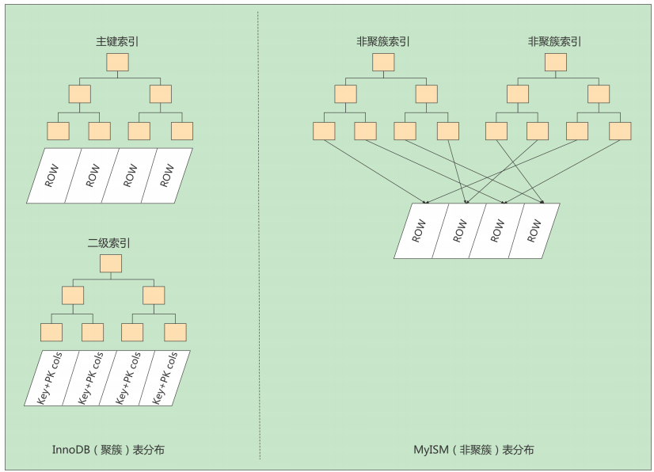

  


### 003 一个表中如果没有创建索引，那么还会创建B+树吗？

会

- 如果有主键会创建聚簇索引

- 如果没有主键会生成rowid作为隐式主键


### 004 说一下B+树索引实现原理（数据结构）

#### 讲义

假设有一个表index_demo，表中有2个INT类型的列，1个CHAR(1)类型的列，c1列为主键：

```sql
CREATE TABLE index_demo(c1 INT,c2 INT,c3 CHAR(1),PRIMARY KEY(c1)) ;
```

index_demo表的简化的行格式示意图如下：

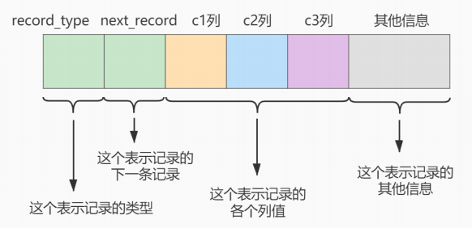


我们只在示意图里展示记录的这几个部分：

- `record_type：`表示记录的类型， 0是普通记录、 2是最小记录、 3 是最大记录、1是B+树非叶子节点记录。
- `next_record：`表示下一条记录的相对位置，我们用箭头来表明下一条记录。
- `各个列的值：`这里只记录在 index_demo 表中的三个列，分别是 c1 、 c2 和 c3 。 
- `其他信息：`除了上述3种信息以外的所有信息，包括其他隐藏列的值以及记录的额外信息。


将`其他信息`项暂时去掉并把它竖起来的效果就是这样：

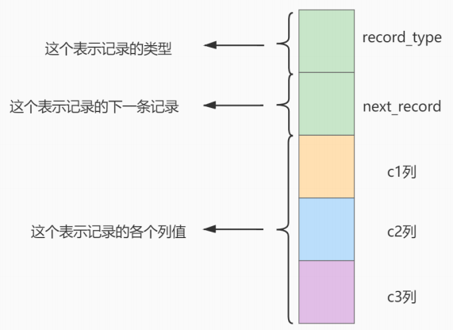


把一些记录放到页里的示意图就是（这里一页就是一个磁盘块，代表一次IO）：

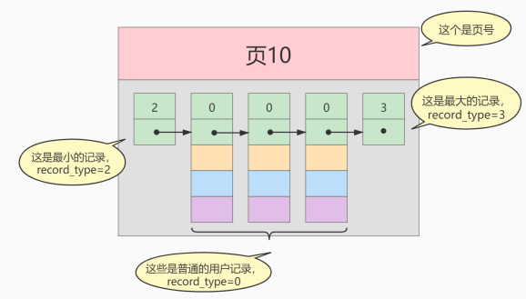

name age sex


`MySQL InnoDB的默认的页大小是16KB`，因此数据存储在磁盘中，可能会占用多个数据页。如果各个页中的记录没有规律，我们就不得不依次遍历所有的数据页。`如果我们想快速的定位到需要查找的记录在哪些数据页中`，我们可以这样做 ：

- 下一个数据页中用户记录的主键值必须大于上一个页中用户记录的主键值
- 给所有的页建立目录项

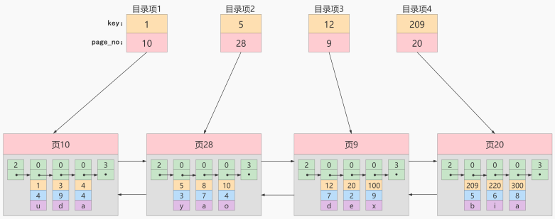

以`页28`为例，它对应`目录项2` ，这个目录项中包含着该页的`页号28`以及该页中用户记录的`最小主键值 5`。我们只需要把几个目录项在物理存储器上连续存储（比如：数组），就可以实现根据主键值快速查找某条记录的功能了。`比如：查找主键值为 20 的记录，具体查找过程分两步：`

1. 先从目录项中根据二分法快速确定出`主键值为20的记录在目录项3中`（因为 12 ≤ 20 < 209 ），`对应页9`。 
2. 再到页9中根据二分法快速定位到主键值为 20 的用户记录。

至此，针对数据页做的简易目录就搞定了。这个目录有一个别名，称为`索引` 。 


#### InnoDB中的索引方案

我们新分配一个编号为30的页来专门存储`目录项记录`，页10、28、9、20专门存储`用户记录`： 

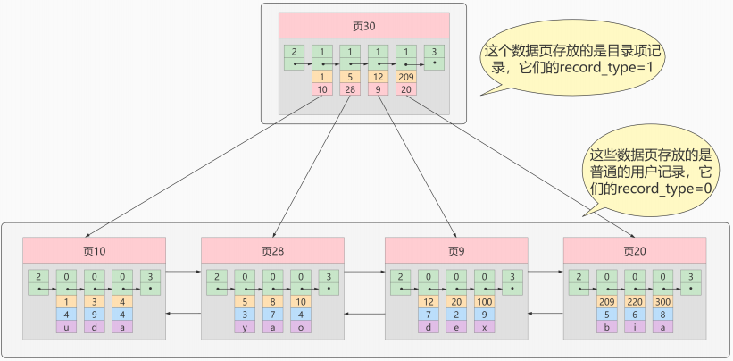

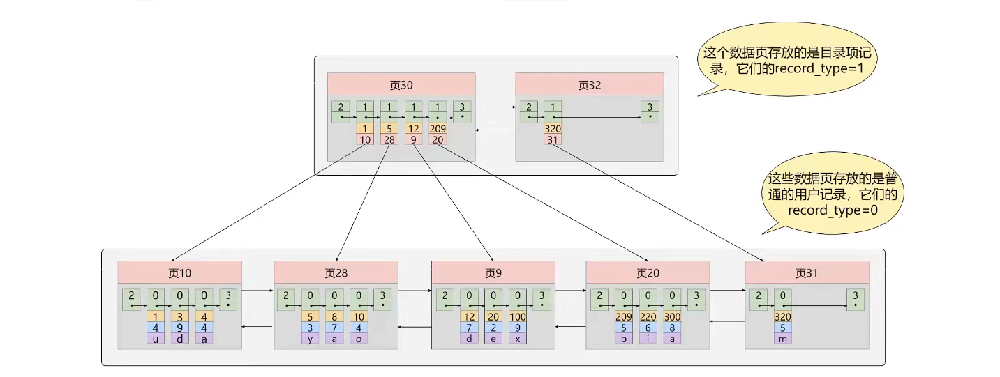

`目录项记录和普通的用户记录的不同点：` 

- 目录项记录 的 record_type 值是1，而 普通用户记录 的 record_type 值是0。
- 目录项记录只有主键值和页的编号两个列，而普通的用户记录的列是用户自己定义的，包含很多列，另外还有InnoDB自己添加的隐藏列。

`现在查找主键值为 20 的记录，具体查找过程分两步：`

1. 先到页30中通过二分法快速定位到对应目录项，因为 12 ≤ 20 < 209 ，就是页9。 
2. 再到页9中根据二分法快速定位到主键值为 20 的用户记录。


**更复杂的情况如下：**

我们生成了一个存储更高级目录项的 页33 ，这个页中的两条记录分别代表页30和页32，如果用户记录的主键值在 `[1, 320)` 之间，则到页30中查找更详细的目录项记录，如果主键值 不小于320 的话，就到页32中查找更详细的目录项记录。**这个数据结构，它的名称是 B+树 。**

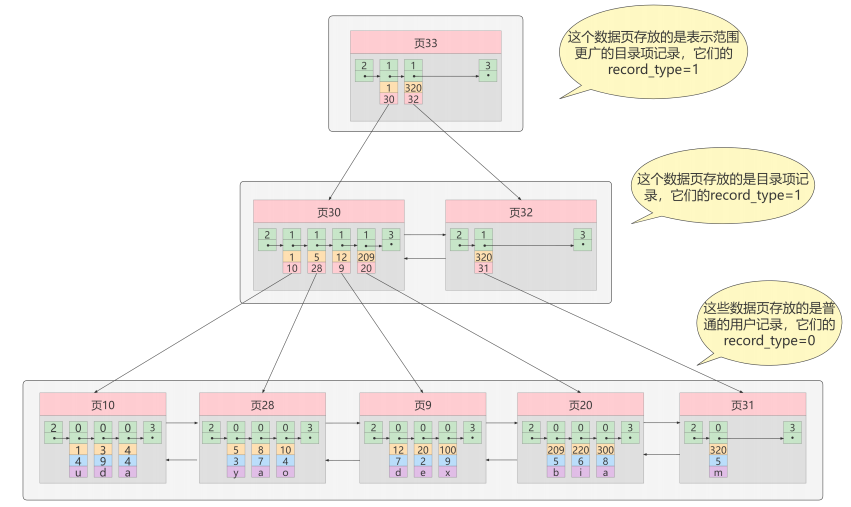

### 005	聚簇索引与非聚簇索引b+树实现有什么区别？

##### 聚簇索引

**特点：**

- `索引和数据保存在同一个B+树中`

- `页内的记录`是按照`主键`的大小顺序排成一个`单向链表` 。
- `页和页之间`也是根据页中记录的`主键`的大小顺序排成一个`双向链表` 。
- 非叶子节点存储的是记录的`主键+页号`。
- 叶子节点存储的是`完整的用户记录`。

**优点：**

- 数据访问更快 ，因为`索引和数据保存在同一个B+树中`，因此从聚簇索引中获取数据比非聚簇索引更快。
- 聚簇索引对于主键的`排序查找`和`范围查找`速度非常快。
- 按照聚簇索引排列顺序，查询显示一定范围数据的时候，由于`数据都是紧密相连`，数据库可以从更少的数据块中提取数据，`节省了大量的IO操作` 。

**缺点：**

- 插入速度严重依赖于插入顺序 ，按照主键的顺序插入是最快的方式，否则将会出现页分裂，严重影响性能。因此，对于InnoDB表，我们一般都会定义一个`自增的ID列为主键`。
- 更新主键的代价很高 ，因为将会导致被更新的行移动。因此，对于InnoDB表，我们一般定义`主键为不可更新`。

**限制：**

- 只有InnoDB引擎支持聚簇索引，`MyISAM不支持聚簇索引`。
- 由于数据的物理存储排序方式只能有一种，所以`每个MySQL的表只能有一个聚簇索引`。
- 如果没有为表定义主键，InnoDB会选择`非空的唯一索引列代替`。如果没有这样的列，InnoDB会`隐式的定义一个主键`作为聚簇索引。
- 为了充分利用聚簇索引的聚簇特性，InnoDB中表的`主键应选择有序的id`，不建议使用无序的id，比如UUID、MD5、HASH、字符串作为主键，无法保证数据的顺序增长。


##### 非聚簇索引

**（二级索引、辅助索引）**

`聚簇索引`，只能在搜索条件是`主键值`时才发挥作用，因为B+树中的数据都是按照主键进行排序的，如果我们想以别的列作为搜索条件，那么需要创建`非聚簇索引`。

**例如，**`以c2列作为搜索条件`，那么需要使`用c2列创建一棵B+树`，如下所示：

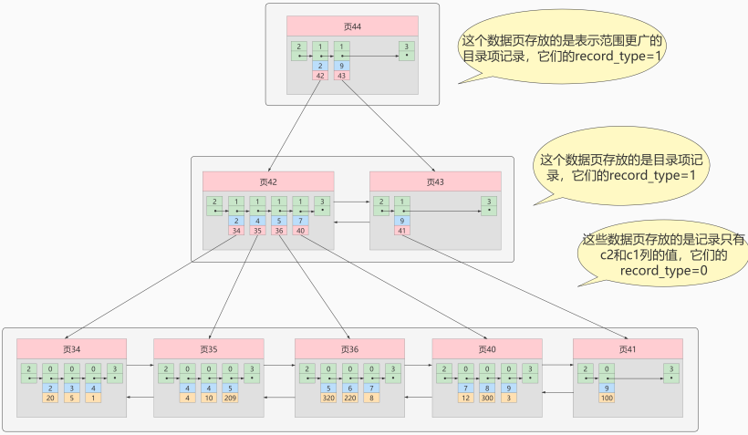


**这个B+树与聚簇索引有几处不同：**

- `页内的记录`是按照从`c2列`的大小顺序排成一个`单向链表` 。
- `页和页之间`也是根据页中记录的`c2列`的大小顺序排成一个`双向链表` 。

- 非叶子节点存储的是记录的`c2列+页号`。
- 叶子节点存储的并不是完整的用户记录，而只是`c2列+主键`这两个列的值。


**一张表可以有多个非聚簇索引：**

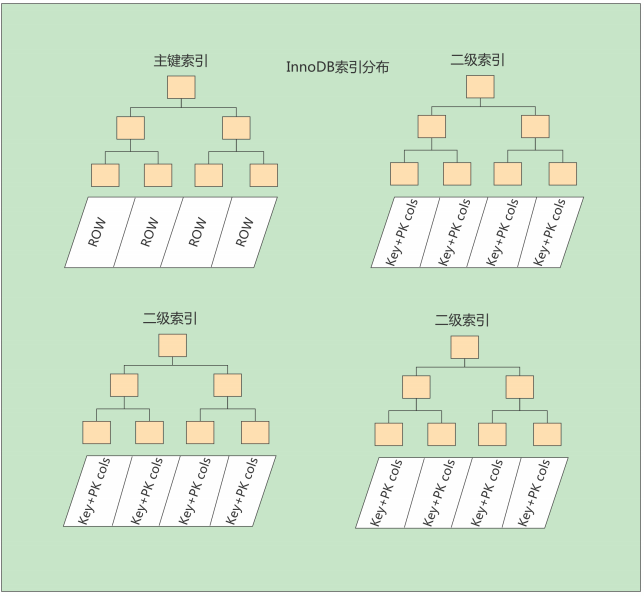

### 006	说一下B+树中聚簇索引的查找（匹配）逻辑


### 007	说一下B+树中非聚簇索引的查找（匹配）逻辑

**例如：**根据c2列的值查找c2=4的记录，查找过程如下：

1. 根据`根页面44`定位到`页42`（因为`2 ≤  4 < 9`）
2. 由于`c2列没有唯一性约束`，所以c2=4的记录可能分布在多个数据页中，又因为 `2 ≤ 4  ≤ 4`，所以确定实际存储用户记录的页在`页34和页35`中。
3. 在页34和35中`定位到具体的记录`。
4. 但是这个B+树的叶子节点`只存储了c2和c1（主键）`两个列，所以我们必须`再根据主键值去聚簇索引中再查找`一遍完整的用户记录。


### 008	平衡二叉树，红黑树，B树和B+树的区别是什么？都有哪些应用场景？

**普通树的问题**

- 左子树全部为空，从形式上看，更像一个单链表，不能发挥BST的优势。
- `解决方案：平衡二叉树(AVL)` 

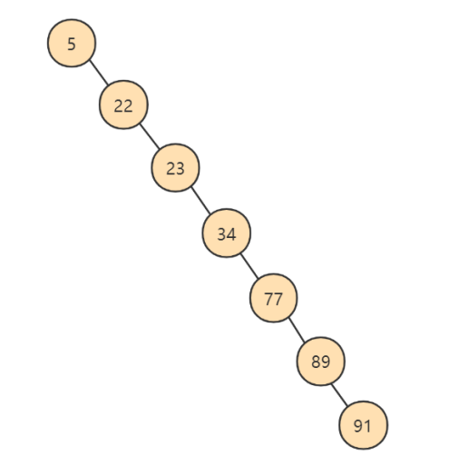

**平衡二叉树（AVL）**

AVL树全称G.M. Adelson-Velsky和E.M. Landis，这是两个人的人名。

- 基础数据结构
- 左右平衡
- 高度差大于1会自旋
- 每个节点记录一个数据

平衡二叉树也叫平衡二叉搜索树（Self-balancing binary search tree）又被称为AVL树， 可以保证查询效率较高。

`具有以下特点：`

- 它是一棵空树或它的左右两个子树的高度差的绝对值不超过1
- 并且左右两个子树都是一棵平衡二叉树。

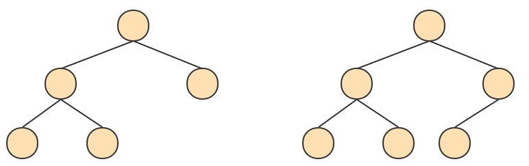

AVL的生成演示：https://www.cs.usfca.edu/~galles/visualization/AVLtree.html

**AVL的问题**

众所周知，IO操作的效率很低，在大量数据存储中，查询时我们不能一下子将所有数据加载到内存中，只能逐节点加载（一个节点一次IO）。如果我们利用二叉树作为索引结构，`那么磁盘的IO次数和索引树的高度是相关的`。平衡二叉树由于树深度过大而造成磁盘IO读写过于频繁，进而导致效率低下。

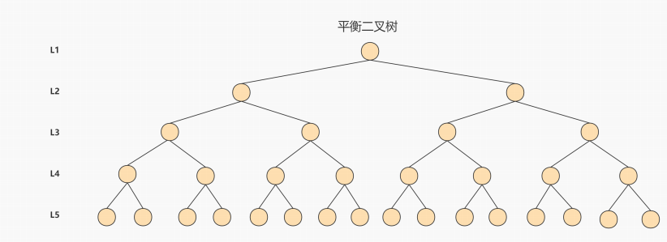

为了提高查询效率，就需要 减少磁盘IO数 。`为了减少磁盘IO的次数，就需要尽量降低树的高度` ，需要把原来“瘦高”的树结构变的“矮胖”，树的每层的分叉越多越好。针对同样的数据，如果我们把二叉树改成 三叉树：

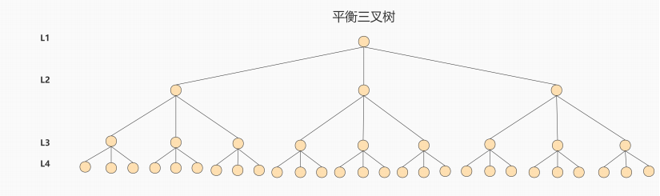

上面的例子中，我们将二叉树变成了三叉树，降低了树的高度。如果能够在一个节点中存放更多的数据，我们还可以进一步减少节点的数量，从而进一步降低树的高度。这就是`多叉树`。


**红黑树**

- hashmap存储
- 两次旋转达到平衡
- 分为红黑节点

在这个棵严格的平台树上又进化为“红黑树”{是一个非严格的平衡树 左子树与右子树的高度差不能超过1}，红黑树的长子树只要不超过短子树的两倍即可！

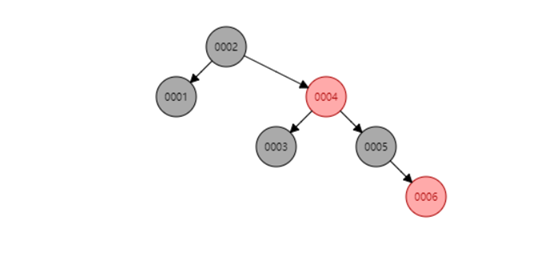

当再次插入7的时候，这棵树就会发生旋转

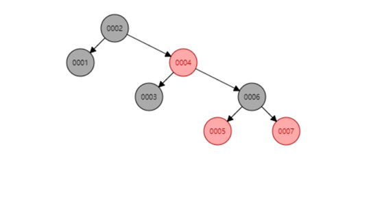


**B+** **树和** **B** **树的差异：**

- B+树中非叶子节点的关键字也会同时存在在子节点中，并且是在子节点中所有关键字的最大值（或最小）。
- B+树中非叶子节点仅用于索引，不保存数据记录，跟记录有关的信息都放在叶子节点中。而B树中， 非叶子节点既保存索引，也保存数据记录 。 
- B+树中所有关键字都在叶子节点出现，叶子节点构成一个有序链表，而且叶子节点本身按照关键字的大小从小到大顺序链接。


### 009	一个b+树中大概能存放多少条索引记录？

- `真实环境`中一个页存放的记录数量是非常大的（**默认16KB**），假设指针与键值忽略不计（或看做10个字节），数据占 1 kb 的空间
- 如果B+树只有1层，也就是只有1个用于存放用户记录的节点，最多能存放 16 条记录。
- 如果B+树有2层，最多能存放 `1600×16=25600` 条记录。
- 如果B+树有3层，最多能存放 `1600×1600×16=40960000` 条记录。
- 如果存储千万级别的数据，只需要三层就够了

`B+树的非叶子节点不存储用户记录，只存储目录记录，相对B树每个节点可以存储更多的记录，树的高度会更矮胖，IO次数也会更少。`

### 010	使用B+树存储的索引CURD执行效率如何？

新增时(C表示新增)，算法复杂度为：O(lognN)，N = 树的高度;

- **步骤**：
  1. 读路径找到插入位置的叶子（约 h*h* 次 I/O）。
  2. 如果叶子未满，直接插入并更新叶子和可能的内节点索引（增量更新）。
  3. 如果叶子满了，触发 **节点分裂**（可能级联到根）。

删除时(D表示删除)，算法复杂度为：O(lognN)，N = 树的高度,**效率：中等到较高**

- **步骤**：
  1. 读路径找到目标叶子（h*h* 次 I/O）。
  2. 删除记录。
  3. 如果叶子剩余记录 ≥ 半满（或设定阈值），仅更新父节点的最小键（有时不变）。
  4. 如果叶子太稀疏（< 半满），尝试 **重分配** 或 **合并** 兄弟节点（可能引起内节点更新或合并）。

查询时(Read查询),算法复杂度为：O(log⁡nN)，M*为节点出度，**效率很高**;

更新时(Update)，**效率**：取决于更新内容

- **更新非索引列**：
  → 实际上 = Read（找到记录位置） + Write（修改数据区）。
  代价 ≈ 一次查询 + 一次写回（可能只写叶子页）。
- **更新索引列（即索引键值）**：
  → 逻辑上 = Delete(old key) + Insert(new key)。
  代价 = 删除 + 插入，可能导致两个不同的叶子节点位置变化，开销高于非索引更新。
- 如果是聚集索引的键更新：可能导致记录在叶子节点甚至页之间移动，代价更高。


### 011	什么是自适应哈希索引？

自适应哈希索引是Innodb引擎的一个特殊功能，当它注意到某些索引值被使用的非常频繁时，会在内存中基于B-Tree所有之上再创建一个哈希索引，这就让B-Tree索引也具有哈希索引的一些优点，比如快速哈希查找。这是一个完全自动的内部行为，用户无法控制或配置

```sql
SHOW ENGINE INNODB STATUS \G ;

## 查看INSERT BUFFER AND ADAPTIVE HASH INDEX
```


### 012	什么是2-3树 2-3-4树？

多叉树（multiway tree）允许`每个节点可以有更多的数据项和更多的子节点`。2-3树，2-3-4树就是多叉树，多叉树通过`重新组织节点，减少节点数量，增加分叉，减少树的高度`，能对二叉树进行优化。

**2-3树**

下面2-3树就是一颗多叉树

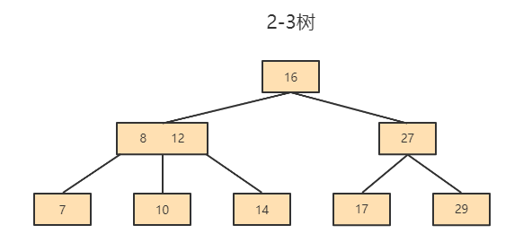

2-3树具有如下特点：

- 2-3树的所有叶子节点都在同一层。
- 有两个子节点的节点叫二节点，二节点要么没有子节点，要么有两个子节点。
- 有三个子节点的节点叫三节点，三节点要么没有子节点，要么有三个子节点。
- 2-3树是由二节点和三节点构成的树。
- 对于三节点的子树的值大小仍然遵守 BST 二叉排序树的规则。

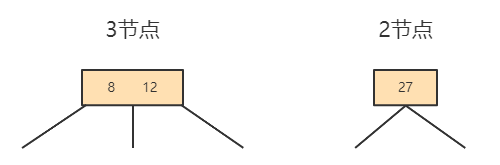


**2-3-4树**

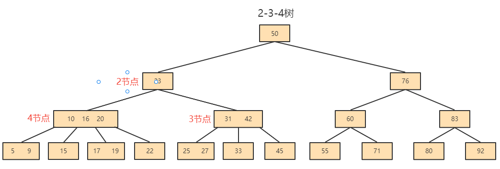


### 013 为什么官方建议使用自增长主键作为索引？（说一下自增主键和字符串类型主键的区别和影响）

- 自增主键能够维持底层数据顺序写入
- 读取可以由b+树的二分查找定位
- 支持范围查找，范围数据自带顺序

字符串无法完成以上操作


### 014 使用int自增主键后 最大id是10，删除id 10和9，再添加一条记录，最后添加的id是几？删除后重启mysql然后添加一条记录最后id是几？

删除之后

- 如果重启，会从最大的id开始递增 (对于本题就是9)
- 如果没重启，会延续删除之前最大的id开始递增 (对于本题就是11)


### 015 索引的优缺点是什么？

**优点**

聚簇（主键）索引：

- 顺序读写
- 范围快速查找
- 范围查找自带顺序

非聚簇索引：

- 条件查询避免全表扫描scan
- 范围，排序，分组查询返回行id，排序分组后，再回表查询完整数据，有可能利用顺序读写
- 覆盖索引不需要回表操作

**缺点**

索引是个好东西，可不能乱建，它在空间和时间上都会有消耗：

- **空间上的代价**

每建立一个索引都要为它建立一棵B+树，`每一棵B+树的每一个节点都是一个数据页，一个页默认会占用 16KB 的存储空间`，一棵很大的B+树由许多数据页组成，那就是很大的一片存储空间。

- **时间上的代价**

`每次对表中的数据进行 增、删、改 操作时，都需要去修改各个B+树索引`。而增、删、改操作可能会对节点和记录的排序造成破坏`，所以存储引擎需要额外的时间进行一些记录移位、页面分裂、页面回收等操作来维护好节点和记录的排序。`如果我们建了许多索引，每个索引对应的B+树都要进行相关的维护操作，会给性能拖后腿。


### 016	使用索引一定能提升效率吗？

不一定

- 少量数据全表扫描也很快，可以直接获取到全量数据
- 唯一索引会影响插入速度，但建议使用
- 索引过多会影响更新，插入，删除数据速度


### 017	如果是大段文本内容，如何创建（优化）索引？

第一种方式是分表存储，然后创建索引

第二是使用es（Elasticsearch，倒排索引）为大文本创建索引


### 018 什么是聚簇索引？

聚簇索引数据和索引存放在一起组成一个b+树（参考005题）

### 019	一个表中可以有多个（非）聚簇索引吗？

聚簇索引只能有一个，因为是通过主键建立的。

非聚簇索引可以有多个

### 020	聚簇索引与非聚集索引的特点是什么？

**聚簇索引 (Clustered Index)**

​	**核心特点：** **“索引即数据”**。索引的叶子节点直接存储了完整的整行数据。

-   **物理顺序**：表中数据的物理行顺序与索引键的逻辑顺序一致。因此，一个表**只能有一个**聚簇索引。
-   **查找过程**：在聚簇索引中查找，只需从根节点走到叶子节点，拿到叶子节点的数据页，即可直接获得完整行。
-   **性能特征**：
    -   **范围查询极快**：因为数据物理上是排序的，找到起点后顺序扫描即可。
    -   **主键查询最快**：一次 IO 即可定位数据。
    -   **插入/更新**：如果主键是自增的，插入效率很高（追加写）；如果主键是随机的（如 UUID），会导致频繁的**页分裂**和数据移动，性能较差。

**非聚簇索引 (Non-clustered Index)**

​	**核心特点：** **“索引是目录”**。索引结构与数据存储分离。叶子节点存储的是**索引键值 + 书签（RowId/主键值）**。

-   **逻辑与物理**：索引的逻辑顺序与磁盘物理顺序无关。因此，一个表可以有很多个非聚簇索引。
-   **查找过程**：两步查找。
    1.  在非聚簇索引树上找到对应的键值。
    2.  拿到书签（主键或行指针），再去聚簇索引（或堆表）中查找完整数据。

-   **性能特征**：
    -   **覆盖索引**：如果查询的字段恰好都在非聚簇索引里，则不需要回表，效率极高。
    -   **回表开销**：如果非聚簇索引不包含所需的所有字段，需要根据书签值回表查询，此时会产生额外的随机 IO。

核心区别对比表

| 维度         | 聚簇索引                          | 非聚簇索引                           |
| :----------- | :-------------------------------- | :----------------------------------- |
| **物理存储** | 叶子节点存储**整行数据**          | 叶子节点存储**索引键 + 主键值**      |
| **数量限制** | 每个表 **1个**                    | 每个表 **最多 999个**                |
| **查询速度** | 点查/范围查极快 (直接命中)        | 通常较慢 (需回表，除非覆盖索引)      |
| **插入性能** | 依赖顺序 (自增主键快，随机主键慢) | 相对稳定 (仅维护索引结构)            |
| **内存占用** | 占用较大 (数据量大)               | 占用较小 (仅存索引列+键)             |
| **典型例子** | InnoDB 的主键索引                 | MyISAM 的所有索引、InnoDB 的普通索引 |

---

**关键场景解析：为什么推荐自增主键？**

以 InnoDB (MySQL) 为例，数据是按主键聚簇存储的：

1.  **自增主键 (Auto-increment)**：
    -   新记录总是追加到数据页的末尾。
    -   **结果**：B+树向右生长，页分裂次数极少，写入性能高。

2.  **UUID/随机主键**：
    -   新记录需要插入到 B+树的中间位置。
    -   **结果**：为了腾出空间，频繁发生页分裂、移动数据，导致大量磁盘碎片和随机 IO，写入性能较差。

**总结**：
**聚簇索引**适合用于：主键查询、范围查询、排序查询。
**非聚簇索引**适合用于：精确查询且数据量较大、需要覆盖索引避免回表的场景。


### 021	CRUD时聚簇索引与非聚簇索引的区别是什么？

- 聚簇索引插入新值比采用非聚簇索引插入新值的速度要慢很多，因为插入要保证主键不能重复
- 聚簇索引范围，排序查找效率高，因为是有序的
- 非聚簇索引访问需要两次索引查找，第一次找到主键值，第二次根据主键值找到行数据


### 022 非聚簇索引为什么不存数据地址值而存储主键？

因为聚簇索引中有时会引发分页操作、重排操作数据有可能会移动


### 023 什么是回表操作？

一个容易混淆的概念：回表与覆盖索引

-   **回表**：使用非聚簇索引查询，但需要查的字段不在该索引里，数据库必须先查索引找到主键，再根据主键查聚簇索引。**速度慢**。
-   **覆盖索引**：创建一个非聚簇索引，里面包含了本次查询需要的**所有字段**。数据库只查这个索引就能返回结果，不再需要回表。**速度快**。

```sql
## 回表操作
-- 仅在 name 上建索引
CREATE INDEX idx_name ON user(name);
## 第一次 取到id
## 第二次（回表）根据id拿到完整数据
-- 查询 (需要回表获取 age)
SELECT age FROM user WHERE name='张三';
```


### 024	什么是覆盖索引？

```sql
## 覆盖索引
-- 建立联合索引，包含查询需要的字段
CREATE INDEX idx_name_age ON user(name, age);
-- 查询 (不需要回表，直接从索引返回 age)
SELECT age FROM user WHERE name='张三';

## 覆盖索引不会回表查询，查询效率也是比较高的
```

**核心区别对比表**

| 维度                | 回表 (Back to Table)             | 覆盖索引 (Covering Index) |
| :------------------ | :------------------------------- | :------------------------ |
| **查询次数**        | 2次 (二级索引 + 聚簇索引)        | 1次 (仅二级索引)          |
| **访问数据位置**    | 索引树 + 数据堆表/聚簇索引叶子   | 仅索引树                  |
| **性能**            | 慢 (尤其是随机I/O)               | 快 (纯内存/顺序I/O潜力)   |
| **是否产生随机I/O** | 可能产生 (回表时按主键查找)      | 不产生                    |
| **依赖条件**        | 默认使用二级索引且未命中覆盖条件 | 查询字段是指索引列的子集  |


### 025	非聚集索引一定回表查询吗?

不一定，只要b+树中包含的字段（创建索引的字段），覆盖（包含）想要select 的字段，那么就不会回表查询了。


### 026	为什么要回表查询？直接存储数据不可以吗？

为了控制非聚簇索引的大小


### 027	如果把一个 InnoDB 表的主键删掉，是不是就没有主键，就没办法进行回表查询了？

不是，InnoDB会生成rowid辅助回表查询


### 028  什么是联合索引，组合索引，复合索引？

这三个名词（**联合索引、组合索引、复合索引**）指的是**同一个东西**

**定义：** 将一个SQL查询中的**多个列**（字段）组合起来，共同创建一个B+树索引。

```sql
## 假设有一张用户表 user：
CREATE TABLE user (
    id INT,
    last_name VARCHAR(50),
    first_name VARCHAR(50),
    age INT
);
## 创建一个联合索引：
CREATE INDEX idx_name ON user (last_name, first_name, age);
-- 这里按照 last_name -> first_name -> age 的顺序

## 底层数据结构（B+树）的排序规则：
## 首先按照 last_name 排序。
## 如果 last_name 相同，再按照 first_name 排序。
## 如果 last_name 和 first_name 都相同，再按照 age 排序。
```

**联合索引的核心原则：最左前缀匹配**

> **只要查询的条件中，用到了索引最左边的一个或多个列，索引就能生效。跳过左边的列，索引就无效。**

| SQL 查询                                                    | 索引是否生效？ | 原因                                                         |
| :---------------------------------------------------------- | :------------- | :----------------------------------------------------------- |
| `WHERE last_name = '张'`                                    | ✅ **生效**     | 用到了最左列 `last_name`                                     |
| `WHERE last_name = '张' AND first_name = '三'`              | ✅ **生效**     | 用到了 `last_name` 和 `first_name`，顺序正确                 |
| `WHERE last_name = '张' AND first_name = '三' AND age = 30` | ✅ **生效**     | 用到了全部三列（完美命中）                                   |
| `WHERE first_name = '三'`                                   | ❌ **不生效**   | 跳过了最左边的 `last_name`（无法定位）                       |
| `WHERE last_name = '张' AND age = 30`                       | ⚠️ **部分生效** | 只用到了 `last_name` 过滤，`age` 用不上（因为跳过了 `first_name`） |


### 029 复合索引创建时字段顺序不一样使用效果一样吗？

我们也可以同时以多个列的大小作为排序规则，也就是同时为多个列建立索引，比方说我们想让B+树按照 `c2和c3列` 的大小进行排序，这个包含两层含义：

- 先把各个记录和页按照`c2`列进行排序。
- 在记录的`c2`列相同的情况下，采用`c3`列进行排序
- B+树叶子节点处的记录由`c2列、c3列和主键c1列组成`
- 本质上也是二级索引


### 030 什么是唯一索引？

```sql
## 随表一起创建索引
CREATE TABLE customer (
  id INT UNSIGNED AUTO_INCREMENT,
  customer_no VARCHAR(200),
  customer_name VARCHAR(200),
  
  PRIMARY KEY(id), -- 主键索引：列设定为主键后会自动建立索引，唯一且不能为空。
  UNIQUE INDEX uk_no (customer_no), -- 唯一索引：索引列值必须唯一，允许有NULL值，且NULL可能会出现多次。
  KEY idx_name (customer_name), -- 普通索引：既不是主键，列值也不需要唯一，单纯的为了提高查询速度而创建。
  KEY idx_no_name (customer_no,customer_name) -- 复合索引：即一个索引包含多个列。
);

## 单独建创索引
CREATE TABLE customer1 (
  id INT UNSIGNED,
  customer_no VARCHAR(200),
  customer_name VARCHAR(200)
);

ALTER TABLE customer1 ADD PRIMARY KEY customer1(id); -- 主键索引
CREATE UNIQUE INDEX uk_no ON customer1(customer_no); -- 唯一索引
CREATE INDEX idx_name ON customer1(customer_name);  -- 普通索引
CREATE INDEX idx_no_name ON customer1(customer_no,customer_name); -- 复合索引
```


### 	031 唯一索引是否影响性能？

是, 它在某些场景下能提升查询性能，但在写入（插入、更新）时一定会带来额外开销。


### 	032 什么时候使用唯一索引？

业务需求唯一字段的时候，一般不考虑性能问题

. 【强制】业务上具有唯一特性的字段，即使是多个字段的组合，也必须建成唯一索引。 说明：不要以为唯一索引影响了 insert 速度，这个速度损耗可以忽略，但提高查找速度是明 显的；另外，即使在应用层做了非常完善的校验控制，只要没有唯一索引，根据墨菲定律，必 然有脏数据产生。


### 033 什么时候适合创建索引，什么时候不适合创建索引？

**适合创建索引**

- 频繁作为where条件语句查询字段

- 关联字段需要建立索引
- 排序字段可以建立索引

- 分组字段可以建立索引(因为分组前提是排序)

- 统计字段可以建立索引（如.count(),max()）

**不适合创建索引**

- 频繁更新的字段不适合建立索引

- where，分组，排序中用不到的字段不必要建立索引

- 可以确定表数据非常少不需要建立索引

- 参与mysql函数计算的列不适合建索引


### 034 什么是索引下推？

索引下推（Index Condition Pushdown，简称ICP）是MySQL 5.6引入的一种**优化查询的执行方式**。

把本该在**Server层**做的WHERE条件判断，**下推**到**存储引擎层**，让存储引擎在读取索引时就利用WHERE条件提前过滤掉不符合的行，从而减少回表次数。

- `如果没有索引下推，那么MySQL在存储引擎层找到满足`content1 > 'z'`条件的第一条二级索引记录。`主键值进行回表`，返回完整的记录给server层，server层再判断其他的搜索条件是否成立。如果成立则保留该记录，否则跳过该记录，然后向存储引擎层要下一条记录。
- `如果使用了索引下推，那么MySQL在存储引擎层找到满足`content1 > 'z'`条件的第一条二级索引记录。`不着急执行回表`，而是在这条记录上先判断一下所有关于`idx_content1`索引中包含的条件是否成立，也就是`content1 > 'z' AND content1 LIKE '%a'`是否成立。如果这些条件不成立，则直接跳过该二级索引记录，去找下一条二级索引记录；如果这些条件成立，则执行回表操作，返回完整的记录给server层。

```sql
## 表user有一个联合索引(last_name, first_name)
SELECT * FROM user 
WHERE last_name = '张' AND first_name LIKE '%三%';   -- 注意：%在左边
```

**1、执行过程（没有ICP）：**

1.  **存储引擎**：通过索引找到所有`last_name='张'`的索引条目（比如有100条）。
2.  **存储引擎**：根据这100条索引里记录的主键ID，**回表**（随机I/O）读取100次，拿到完整的100行数据给Server层。
3.  **Server层**：对这100行数据，逐一判断`first_name LIKE '%三%'`，过滤掉不符合的。
4.  **结果**：假设只有10条符合，Server层浪费了90次回表（这90次回表拿到数据后发现其实不符合）。

**问题：** 索引`(last_name, first_name)`明明包含了`first_name`的值，但因为`LIKE '%三%'`（%在左边）导致无法用索引精准定位，这些被读出来的索引条目中包含的`first_name`值在存储引擎层被白白浪费了——存储引擎没有用这个条件过滤，反而盲目地回表。

**2、执行过程（启用ICP）：**

1.  **Server层**：把`first_name LIKE '%三%'`这个条件也下推给存储引擎。
2.  **存储引擎**：通过索引找到`last_name='张'`的索引条目时，**在索引页内部**就直接判断当前行的`first_name`是否符合`LIKE '%三%'`。
3.  **存储引擎**：**只有符合条件**的索引条目，才去回表获取完整行数据。
4.  **结果**：假设100个`last_name='张'`中只有10个`first_name`符合`LIKE '%三%'`，则只回表10次。

**节省了90次随机I/O回表操作**，性能显著提升。

**3、ICP生效条件：**

1.  只能用于**二级索引**（非聚簇索引）。
2.  查询必须是**部分使用索引**的场景（即WHERE条件不能完全覆盖索引列，需要回表）。
3.  索引中包含的列可以用于提前过滤。

**4、ICP不生效的情况：**

1.  聚簇索引（主键索引）——回表本身就是数据页，不需要ICP。
2.  WHERE条件中的列**不在索引中**（无法下推，因为索引里没有这个值）。
3.  使用了**分区表**且查询跨越多个分区（某些版本限制）。
4.  查询使用了**`select *`但SELECT列全在索引中**（此时本身就是覆盖索引，无需回表，也就无所谓ICP）。

**5、如何确认ICP是否启用？**

```sql
-- 查看ICP状态（默认开启）
SHOW VARIABLES LIKE 'optimizer_switch';
-- 找到 index_condition_pushdown=on

-- 查看执行计划
EXPLAIN SELECT * FROM user WHERE last_name='张' AND first_name LIKE '%三%';

## 执行计划输出中，`Extra`列会显示：
--   有ICP：`Using index condition`
--  无ICP：`Using where`（在Server层过滤）
```


### 035  有哪些情况会导致索引失效？

| 失效分类                           | 具体写法（❌ 错误示例）                                       | 原因与说明                                                 |
| :--------------------------------- | :----------------------------------------------------------- | :--------------------------------------------------------- |
| 违反最左前缀                       | 联合索引 `(a,b,c)`，查询 `where b=2` 或 `where a=1 and c=3`  | 必须从索引的最左列开始匹配，不能跳过中间列                 |
| 索引列计算                         | `where id + 1 = 10`                                          | 索引列参与算术运算后，值已变，无法直接查找原值             |
| 使用函数                           | `where DATE(create_time) = '2024-01-01'`                     | 对索引列使用函数会破坏其原始值的排序                       |
| 隐式类型转换                       | `phone` 字段是 `varchar`，但查询 `where phone = 13800000000` | 数据库会将索引列转换为数字，导致无法使用索引               |
| 错误的模糊查询                     | `where name like '%张三'` 或 `'%张三%'`                      | `%` 通配符在开头时，无法利用B+树的前缀匹配                 |
| OR 连接条件                        | `where name = '张三' or age = 20`（假设 `age` 无索引）       | `OR` 两侧必须都有索引，否则会全表扫描                      |
| 使用反向查询                       | `where status != 1` 或 `where id not in (1,2,3)` 或 `where age is not null` | 负向查询通常不走索引（除非结果集极小，优化器可能改变策略） |
| 范围查询过大                       | 联合索引 `(a,b,c)`，查询 `where a=1 and b>10 and c=2`        | 范围查询（`>`, `<`, `between`）会导致后续索引列失效        |
| 优化器误判                         | 某列 `status` 90% 都是1，查询 `where status = 1`             | 优化器认为全表扫描（顺序IO）比随机回表更高效               |
| ORDER BY 顺序错误                  | 联合索引 `(a,b)`，查询 `order by b, a`                       | 索引默认按 `(a,b)` 排序，`(b,a)` 与之不一致                |
| 使用 `select *` 且需要回表很多数据 | 同“优化器误判”原理                                           | 回表成本太高，优化器可能放弃索引                           |

**执行 `EXPLAIN` 查看执行计划：**

-   `type` = `ALL`：最差，全表扫描 → **索引失效**
-   `type` = `index`：全索引扫描，比全表好一点，但也不是最优
-   `type` = `range` / `ref`：正常使用索引
-   `key` = `NULL`：**没用上索引**


### 036  为什么LIKE以%开头索引会失效？

没有高效使用索引是因为字符串索引会逐个转换成accii码，生成b+树时按首个字符串顺序排序，类似复合索引未用左列字段失效一样，跳过开始部分也就无法使用生成的b+树了


### 037  一个表有多个索引的时候，能否手动选择使用哪个索引？

不可用手动直接干预，只能通过mysql优化器自动选择


### 038 如何查看一个表的索引？

```sql
show index from t_emp; -- 显示表上的索引
explain select * from t_emp where id=1; -- 显示可能会用到的索引及最终使用的索引
```


### 039 能否查看到索引选择的逻辑？是否使用过optimizer_trace？

```sql
set session optimizer_trace="enabled=on",end_markers_in_json=on;
-- 执行SQL
-- sql text...
-- 查看
SELECT * FROM information_schema.OPTIMIZER_TRACE;
set session optimizer_trace="enabled=off";
```


### 040  多个索引优先级是如何匹配的？

1. 主键（唯一索引）匹配
2. 全值匹配（单值匹配）
3. 最左前缀匹配
4. 范围匹配
5. 索引扫描
6. 全表扫描


 一般性建议

Ø 对于单键索引，尽量选择过滤性更好的索引（例如：手机号，邮件，身份证）

Ø 在选择组合索引的时候，过滤性最好的字段在索引字段顺序中，位置越靠前越好。

Ø 选择组合索引时，尽量包含where中更多字段的索引

Ø 组合索引出现范围查询时，尽量把这个字段放在索引次序的最后面

Ø 尽量避免造成索引失效的情况


### 041  使用Order By时能否通过索引排序？

没有过滤条件不走索引（比如where，limit等过滤条件），添加过滤条件后可以走到索引（通过执行计划查看）


### 042  通过索引排序内部流程是什么？

通过索引排序（即 `ORDER BY` 使用索引来避免 `filesort`）的内部流程，核心是**利用 B+树索引本身的有序性**，直接按索引顺序读取数据，省去额外的排序步骤。

步骤：

1. **SQL 解析与优化**：MySQL 分析 `ORDER BY` 子句，检查是否能用索引（字段顺序、方向一致，不跳列，不涉及函数等）。
2. **索引选择**：如果可行，优化器选择该索引用于查询和排序。
3. **执行器调用存储引擎**：通过索引扫描，直接按有序顺序获取数据。
4. **返回结果**：无需额外排序（`filesort`），直接返回。（核心是：**索引的叶子节点已经是排好序的，执行器只需沿链表顺序遍历即可**。）
5. 如果第2步中，无法用索引，则计算select的字段是否超过max_length_for_sort_data限制，如果超过，启动双路排序，否则使用单路


关键配置：

- sort_buffer可供排序的内存缓冲区大小
- max_length_for_sort_data 单行所有字段总和限制，超过这个大小启动双路排序

1. 通过索引检过滤筛选条件索到需要排序的字段+其他字段（如果是符合索引）
2. 判断索引内容是否覆盖select的字段
   1. 如果覆盖索引，select的字段和排序都在索引上，那么在内存中进行排序，排序后输出结果
   2. 如果索引没有覆盖查询字段，接下来计算select的字段是否超过max_length_for_sort_data限制，如果超过，启动双路排序，否则使用单路


### 043  什么是双路排序和单路排序

单路排序：一次取出所有字段进行排序，内存不够用的时候会使用磁盘

双路排序：取出排序字段进行排序，排序完成后再次回表查询所需要的其他字段


如果不在索引列上，filesort有两种算法： mysql就要启动双路排序和单路排序

 **双路排序（慢）**

Ø MySQL 4.1之前是使用双路排序，字面意思就是两次扫描磁盘，最终得到数据， 读取行指针和order by列，对他们进行排序，然后扫描已经排序好的列表，按照列表中的值重新从列表中读取对应的数据输出

Ø 从磁盘取排序字段，在buffer进行排序，再从磁盘取其他字段。

Ø 取一批数据，要对磁盘进行两次扫描，众所周知，I\O是很耗时的，所以在mysql4.1之后，出现了第二种改进的算法，就是单路排序。

**单路排序（快）**

从磁盘读取查询需要的所有列，按照order by列在buffer对它们进行排序，然后扫描排序后的列表进行输出， 它的效率更快一些，避免了第二次读取数据。并且把随机IO变成了顺序IO，但是它会使用更多的空间， 因为它把每一行都保存在内存中了。

**结论及引申出的问题**

 但是用单路有问题：在sort_buffer中，单路比多路要多占用很多空间，因为单路是把所有字段都取出, 所以有可能取出的数据的总大小超出了sort_buffer的容量，导致每次只能取sort_buffer容量大小的数据，进行排序（创建tmp文件，多路合并），排完再取sort_buffer容量大小，再排……从而多次I/O。

单路本来想省一次I/O操作，反而导致了大量的I/O操作，反而得不偿失。

**优化策略**

Ø 增大sort_buffer_size参数的设置

Ø 增大max_length_for_sort_data参数的设置

Ø 减少select 后面的查询的字段。 禁止使用select * 

**提高Order By的速度** 

1. Order by时 select * 是一个大忌。只Query需要的字段， 这点非常重要。在这里的影响是：

当Query的字段大小总和小于max_length_for_sort_data 而且排序字段不是 TEXT|BLOB 类型时，会用改进后的算法——单路排序， 否则用老算法——多路排序。

两种算法的数据都有可能超出sort_buffer的容量，超出之后，会创建tmp文件进行合并排序，导致多次I/O，但是用单路排序算法的风险会更大一些，所以要提高sort_buffer_size。 

2. 尝试提高 sort_buffer_size

不管用哪种算法，提高这个参数都会提高效率，当然，要根据系统的能力去提高，因为这个参数是针对每个进程（connection）的 1M-8M之间调整。 MySQL5.7和8.0，InnoDB存储引擎默认值是1048576字节，1MB。

```sql
SHOW VARIABLES LIKE '%sort_buffer_size%';                   
```

3. 尝试提高 max_length_for_sort_data

提高这个参数， 会增加用改进算法的概率。

```sql
SHOW VARIABLES LIKE '%max_length_for_sort_data%'; 

## 5.7默认1024字节
## 8.0默认4096字节
```

但是如果设的太高，数据总容量超出sort_buffer_size的概率就增大，明显症状是高的磁盘I/O活动和低的处理器使用率。如果需要返回的列的总长度大于max_length_for_sort_data，使用双路算法，否则使用单路算法。1024-8192字节之间调整


### 044 group by 分组和order by在索引使用上有什么区别？

group by 使用索引的原则几乎跟order by一致 ，唯一区别：

- group by 先排序再分组，遵照索引建的最佳左前缀法则
- group by没有过滤条件，也可以用上索引。Order By 必须有过滤条件才能使用上索引。


### 045  如果表中有字段为null，又被经常查询该不该给这个字段创建索引？

应该创建索引，使用的时候尽量使用is null判断。

- IS NOT NULL 失效 和 IS NULL

```sql
EXPLAIN SELECT * FROM emp WHERE emp.name IS NULL;
EXPLAIN SELECT * FROM emp WHERE emp.name IS NOT NULL; --索引失效
```

**注意：**当数据库中的数据的索引列的`NULL值达到比较高的比例的时候`，即使在IS NOT NULL 的情况下 MySQL的查询优化器会选择使用索引，`此时type的值是range（范围查询）`

```sql
-- 将 id>20000 的数据的 name 值改为 NULL
UPDATE emp SET `name` = NULL WHERE `id` > 20000;

-- 执行查询分析，可以发现 IS NOT NULL 使用了索引
-- 具体多少条记录的值为NULL可以使索引在IS NOT NULL的情况下生效，由查询优化器的算法决定
EXPLAIN SELECT * FROM emp WHERE emp.name IS NOT NULL
```


### 046  有字段为null索引是否会失效？

不一定会失效，每一条sql具体有没有使用索引 可以通过trace追踪一下


## 二、MySQL 内部技术架构

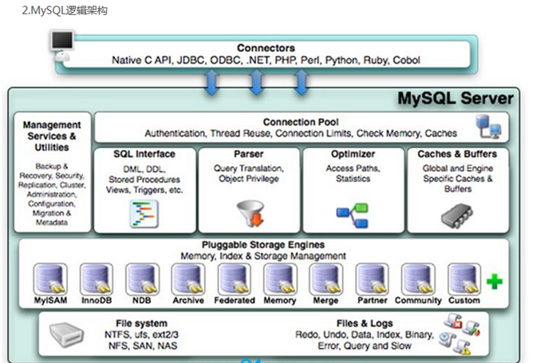

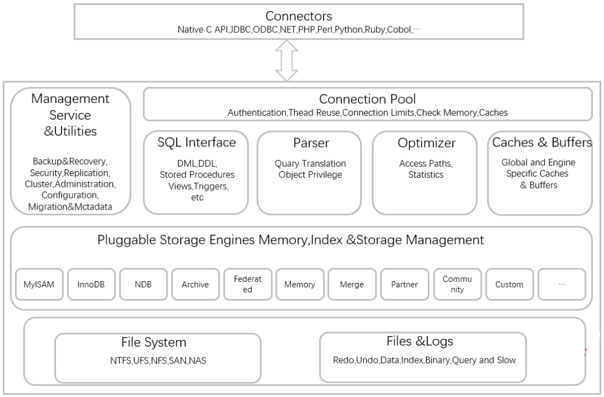

### 047 Mysql内部支持缓存查询吗？

当MySQL接收到客户端的查询SQL之后，仅仅只需要对其进行相应的权限验证之后，就会通过Query Cache来查找结果，甚至都不需要经过Optimizer模块进行执行计划的分析优化，更不需要发生任何存储引擎的交互

**mysql5.7支持内部缓存，8.0之后就废弃掉了**

### 048 mysql8为何废弃掉查询缓存？

缓存的意义在于快速查询提升系统性能，可以灵活控制缓存的一致性

mysql缓存的限制

1. mysql基本没有手段灵活的管理缓存失效和生效，尤其对于频繁更新的表
2. SQL必须完全一致才会导致cache命中
3. 为了节省内存空间，太大的result set不会被cache (query_cache_limit参数控制查询缓存区大小)；
4. MySQL缓存在分库分表环境下是不起作用的；
5. 执行SQL里有触发器,自定义函数时，MySQL缓存也是不起作用的；
6. 在表的结构或数据发生改变时，基于该表相关cache立即全部失效。

### 049 MySQL无缓存后，替代方案是什么？

应用层组织缓存，最简单的是使用redis，ehcached等


### 050 Mysql内部有哪些核心模块组成，作用是什么？

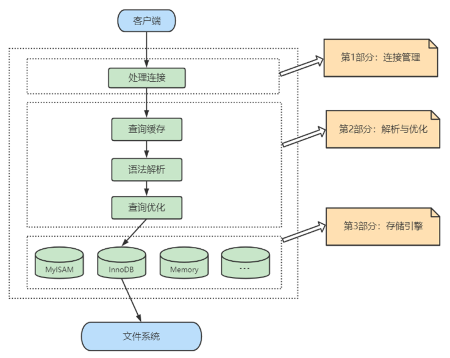

#### **Connectors（客户端）**

MySQL服务器之外的客户端程序，与具体的语言相关，例如Java中的JDBC，图形用户界面SQLyog等。`本质上都是在TCP连接上通过MySQL协议和MySQL服务器进行通信。`

#### **MySQL Server（服务器）**

##### **第1层：连接层**

- 系统（客户端）访问 MySQL 服务器前，做的`第一件事就是建立 TCP 连接`。
- 经过三次握手建立连接成功后， MySQL 服务器对 TCP 传输过来的账号密码做`身份认证、权限获取`。
  - 用户名或密码不对`，会收到一个`Access denied for user`错误，客户端程序结束执行`
  - `用户名密码认证通过`，会从权限表`查出账号拥有的权限`与连接关联，之后的权限判断逻辑，都将依赖于此时读到的权限
- TCP 连接收到请求后，必须要分配给一个线程专门与这个客户端的交互。所以还会有个线程池，去走后面的流程。每一个连接从线程池中获取线程，省去了创建和销毁线程的开销。

##### **第2层：服务层**

**SQL Interface：SQL接口：**

- `接收用户的SQL命令，并且返回用户需要查询的结果。`比如SELECT ... FROM就是调用SQL Interface 
- MySQL支持DML（数据操作语言）、DDL（数据定义语言）、存储过程、视图、触发器、自定义函数等多种SQL语言接口

###### **Parser：解析器**

- 在SQL命令传递到解析器的时候会被解析器验证和解析。解析器中SQL 语句进行`语法分析、语法解析`，并为其创建`语法树`。

**语法分析**

语法分析主要是把输入转化成若干个tokens，包含key和非key。在分析之后，会得到4个Token，其中有2个key，它们分别是SELECT、FROM。

| key    | 非key | key  | 非key |
| ------ | ----- | ---- | ----- |
| SELECT | age   | FROM | user  |

- 典型的解析树如下：

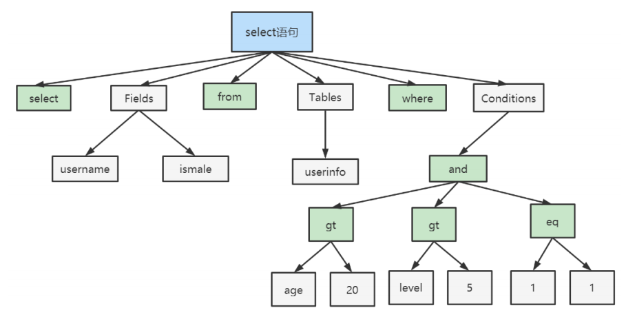

###### Optimizer：查询优化器

- SQL语句在语法解析后、查询前会使用查询优化器对查询进行优化，`确定SQL语句的执行路径，生成一个执行计划`。

###### Caches & Buffers： 查询缓存组件

- MySQL内部维持着一些Cache和Buffer，比如Query Cache用来缓存一条SELECT语句的执行结果，如果能够在其中找到对应的查询结果，那么就不必再进行查询解析、查询优化和执行的整个过程了，直接将结果反馈给客户端。
- 这个缓存机制是由一系列小缓存组成的。比如表缓存，记录缓存，key缓存，权限缓存等 。
- 这个查询缓存可以在不同客户端之间共享 。 

##### **第3层：存储引擎层**

插件式存储引擎层（ Storage Engines），`负责MySQL中数据的存储和提取，对物理服务器级别维护的底层数据执行操作，服务器通过API与存储引擎进行通信`。不同的存储引擎具有的功能不同，管理的表有不同的存储结构，采用的存取算法也不同，这样我们可以根据自己的实际需要进行选取。例如MyISAM引擎和InnoDB引擎。

##### 第4层：文件系统层

所有的数据、数据库、表的定义、表的每一行的内容、索引，都是存在`文件系统` 上，以文件的方式存在，并完成与存储引擎的交互。


### 051  MySQL 执行一条查询语句的内部执行过程

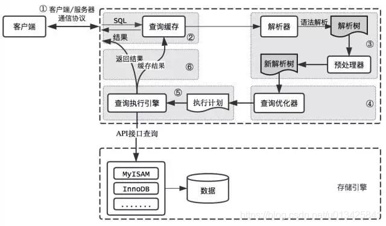

**首先，**`MySQL客户端通过协议与MySQL服务器建连接，通过SQL接口发送SQL语句，先检查查询缓存，如果命中，直接返回结果，否则进行语句解析。`也就是说，在解析查询之前，服务器会先访问查询缓存，如果某个查询结果已经位于缓存中，服务器就不会再对查询进行解析、优化、以及执行。它仅仅将缓存中的结果返回给用户即可，这将大大提高系统的性能。

**接下来，**`MySQL解析器通过关键字将SQL语句进行解析，并生成一棵对应的解析树，`解析器使用MySQL语法规则验证和解析SQL语句。例如，它将验证是否使用了错误的关键字，或者使用关键字的顺序是否正确，引号能否前后匹配等；`预处理器则根据MySQL规则进一步检查解析树是否合法，`例如，这里将检查数据表和数据列是否存在，还会解析名字和别名，看是否有歧义等。`然后预处理器会进行查询重写，生成一棵新解析树。`

**接下来，**`查询优化器将解析树转化成执行计划。`MySQL优化程序会对我们的语句做一些优化，如子查询转换为连接、表达式简化等等。优化的结果就是生成一个执行计划，这个执行计划表明了应该使用哪些索引执行查询，以及表之间的连接顺序是啥样，等等。我们可以使用EXPLAIN语句来查看某个语句的执行计划。

**最后，**`进入执行器阶段。`完成查询优化后，`查询执行引擎`会按照生成的执行计划调用存储引擎提供的接口执行SQL查询并将结果返回给客户端。在MySQL8以下的版本，如果设置了查询缓存，这时会将查询结果进行缓存，再返回给客户端。

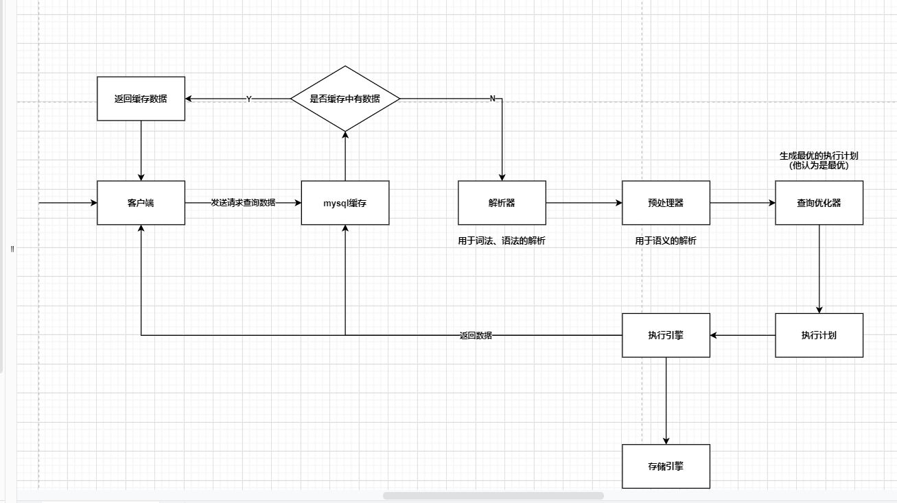


### 052 MySQL 提示“不存在此列”是执行到哪个节点报出的？

是在Parser：解析器 分析sql语法的时候检查的列。


### 053 如果一张表创建了多个索引，在哪个阶段或模块进行的索引选择？

在优化器阶段**Optimizer：查询优化器：**


### 054 MySQL 支持哪些存储引擎？默认使用哪个？

查看MySQL提供什么存储引擎

```sql
SHOW ENGINES;
```

下面的结果表示MySQL中默认使用的存储引擎是InnoDB，支持事务，行锁，外键，支持分布式事务(XA)，支持保存点(回滚)

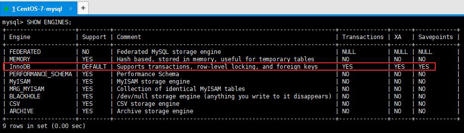


也可以通过以下语句查看默认的存储引擎：

```sql
SHOW VARIABLES LIKE '%default_storage_engine%';
```

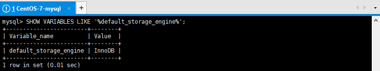


### 055 Mysql8.0自带哪些存储引擎？分别是做什么的？

#### 1. InnoDB存储引擎

- InnoDB是MySQL的默认事务型引擎，它被设计用来`处理大量的短期(short-lived)事务`。可以确保事务的完整提交(Commit)和回滚(Rollback)。
- 除非有非常特别的原因需要使用其他的存储引擎，否则`应该优先考虑InnoDB引擎`。
- 数据文件结构：
  - 表名.frm 存储表结构（MySQL8.0时，合并在表名.ibd中）
  - 表名.ibd 存储数据和索引
- InnoDB不仅缓存索引还要缓存真实数据， 对内存要求较 高 ，而且内存大小对性能有决定性的影响。

#### 2. MyISAM存储引擎

- MyISAM提供了大量的特性，包括全文索引、压缩、空间函数(GIS)等，但`MyISAM不支持事务和行级锁`，有一个毫无疑问的缺陷就是崩溃后无法安全恢复。

- 优势是访问的 速度快 ，对事务完整性没有要求或者以SELECT、INSERT为主的应用。
- 数据文件结构：
  - 表名.frm 存储表结构
  - 表名.MYD 存储数据
  - 表名.MYI 存储索引
 - MyISAM只缓存索引，不缓存真实数据。

#### 3. Archive引擎

- `Archive档案存储引擎只支持INSERT和SELECT操作`。
- Archive表适合日志和数据采集（档案）类应用。
- 根据英文的测试结论来看，Archive表比MyISAM表要小大约75%，比支持事务处理的InnoDB表小大约83%。

#### 4. Blachole引擎

- `Blackhole引擎没有实现任何存储机制，它会丢弃所有插入的数据，不做任何保存`。
- 但服务器会记录Blackhole表的日志，所以可以用于复制数据到备库，或者简单地记录到日志。但这种应用方式会碰到很多问题，因此并不推荐。 

#### 5. CSV引擎

- `CSV引擎可以将普通的CSV文件作为MySQL的表来处理，但不支持索引`。
- CSV引擎可以作为一种数据交换的机制，非常有用。
- CSV存储的数据直接可以在操作系统里，用文本编辑器，或者excel读取。

#### 6. Memory引擎

- 如果需要快速地访问数据，并且这些数据不会被修改，重启以后丢失也没有关系，那么使用Memory表是非常有用。
- Memory表至少比MyISAM表要快一个数量级。

#### 7.Federated引擎

- `Federated引擎是访问其他MySQL服务器的一个代理（跨库关联查询）`，尽管该引擎看起来提供了一种很好的跨服务器的灵活性，但也经常带来问题，因此默认是禁用的。


### 056 介绍一下Innodb存储引擎

https://dev.mysql.com/doc/refman/5.7/en/innodb-architecture.html

下面是官方的InnoDB引擎结构图，主要分为内存结构和磁盘结构两大部分。

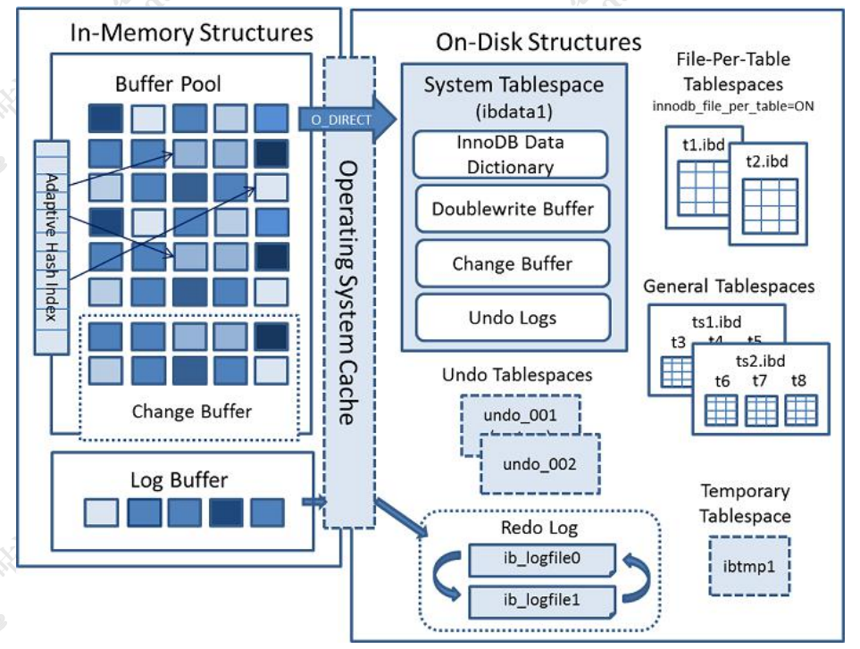

共分为四个部分：

①Buffer Pool：缓冲池。作用：**用来缓存表数据和索引**数据，为了减少磁盘I/O操作，提升效率

②Change Buffer：写缓冲区。作用：**针对二级索引页（辅助索引）的更新优化措施**

③Log Buffer：日志缓冲区。作用：**（1）用来保存写入磁盘上的log文件（redo、undo）的数据；（2）用来优化每次更新操作都要写入redo Log 产生的磁盘I/O**。日志缓冲区内容会定期刷新到磁盘Log文件中

④Adaptive Hash Index：自适应Hash索引。作用：InnoDB不智齿手动创建Hash索引，但是它会进行自调优。判断如果建立了自适应Hash索引能够提升查询效率，则会在内存中建立相关的Hash索引，不需要人工干预。Innodb会根据自己的需求去创建Hash索引。

#### 1、内存区域

##### **Buffer Pool**

在InnoDB访问表记录和索引时会在Buffer Pool的页中缓存，以后使用可以减少磁盘IO操作，提升效率。主要用来缓存热的数据页和索引页。

Buffe Pool 有**缓存数据页（Page）**和对缓存数据页进行描述的**控制块**组成。

（1）缓存数据页（Page）：Innodb 存储引擎以 页 为单位对数据进行划分，以页作为磁盘和内存监护的基本单位。默认页大小（16KB）。

Buffe Pool 除了缓存了索引页和数据页，还有undo页，自适应哈希索引、插入缓存页、锁信息等。

（2）控制块：控制块中存储着对应的缓存页所属的表空间信息，数据页编号，控制块所对应的缓存页在Buffe Pool 中的地址信息。

（3）Buffe Pool 默认大小为128M，以Page（16KB）为单位，控制块一般为Page的5%大小大约800字节。

###### 发散1、**如何判断一个数据页是否在Buffe Pool 中？**

​	MySQL中有一个Hash表结构，在该结构中以“**表空间号+数据页编号**” 作为KEY值；以“**缓存页对应的控制块**”作为VALUE值。当需要访问某个页的数据时，先从Hash表中根据 表空间号+数据页编号 查看是否存在对应的缓存页，如果有，则直接使用；如果没有，则从free链表里面拿出来一个空闲缓存页，把磁盘中对应的页加载到该缓存页的位置

###### 发散2、在Buffe Pool 中如何管理Page页？

Page页分类：在Buffe Pool底层采用链表管理Page。Page根据状态分为三种类型：

1）free Page：空闲Page，未被使用的；

2）clean Page：被使用的Page，但是数据没有被修改过；

3）dirty Page：脏页，被使用过的Page，并且数据被更改过，缓存也中的数据和磁盘数据不一致，需要后期写入磁盘中；

上面三种Page类型，Innodb采用三种不同的链表结构进行维护和管理。

1）==free list（双向链表）==：把所有的空闲缓存页对应的控制块作为节点放在==free list（双向链表）==中。

磁盘加载页的流程：

> ①从free list中取出一个空闲的控制块（对应缓存页）
>
> ②把该缓存页对应的控制块信息填上
>
> ③把缓存页对应的free 链表节点从链表中删除。

2）==flush list（双向链表）== ：该链表表示需要刷新到磁盘缓冲区，**==管理脏页==**。内部Page按照修改时间排序。

由后台线程负责每隔一段时间把脏页刷新到磁盘中。

3）==lru list==。表示正在使用的缓冲区，**管理 clean Page和dirty Page**，该缓冲区以 midpoint为基点，前面的链表称为 new 列表区，存放经常使用的数据（站63%）；后面的链表称为 old 列表区，存放不经常访问的数据（占37%）

注意：dirty Page在flush list 和 lru list里面都存在，但是两者互不影响。lru list负责管理Page 的可用性和释放；flush list负责管理dirty Page 的刷盘操作

##### **Log Buffer**

是日志缓冲区。**用来保存要写入磁盘上的log（redo ,undo）文件的数据。**Log Buffer定期进行刷盘

Log Buffer作用：用来优化每次更新操作后都要写入redo log而产生的磁盘I/O过多问题。【Log Buffer满是自动刷盘，当遇到BLOB或者更新语句多的大事务时，增加Log Buffer可以节省磁盘I/O】


##### **Adaptive Hash Index**

自适应哈希索引

##### **Change Buffer**

==写缓冲区，是针对二级索引页的更新优化措施。==应用在非唯一普通索引页（non-unique secondary index page）不在缓冲池中，对页进行了写操作，并不会立刻将磁盘页加载到缓冲池，而仅仅记录缓冲变更（Buffer Changes），等未来数据被读取时，再将数据合并（Merge）恢复到缓冲池中的技术。写缓冲的目的是降低写操作的磁盘IO，提升数据库性能。


==主要作用：==在进行DML操作时，如果请求的是二级索引（辅助索引）并且没有在缓冲池中，此时，并不会立刻加载到缓冲池，而是在Change Buffer中记录缓冲变更，等待未来数据被读取的时候，再将数据合并恢复到Buffer Pool.

Change Buffer 占用了Buffer Pool空间，默认占用25%，最大允许占用50%。（这个根据具体业务量而定）

应用场景：对于写多读少的场景，页面在写完之后马上被访问的效率比较小，这时候在使用Change Buffer效果最好。


###### 什么情况下进行Merge？

1）访问这个数据页会触发Merge

2）系统有后台线程，定期Merge

3）在数据库正常关闭过程中，回执行Merge

###### ==Change Buffer 更新流程==

**写缓冲区，仅适用于非唯一二级索引页，为什么?**

如果索引设置了唯一性，在进行修改时，InnoDB就必须要做唯一性校验，因此必须查询磁盘，做一次I0操作。
会直接将记录查询到Buffer Pool中，然后在缓冲池中修改，不会在Change Buffer 中操作。


#### 2、磁盘区域

磁盘中的结构分为两大类：表空间和重做日志。

官方文档：https://dev.mysql.com/doc/refman/8.0/en/innodb-storage-engine.html

- 表空间：是Innodb物理存储中的最后高层。分为系统表空间(MySQL 目录的 ibdata1 文件)，临时表空间，常规表空间，Undo 表空间以及 file-per-table 表空间(MySQL5.7默认打开file_per_table 配置）。系统表空间又包括了InnoDB数据字典，双写缓冲区(Doublewrite Buffer)，修改缓存(Change Buffer），Undo日志等。
- Redo日志：存储的就是 Log Buffer 刷到磁盘的数据。


##### （1）系统表空间

是一个共享的表空间，该空间的数据文件默认是 IBDATA1.

在设置了系统表空间自动增长后，是不可缩减的，即使删除系统表空间中存储的表和索引，也不会缩减其在磁盘中的大小。（默认大小12M）

**数据字典**：包含表结构，数据库名/表名，字段类型，视图，索引，表字段信息，mysql版本等信息。

**双写缓冲区**：y哦那个与保证写入磁盘时页数据的完整性，防止写失效问题。

**修改缓冲区**：内存中ChangeBuffer对应的持久化区域，为了保证数据完整性。

**回滚日志（Undo log）**：记录数据修改前的状态，逻辑日志。主要用来实现事务回滚，实现MVCC

##### （2）独立表空间

每个表都有自己的独立表空间，并且每个表的数据和索引都存在自己的表空间中。

作用：可以实现单表在不同数据库中的移动。表空间可以回收（再执行删除或者清空操作后，会还给操作系统）

##### （3）通用表空间

与系统表空间类似，是共享的，可以存储多个表数据。（比独立表空间消耗的内存少，占有磁盘空间小）

##### （4）回滚表空间

用来保存回滚日志。undo log默认保存在系统表空间的ibdata1文件中。

参数innodb_undo_tablespace =0 表示不开启独立表空间，1表示开启。

##### 什么时候需要开启undo 表空间？

由于系统表空间不会自动缩减，当出现大事务时，undo log 会不断增大，当ibdata1文件写满时，MySQL8.0之后对Undo进行了分离，默认会产生两个undo表空间文件，进行动态的扩缩容。

##### （5）临时表空间

用于存储用户创建的临时表和磁盘内部的临时表。MySQL5.7之后采用独立的临时表空间，命名为 ibtmp1 文件，初始大小12M，默认无上限。


### 057 能否单独为一张表设置存储引擎？

`方法1：`

设置默认存储引擎：

```sql
SET DEFAULT_STORAGE_ENGINE=MyISAM;
```

`方法2：`

或者修改 my.cnf 文件：vim /etc/my.cnf
新增一行：default-storage-engine=MyISAM 
重启MySQL：systemctl restart mysqld

`方法3：`

我们可以为 不同的表设置不同的存储引擎

```sql
CREATE TABLE 表名( 建表语句; ) ENGINE = 存储引擎名称;
ALTER TABLE 表名 ENGINE = 存储引擎名称;
```


### 058 阿里、京东等大厂都有自研的存储引擎，如何开发一套自己的？

开发存储引擎并不难，难的是开发出来高效的有意义的存储引擎。

简单例子可以看一下官方源码中的示例，可以实现一个什么也没做的存储引擎。

有兴趣可以参考官方文档：https://dev.mysql.com/doc/dev/mysql-server/latest/


### 059 MyISAM 和 InnoDB 的区别是什么？

| **对比项**     | **MyISAM**                                               | **InnoDB**                                                   |
| -------------- | -------------------------------------------------------- | ------------------------------------------------------------ |
| **外键**       | 不支持                                                   | 支持                                                         |
| 事务           | 不支持                                                   | 支持                                                         |
| **行表锁**     | 表锁，即使操作一条记录也会锁住整个表，不适合高并发的操作 | 行锁，操作时只锁某一行，不对其它行有影响，适合高并发的操作   |
| 缓存           | 只缓存索引，不缓存真实数据                               | 不仅缓存索引还要缓存真实数据，对内存要求较高，而且内存大小对性能有决定性的影响 |
| 关注点         | 并发查询，节省资源、消耗少、简单业务                     | 并发写、事务、多表关系、更大资源                             |
| 默认安装       | Y                                                        | Y                                                            |
| 默认使用       | N                                                        | Y                                                            |
| 自带系统表使用 | Y                                                        | N                                                            |


### 060 具体说一下如何做技术选型

除非几乎没有写操作全部都是高频的读操作可以选择MyISAM作为表的存储引擎，其他业务可以一律使用InnoDB。


## 三 、mysql 事务

### 061 什么是数据库事务？

**事务**

- 是数据库操作的最小工作单元，是作为单个逻辑工作单元执行的一系列操作；

- 这些操作作为一个整体一起向系统提交，要么都执行、要么都不执行；

- 事务是一组不可再分割的操作集合（工作逻辑单元）


### 062 事务的特性是什么？

#### **1 、原子性**  atomicity

事务是数据库的逻辑工作单位，事务中包含的各操作**要么都做，要么都不做** 

#### **2 、一致性**  consistency

事务执行的结果必须是使数据库从一个一致性状态变到另一个一致性状态。因此当数据库只包含成功事务提交的结果时，就说数据库处于一致性状态。如果数据库系统 运行中发生故障，有些事务尚未完成就被迫中断，这些未完成事务对数据库所做的修改有一部分已写入物理数据库，这时数据库就处于一种不正确的状态，或者说是 不一致的状态。 

#### **3 、隔离性** isolation

一个事务的执行不能其它事务干扰。即一个事务内部的操作及使用的数据对其它并发事务是隔离的，并发执行的各个事务之间不能互相干扰。 

#### **4 、持续性** **永久性** durability

也称永久性，指一个事务一旦提交，它对数据库中的数据的改变就应该是永久性的。接下来的其它操作或故障不应该对其执行结果有任何影响。

 Innodb有两种事务日志：

​	**==Redo log：重做日志==**。用于保证事务持久性

​	**==Undo log：回滚日志==**。用于保证事务的原子性和隔离性


### 063 并发事务会有哪些问题？

多个事务并发执行一定会产生相互争夺资源的问题

| 问题                               | 数据是否正确                 | 是否需事务隔离 |
| :--------------------------------- | :--------------------------- | :------------- |
| **脏读**（Dirty read）             | 严重错误（数据从未真正存在） | 必须避免       |
| **不可重复读**（Unrepeatableread） | 数据虽真实，但前后矛盾       | 视业务需求而定 |
| **幻读**（Phantom read）           | 行数变化，逻辑不一致         | 视业务需求而定 |
| **更新丢失**（Lost of modify）     | 严重错误（更新被覆盖）       | 必须避免       |


### 064 什么是脏读     

**脏读（Dirty read）**：是一个事务在处理过程中读取了另外一个事务未提交的数据

当一个事务正在访问数据并且对其进行了修改，但是还没提交事务，这时另外一个事务也访问了这个数据，然后使用了这个数据，因为这个数据的修改还没提交到数据库，所以另外一个事务读取的数据就是“**脏数据**”，这种行为就是“**脏读**”，依据“**脏数据**”所做的操作可能是会出现问题的。


###  065 丢失修改

**修改丢失（Lost of modify）**：*是指一个事务读取一个数据时，另外一个数据也访问了该数据，那么在第一个事务修改了这个数据之后，第二个事务也修改了这个数据。这样第一个事务内的修改结果就被丢失，这种情况就被称为修改丢失。


### 066 不可重复读 

**不可重复读（Unrepeatableread）**：指在一个事务内多**次读取同一数据**，在这个事务还没结束时，另外一个事务也访问了这个数据并**对这个数据进行了修改**，那么就可能造成第一个事务两次读取的数据不一致，这种情况就被称为不可重复读。


###   067 幻读

**幻读（Phantom read）**：是指同一个事务内多次查询返回的结果集总数不一样（比如增加了或者减少了行记录）。

幻读与不可重复读类似，幻读是指一个事务**读取了几行数据**，这个事务还没结束，接着另外一个事务**插入了一些数据**，在随后的查询中，第一个事务读取到的数据就会**比原本读取到的多**，就好像发生了幻觉一样，所以称为\**幻读**。


### 068 不可重复读和幻读有什么区别？

核心区别在于：**不可重复读**侧重“**数据值**变了”（针对同一行），而**幻读**侧重“**记录条数**变了”（针对满足条件的记录集合）

|              | ** 不可重复读**                                     | **幻读**                                     |
| :----------- | :-------------------------------------------------- | -------------------------------------------- |
| **关注点**   | 同一行数据的**字段值**                              | 满足条件的**记录集合**（行数或某行是否存在） |
| **触发操作** | 其他事务对**已有数据**执行 **UPDATE** 或 **DELETE** | 其他事务执行 **INSERT** 或 **DELETE**        |
| **后果**     | 同一事务两次读某行，内容变不同                      | 同一事务两次查询，返回的行数变不同           |
| **解决机制** | 行锁（锁定已存在的行）                              | 间隙锁或范围锁（锁定不存在的“间隙”）         |


### 069 Mysql是如何避免事务并发问题的？

避免事务并发问题是需要付出性能代价的，此时和分布式系统设计一样（CAP定理及base理论），为了保证一致性就一定会牺牲性能，要做取舍

在mysql内部通过加锁的方式实现好了解决方案可供选择，就是配置事务隔离级别


### 070 什么是事务隔离级别？

#### 总表

| 隔离级别                         | 脏读      | 不可重复读 | 幻读                                        |
| :------------------------------- | :-------- | :--------- | :------------------------------------------ |
| **读未提交**（READ-UNCOMMITTED） | 不可避免❌ | 不可避免❌  | 不可避免❌                                   |
| **读已提交**（READ-COMMITTED）   | 可避免✅   | 不可避免❌  | 不可避免❌                                   |
| **可重复读**（REPEATABLE-READ）  | 可避免✅   | 可避免✅    | 不可避免❌（InnoDB的RR级别通过间隙锁解决了） |
| **可串行化**（SERIALIZABLE）     | 可避免✅   | 可避免✅    | 可避免✅                                     |

> **补充说明**：
>
> - **更新丢失**不能单靠隔离级别完全防止，通常需要使用**悲观锁**（`SELECT ... FOR UPDATE`）或**乐观锁**（版本号机制）。
> - MySQL InnoDB引擎在**可重复读**级别下，通过**间隙锁**机制解决了幻读问题，这是它与SQL标准定义的不同之处。

简单来说：如果业务对数据一致性要求极高（如金融系统），建议使用**可重复读**或**可串行化**，并结合乐观/悲观锁机制；如果只要求最终数据正确，短期内的不可重复读可以接受，使用**读已提交**即可获得更好的并发性能。

不同的事务隔离级别通过不同的机制（主要是**锁**和**MVCC，多版本并发控制**）来避免这几个问题。下面分别说明每个级别具体是如何做到的。

#### 1、读未提交（Read Uncommitted）

- **避免问题的能力**：❌ 什么都不避免
- **原理**：事务几乎不加锁，读操作直接读最新数据（包括未提交的修改）
- **避免方式**：无
- **脏读为何发生**：读到其他事务未提交的修改 → 可能发生
- **不可重复读**：可能发生
- **幻读**：可能发生

**适用**：几乎不用，除非能接受完全不一致的临时查询。

---

#### 2、读已提交（Read Committed）

- **避免脏读**：✅
- **避免不可重复读**：❌
- **避免幻读**：❌

##### (1) 如何避免脏读？
- **原理**：读操作只认**已提交**的数据
- **实现方式**（两种常见方案）：
  - **MVCC（主流）**：每条数据有多个版本，事务只能看到比自己启动早（或已提交）的版本
  - **读锁+立即释放**：读时加共享锁，读完立刻释放（不保持到事务结束）
- **效果**：未提交的修改对其他事务不可见 → **脏读被避免**

##### (2) 为什么仍可能不可重复读/幻读？
- **不可重复读**：两次读之间，另一个事务**提交**了修改，且两次读各自看到最新提交版本 → 值可能不同
- **幻读**：第二次查询时，别的已提交事务新增/删除了符合条件的行 → 行数可能变化

**适用**：很多业务系统的默认级别（如Oracle、PostgreSQL默认），平衡一致性和性能。

---

#### 3、可重复读（Repeatable Read）

- **避免脏读**：✅
- **避免不可重复读**：✅
- **避免幻读**：标准定义下❌，但 **MySQL InnoDB 通过间隙锁避免** ✅

##### (1) 如何避免不可重复读？
- **MVCC + Read View 复用**：
  - 事务开始时生成一个 **Read View**（快照）
  - 整个事务期间，**复用同一个 Read View**
  - 无论其他事务如何修改并提交，读到的始终是快照版本
- **效果**：同一事务内多次读同一行，值不变 → **不可重复读被避免**

##### (2) 如何避免幻读（InnoDB实现）？
标准定义下可重复读**不避免幻读**，但InnoDB通过**间隙锁**做到了：
- 执行 `SELECT ... FOR UPDATE/LOCK IN SHARE MODE` 或 `UPDATE/DELETE` 时
- 不仅锁住已存在的行，还锁住查询条件范围内的**间隙**（gap）
- 其他事务无法在间隙中插入新行
- 普通 `SELECT` 走 MVCC 快照读，本来就不存在幻读（看到的是旧快照）

**注意**：InnoDB的“可重复读+快照读”天然没有幻读问题；只有当前读才会因间隙锁避免幻读。

**适用**：MySQL默认级别，适合多数OLTP场景（如金融、订单系统）。

---

#### 4、可串行化（Serializable）

- **避免所有三个问题**：✅✅✅

##### (1) 如何做到？
- **严格两阶段锁 + 间隙锁**：
  - 读操作加**共享锁**，写操作加**排他锁**
  - 所有锁持有到事务结束（COMMIT/ROLLBACK）
  - 范围查询还会加**间隙锁**（或谓词锁）
- **效果**：事务完全串行化执行，任何并发冲突都被阻塞

##### (2) 为什么能避免所有问题？
- **脏读**：读未提交的数据？排他锁阻塞读 → 不可能
- **不可重复读**：其他事务修改？共享锁一直持有 → 无法修改 → 值不变
- **幻读**：其他事务插入？间隙锁阻止插入 → 行数不变

**代价**：并发性能极低，几乎串行执行。

**适用**：极少数对一致性要求绝对严格且写并发低的场景（如某些报表对账）。

---

#### 总结对比表

| 隔离级别               | 避免脏读机制          | 避免不可重复读机制   | 避免幻读机制  |
| :--------------------- | :-------------------- | :------------------- | :------------ |
| **读未提交**           | 无                    | 无                   | 无            |
| **读已提交**           | MVCC（或锁+立即释放） | 无（两次读快照不同） | 无            |
| **可重复读**（标准）   | MVCC                  | MVCC（同一快照）     | 无            |
| **可重复读**（InnoDB） | MVCC                  | MVCC（同一快照）     | 间隙锁        |
| **可串行化**           | 共享/排他锁           | 锁持有到事务结束     | 间隙锁/谓词锁 |


### 071 默认的级别是什么？

`MySQL InnoDB`存储引擎默认的事务隔离级别是**可重复读（REPEATABLE-READ）**

```
MySQL 5.7 SELECT @@tx_isolation;
MySQL 8.0 SELECT @@transaction_isolation;
```


### 072 如何选择事务隔离级别？

隔离级别越低，事务请求的锁越少相应性能也就越高，如没有特殊要求或有错误发生，使用默认的隔离级别即可，如果系统中有高频读写并且对一致性要求高那么就需要比较高的事务隔离级别甚至串行化。


### 073 靠缓存可以提升高事务隔离级别的性能吗？

提升事务级别的目的本质是提供更高的数据一致性，如果前置有缓存，那么缓存只能提供高效读并不能保证数据及时一致性，相反的我们还需要对缓存管理有额外的开销。


### 074 Mysql事务隔离是如何实现的？

隔离的实现主要是读写锁和MVCC


### 075 什么是一致性非锁定读和锁定读？

#### **锁定读**

使用到了读写锁，读操作**必须加锁**，读取的是**最新已提交的数据**，并阻塞其他事务的冲突操作。

**核心原理：锁机制**

- **共享锁**：多个事务可以同时加共享锁读同一行，但任何事务不能加排他锁
- **排他锁**：只有一个事务能加排他锁，其他读写都被阻塞
- 锁通常持有到事务结束（COMMIT/ROLLBACK）

读写锁是最简单直接的的事务隔离实现方式

- 每次读操作需要获取一个共享(读)锁，每次写操作需要获取一个写锁。
- 共享锁之间不会产生互斥，共享锁和写锁之间、以及写锁与写锁之间会产生互斥。
- 当产生锁竞争时，需要等待其中一个操作释放锁后，另一个操作才能获取到锁。

锁机制，解决的就是**多个事务同时更新数据**，此时必须要有一个加锁的机制

- 行锁（记录锁）：解决的就是**多个事务同时更新一行数据**
- 间隙锁：解决的就是**多个事务同时更新多行数据**

下列操作属于锁定读

```
select ... lock in share mode
select ... for update
insert、update、delete
```


#### **非锁定读**

读操作**不需要加锁**，读取的是某个时间点的**快照数据**，而不是最新的数据。

**核心原理：MVCC**

- 每行记录可能有多个版本（通过DB_TRX_ID、DB_ROLL_PTR等隐藏字段）
- 根据当前事务的隔离级别和 Read View，决定读取哪个版本
- 读操作不阻塞写操作，写操作也不阻塞读操作

**特点：**

- **高并发**：读不阻塞写，写不阻塞读
- **无锁开销**：不需要等待或释放锁
- **一致性**：事务内看到的是稳定的快照


### 076	说一下MVCC内部细节

https://dev.mysql.com/doc/refman/5.7/en/innodb-multi-versioning.html

MVCC（Multi-Version Concurrency Control 多版本并发控制）是一种并发控制的方法，一般在数据库管理系统中，实现对数据库的并发访问

InnoDB是一个多版本的存储引擎。它保存有关已更改行的旧版本的信息，以支持并发和回滚等事务特性。这些信息存储在一个称为回滚段的数据结构中的系统表空间或undo表空间中。参见第14.6.3.4节“撤消表空间”。InnoDB使用回滚段中的信息来执行事务回滚所需的撤消操作。它还使用这些信息构建行的早期版本，以实现一致的读取。

MVCC 的实现依赖于：隐藏字段、Read View、undo log

#### **隐藏字段**

主要作用：标记，回滚，生成没有主键的B+树索引

```sql
6-byte DB_TRX_ID 
## 用来标识最近一次对本行记录做修改 (insert 、update) 的事务的标识符 ，即最后一次修改本行记录的事务 id。 如果是 delete 操作， 在InnoDB存储引擎内部也属于一次 update 操作，即更新行中的一个特殊位 ，将行标识为己删除，并非真正删除。

7-byte DB_ROLL_PTR
## 回滚指针，指向该行的 undo log。如果该行未被更新，则为空.

6-byte DB_ROW_ID
## 如果没有设置主键且该表没有唯一非空索引时，InnoDB会使用该 id 来生成聚簇索引.
```

#### **Read View**

不同的事务隔离级别中，当有事物在执行过程中修改了数据（更新版本号），在并发事务时需要判断一下版本链中的哪个版本是当前事务可见的。为此InnoDB有了ReadView的概念，使用ReadView来记录和隔离不同事务并发时此记录的哪些版本是对当前访问事物可见的。

#### **undo log**

除了用来回滚数据，还可以读取可见版本的数据。以此实现非锁定读


### 077 Mysql事务一致性，原子性是如何实现的？

首先是通过**锁和mvcc**实现了执行过程中的**一致性和原子性**

其次是在灾备方面通过Redo log实现，Redo log会把事务在执行过程中对数据库所做的所有修改都记录下来，在之后系统崩溃重启后可以把事务所做的任何修改都恢复出来。

#### 一、原子性如何实现？

原子性意味着：事务中的操作要么全部成功，要么全部失败（回滚）。MySQL 通过 **undo log** 实现这一点。

**1. undo log 是什么？**
- 逻辑日志，记录的是“如何撤销/反向操作”的信息。
- 例如：
  - `INSERT` → 记录对应的 `DELETE`
  - `DELETE` → 记录对应的 `INSERT`
  - `UPDATE` → 记录修改前的旧值

**2. 工作流程**
- **事务执行时**：每修改一行数据，MySQL 会先写一条 undo log，记录修改前的状态。
- **事务提交前**：如果发生错误或显式 `ROLLBACK`，MySQL 根据 undo log 中的“反向操作”将数据恢复原状。
- **事务提交后**：对应的 undo log 并不会立即删除（可能被其他事务用于 MVCC），但不再用于回滚。

**3. 关键点**

- 原子性依赖 undo log + 故障恢复机制。
- 即使事务执行到一半崩溃，重启后 InnoDB 会通过 undo log 将未提交事务的修改全部回滚。

#### 二、一致性如何实现？

一致性是 ACID 的最终目标，它依赖**原子性、隔离性、持久性**共同保证，但底层主要靠以下机制：

**1. 数据库层面约束**
- 主键、唯一索引、外键、CHECK 约束、NOT NULL 等，会在执行语句时直接拒绝破坏一致性的操作。

**2. 事务机制保证**
- **原子性** 保证不会出现“部分修改”
- **隔离性**（通过 MVCC + 锁）避免脏读、不可重复读等，防止看到中间不一致状态
- **持久性**（通过 redo log）保证提交的修改不丢失

**3. 具体例子**
- 转账：A 扣 100，B 加 100
  - 如果没有原子性：扣完 A 后崩溃 → 总金额少了 100 ❌
  - 有了原子性：崩溃后回滚 → A 的钱还在 ❌（未完成）
  - 有了持久性：提交成功 → A 减 100，B 加 100 永久生效 ✅

#### 三、与 Redo Log 的关系

你可能会问：redo log 是干什么的？它主要保证**持久性**，但也间接支持原子性。

- **redo log**：记录“做了什么”（物理日志，如“将 page 5 的偏移 100 处的值改为 200”）
- **事务提交时**：先写 redo log（准备阶段），再写 binlog，最后提交。
- **崩溃恢复时**：
  - 已提交但未刷盘的事务 → 重做 redo log
  - 未提交的事务 → 用 undo log 回滚

**两者配合**：redo log 保证重做，undo log 保证回滚，共同维护了事务的原子性和持久性。


#### 四、总结对照表

| 特性       | 核心实现机制                    | 作用                                     |
| ---------- | ------------------------------- | ---------------------------------------- |
| **原子性** | undo log                        | 记录反向操作，事务回滚或崩溃时恢复原状   |
| **一致性** | 原子性 + 隔离性 + 持久性 + 约束 | 保证事务从一个一致状态到另一个一致状态   |
| **隔离性** | MVCC + 锁                       | 并发事务互不干扰                         |
| **持久性** | redo log                        | 提交的事务修改永久保存，即使宕机也不丢失 |

- **问**：如果一个事务执行了一半，MySQL 崩溃了，重启后怎么保证原子性？  
  **答**：崩溃恢复时，检查 redo log 中的事务状态。未提交的事务通过 undo log 回滚。

- **问**：undo log 存在哪里？  
  **答**：InnoDB 的表空间（ibdata1 或独立的 undo 表空间），以回滚段（rollback segment）的形式组织。

- **问**：大事务为什么不好？  
  **答**：undo log 会累积，占用大量磁盘空间，且回滚耗时极长。


### 078 Mysql事务的持久性是如何实现的？

**这个特性在 InnoDB 存储引擎中，主要依靠 **redo log**（重做日志）来实现，同时配合 **doublewrite buffer**（双写缓冲区）来预防部分写入问题，保证了事务的持久性。**当事务提交时，必须先将事务的所有日志写入日志文件进行持久化，就是我们常说的WAL(write ahead log)机制，如果出现断电重启便可以从redolog中恢复，如果redolog写入失败那么也就意味着修改失败整个事务也就直接回滚了。

#### 一、核心实现：Redo Log

如果每次事务提交都直接将修改刷到磁盘上的数据表（表空间），性能会极差（随机I/O，每次修改一个字节也要刷整个16KB页）。Redo Log 解决了这个问题，其核心思想是：**将随机写变为顺序写**。

**1. Redo Log 是什么？**

-   **物理日志**：记录的是“在某个数据页的某个偏移量上，把值改成什么”。
    -   例子：`把页号 100 偏移量 2048 处的 4 字节从 5 改为 6`。
-   **固定大小，循环写入**：Redo Log 文件是磁盘上一块固定大小的空间（如 4 个文件，每个 1GB），采用循环写入的方式，写满后会覆盖最旧的日志（但已刷盘的日志可以覆盖）。

**2. 工作流程（WAL 技术）**

MySQL 采用了 **WAL (Write-Ahead Logging)** 技术，即**日志先行**：

1.  **事务执行中**：修改数据页（内存中）的同时，将修改操作**顺序写入**磁盘上的 redo log buffer（内存缓冲区）。
2.  **事务提交时**：**强制将 redo log buffer 刷盘**（刷到 redo log 文件）。此时，修改操作已经被记录在磁盘上的 redo log 中了。
3.  **返回成功**：告诉客户端“事务已提交”。此时，实际的数据页可能还在内存中，并未写入数据表文件。
4.  **后台异步刷盘**：后台线程会在合适的时机（如检查点、空闲时），将内存中脏页**随机写入**数据表文件。

**3. 崩溃恢复（Crash Recovery）**

-   **场景**：事务刚提交，MySQL 立刻宕机。此时 redo log 中有记录，但数据页还没刷到磁盘。
-   **恢复**：数据库重启后，InnoDB 会读取 redo log 文件，**重放**所有已提交但未写入数据表的事务修改，从而恢复数据。

#### 二、辅助机制：Doublewrite Buffer

Redo Log 依赖于数据页的完整性。但磁盘写入数据页时，可能发生**部分页写入**（Torn Page）问题：写入一个 16KB 的数据页时，只写了前 4KB 就断电了，导致该页损坏。

如果数据页本身损坏，redo log 重放时也无法恢复（redo log 是物理操作日志，需要基于一个完整的数据页）。

**Doublewrite Buffer 解决方案：**

1.  **写 redo log 之前**，先将内存中的脏页**顺序写入**磁盘上一个叫 doublewrite buffer 的连续空间（2MB）。
2.  再从 doublewrite buffer 将数据页**随机写入**实际的数据表文件。
3.  **恢复时**：如果数据页损坏，先从 doublewrite buffer 中读取该页的副本进行还原，然后再应用 redo log。

#### 三、Redo Log 刷盘策略控制

MySQL 允许通过参数 `innodb_flush_log_at_trx_commit` 在性能与持久性之间权衡：

| 值            | 含义                                    | 持久性            | 性能 |
| :------------ | :-------------------------------------- | :---------------- | :--- |
| **1（默认）** | 每次事务提交都强制刷 redo log 到磁盘    | **最高**          | 最慢 |
| **0**         | 每秒刷一次（可能丢失1秒内提交的事务）   | 可能丢失          | 最快 |
| **2**         | 写入 OS 缓存，每秒刷盘（OS 宕机会丢失） | OS 不宕机就没问题 | 较快 |

**生产环境必须设为 1** 才能保证持久性。

#### 四、与原子性实现的区别

| 特性       | 实现日志     | 方向             | 使用场景                 |
| :--------- | :----------- | :--------------- | :----------------------- |
| **持久性** | **Redo Log** | **重做**（Redo） | 已提交的事务，崩溃后重放 |
| **原子性** | **Undo Log** | **撤销**（Undo） | 未提交的事务，崩溃后回滚 |

> **MySQL 通过 WAL 技术将事务提交时的随机写变为顺序写，保证提交即持久化（Redo Log），并配合 Doublewrite Buffer 防止数据页损坏，共同实现了事务的持久性。**


### 079  表级锁和行级锁有什么区别？

 表级锁：**串行化（serializable）时，整表加锁，**事务访问表数据时需要申请锁，虽然可分为读锁和写锁，但毕竟是锁住整张表，会导致并发能力下降，一般是做DDL处理时使用

行级锁：**除了串行化（serializable）时 InnoDB使用的都是行级锁**，只锁一行数据，其他行数据不影响，并发能力强。


### 080	什么是行级锁？Mysql如何完成的？

行级锁实现比较复杂不是单纯锁住一行数据，是由mvcc完成的。

### 081	什么是共享锁（读锁）？

共享锁或S锁，其它事务可以继续加共享锁，但不能加排它锁

### 082	什么是排它锁（写锁/独占锁）？

排它锁或X锁，在进行写操作之前要申请并获得，其它事务不能再获得任何锁。

### 083	什么是意向锁？

它分为意向共享锁（IS）和意向排他锁（IX）

一个事务对一张表的某行添加共享锁前，必须获得对该表一个IS锁或者优先级更高的锁。
一个事务对一张表的某行添加排他锁之前，它必须对该表获取一个IX锁。

意向锁属于表锁，它不与innodb中的行锁冲突，任意两个意向锁之间也不会产生冲突，但是会与表锁（S锁和X锁）产生冲突

### 084	InnoDB支持哪几种锁？

表锁，行锁，间隙锁，Next-Key锁等

在Serializable中读加共享锁，写加排他锁，读写互斥

两段锁协议，将事务分成两个阶段，加锁阶段和解锁阶段（所以叫两段锁）

### 085	当前读和快照读分别是什么？

当前读 ：在锁定读（使用锁隔离事物）的时候读到的是最新版本的数据

快照读：可重复读（repeatable-read）下 mvcc生效读取的是数据的快照，并不是最新版本的数据（未提交事物的数据）

086 什么是XA协议？

https://dev.mysql.com/doc/refman/8.0/en/xa.html

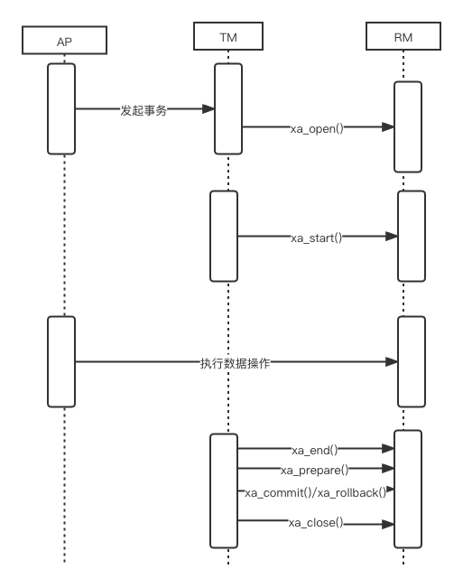

- AP（Application Program）：应用程序，定义事务边界（定义事务开始和结束）并访问事务边界内的资源。
- RM（Resource Manger）资源管理器: 管理共享资源并提供外部访问接口。供外部程序来访问数据库等共享资源。此外，RM还具有事务的回滚能力。
- TM（Transaction Manager）事务管理器：TM是分布式事务的协调者，TM与每个RM进行通信，负责管理全局事务，分配事务唯一标识，监控事务的执行进度，并负责事务的提交、回滚、失败恢复等。


- 应用程序AP向事务管理器TM发起事务请求
- TM调用xa_open()建立同资源管理器的会话
- TM调用xa_start()标记一个事务分支的开头
- AP访问资源管理器RM并定义操作，比如插入记录操作
- TM调用xa_end()标记事务分支的结束
- TM调用xa_prepare()通知RM做好事务分支的提交准备工作。其实就是二阶段提交的提交请求阶段。
- TM调用xa_commit()通知RM提交事务分支，也就是二阶段提交的提交执行阶段。
- TM调用xa_close管理与RM的会话。
  - 这些接口一定要按顺序执行，比如xa_start接口一定要在xa_end之前。此外，这里千万要注意的是事务管理器只是标记事务分支并不执行事务，事务操作最终是由应用程序通知资源管理器完成的。另外，我们来总结下XA的接口
- xa_start:负责开启或者恢复一个事务分支，并且管理XID到调用线程
- xa_end:负责取消当前线程与事务分支的关系
- xa_prepare:负责询问RM 是否准备好了提交事务分支 xa_commit:通知RM提交事务分支
- xa_rollback:通知RM回滚事务分支

### 087 	什么是mysql xa事务？

mysql的xa事务分为两部分：

1. InnoDB内部本地普通事务操作协调数据写入与log写入两阶段提交
2. 外部分布式事务

```
5.7 SHOW VARIABLES LIKE '%innodb_support_xa%';
8.0 默认开启无法关闭
```


XA 事务语法示例如下：

```text
XA START '自定义事务id';

SQL语句...

XA END '自定义事务id';
XA PREPARE '自定义事务id';
XA COMMIT\ROLLBACK '自定义事务id';
```

XA PREPARE 执行成功后，事务信息将被持久化。即使会话终止甚至应用服务宕机，只要我们将【自定义事务id】记录下来，后续仍然可以使用它对事务进行 rollback 或者 commit。

### 088 	xa事务与普通事务区别是什么？

xa事务可以跨库或跨服务器，属于分布式事务，同时xa事务还支撑了InnoDB内部日志两阶段记录

普通事务只能在单库中执行

### 089 	什么是2pc 3pc？

两阶段提交协议与3阶段提交协议，额外增加了参与的角色保证分布式事务完成更完善


### 090 是否使用过select for update？会产生哪些操作？

select本身是一个查询语句，查询语句是不会产生冲突的一种行为，一般情况下是没有锁的，用select for update 会让select语句产生一个排它锁(X), 这个锁和update的效果一样，会使两个事务无法同时更新一条记录。

`SELECT ... FOR UPDATE` 的核心是**加 X 锁（行锁/间隙锁/Next-Key Lock）**，用于实现悲观锁，防止并发修改。它会阻塞其他写操作，应尽量在**短事务**中使用，避免死锁和性能问题。在 RR 隔离级别下还能防止幻读，但代价是可能锁住更多范围。

https://dev.mysql.com/doc/refman/8.0/en/innodb-locks-set.html

https://dev.mysql.com/doc/refman/8.0/en/select.html

#### 一、加锁操作（核心）

`FOR UPDATE` 会对查询返回的**所有行**加上**排他锁（X锁，独占锁）**。

**1. 不同索引情况下的锁范围：**

| 查询类型                                | 加锁范围                           | 说明                           |
| :-------------------------------------- | :--------------------------------- | :----------------------------- |
| **主键/唯一索引等值查询**（记录存在）   | **行锁**（Record Lock）            | 只锁那一行，效率最高           |
| **主键/唯一索引等值查询**（记录不存在） | **间隙锁**（Gap Lock）             | 锁住"应该存在"的间隙，防止幻读 |
| **普通索引等值查询**                    | **行锁 + 间隙锁**（Next-Key Lock） | 锁住索引记录及其前后的间隙     |
| **范围查询**（如 `WHERE id > 10`）      | **多个 Next-Key Lock**             | 锁住整个范围，直到边界         |
| **无索引/索引失效**                     | **表锁**（实际是锁所有行+间隙）    | 整个表被锁住，严重影响并发     |

**2. 锁的兼容性：**
-   **X 锁与 X 锁**：互斥。另一个事务的 `FOR UPDATE` 或 `UPDATE/DELETE` 会被阻塞，直到锁释放。
-   **X 锁与 S 锁（共享锁）**：互斥。普通的 `SELECT`（快照读）不受影响，但 `SELECT ... LOCK IN SHARE MODE` 会被阻塞。

#### 二、事务隔离级别的影响

-   **RC（读已提交）**：只加**行锁**，不加间隙锁。**无法防止幻读**，但并发性能更好。
-   **RR（可重复读，默认）**：加 **Next-Key Lock**（行锁+间隙锁）。**可以防止幻读**，但可能产生更多锁等待。

#### 三、底层执行流程

当你执行 `BEGIN; SELECT * FROM user WHERE id = 1 FOR UPDATE;` 时：

1.  **定位记录**：通过聚簇索引（主键）或辅助索引找到 `id=1` 的记录。
2.  **加锁判断**：
    -   如果该行已被其他事务加了 X 锁 → **阻塞等待**（可设置超时时间 `innodb_lock_wait_timeout`）。
    -   如果没有锁 → 对该行（以及可能的间隙）加上 X 锁。
3.  **返回数据**：将数据返回给客户端。
4.  **锁释放时机**：
    -   `COMMIT` 或 `ROLLBACK` 时**一次性释放所有锁**（不是逐行释放）。
    -   如果事务不结束，锁会一直持有，可能造成锁等待或死锁。

#### 四、产生的其他影响

1.  **阻塞其他写操作**：其他事务的 `UPDATE`、`DELETE`、`INSERT`（可能被间隙锁阻塞）、`SELECT ... FOR UPDATE`、`SELECT ... LOCK IN SHARE MODE` 都会被阻塞。

2.  **可能产生死锁**：两个事务互相持有对方需要的锁。InnoDB 会自动检测并回滚其中一个事务。

    ```sql
    -- 事务1
    SELECT * FROM user WHERE id = 1 FOR UPDATE;
    SELECT * FROM user WHERE id = 2 FOR UPDATE;  -- 等待事务2释放id=2
    
    -- 事务2
    SELECT * FROM user WHERE id = 2 FOR UPDATE;
    SELECT * FROM user WHERE id = 1 FOR UPDATE;  -- 等待事务1释放id=1
    
    -- InnoDB检测到死锁，回滚其中一个
    ```

3.  **影响主从复制**：在主库执行的 `FOR UPDATE` 锁不会同步到从库。从库是读副本，不需要这种写锁。

4.  **性能开销**：
    -   需要额外的锁管理内存和CPU开销。
    -   长时间持有锁会降低并发能力。
    -   可能升级为表锁（当索引失效时），严重影响性能。

#### 五、使用场景（什么时候该用？）

**需要悲观锁控制并发写入时：**

```sql
-- 典型场景：扣减库存
BEGIN;
-- 1. 锁定要操作的库存记录
SELECT stock FROM products WHERE id = 123 FOR UPDATE;
-- 2. 在应用层判断stock是否充足
-- 3. 执行扣减
UPDATE products SET stock = stock - 1 WHERE id = 123;
COMMIT;
```

**何时不应该用：**
-   数据不会被并发修改 → 用普通 `SELECT`
-   可以接受基于快照读的乐观锁 → 用版本号（`version`字段）+ `UPDATE ... WHERE version = ?`
-   只是查询，不需要后续更新 → 不要加 `FOR UPDATE`

#### 六、注意事项

1.  **必须配合事务**：不在事务中时，`FOR UPDATE` 会自动提交（自动提交模式下），锁立刻释放，没有意义。
    ```sql
    ## ①for update仅适用于InnoDB，且必须在事务块(BEGIN/COMMIT)中才能生效。
    ## ②在进行事务操作时，通过“for update”语句，MySQL会对查询结果集中每行数据都添加排他锁，其他线程对该记录的更新与删除操作都会阻塞。排他锁包含行锁、表锁。
    ## ③InnoDB默认是行级别的锁，在筛选条件中当有明确指定主键或唯一索引列的时候，是行级锁。否则是表级别。**
    
    -- 错误用法（自动提交模式）
    SELECT * FROM user WHERE id = 1 FOR UPDATE;  -- 锁立刻释放
    
    -- 正确用法
    BEGIN;  -- 或 START TRANSACTION
    SELECT * FROM user WHERE id = 1 FOR UPDATE;
    -- ... 后续操作
    COMMIT;
    ```
    
2.  **锁等待超时**：默认 `innodb_lock_wait_timeout = 50` 秒，超时后抛出异常。

3.  **跳过锁的行**：使用 `SKIP LOCKED`（MySQL 8.0+）跳过已被锁的行：
    
    ```sql
    SELECT * FROM user WHERE status = 'pending' FOR UPDATE SKIP LOCKED;
    ```

**示例**

```sql
SELECT … FOR UPDATE [OF column_list][WAIT n|NOWAIT][SKIP LOCKED];
select * from t for update 会等待行锁释放之后，返回查询结果。
select * from t for update nowait 不等待行锁释放，提示锁冲突，不返回结果
select * from t for update wait 5 等待5秒，若行锁仍未释放，则提示锁冲突，不返回结果
select * from t for update skip locked 查询返回查询结果，但忽略有行锁的记录
```


### 091 mysql死锁的原因和处理方法

当多个事务同时持有和请求同一资源上的锁而产生循环依赖的时候就产生了死锁。

```sql
排查：
- 正在运行的任务
  - show full processlist;  找到卡主的进程
- 解开死锁
  - UNLOCK TABLES ；
- 查看当前运行的事务
  - SELECT * FROM information_schema.INNODB_TRX;
- 当前出现的锁
  - SELECT * FROM information_schema.INNODB_LOCKS;
- 观察错误日志
- 查看InnoDB锁状态
  - `show status like "innodb_row_lock%";`

-- 查看死锁检测状态，默认 ON
SHOW VARIABLES LIKE 'innodb_deadlock_detect';


-- 当检测到死锁时，InnoDB会：
-- ① 选择回滚代价较小的事务（修改行数少的）
-- ② 返回错误：ERROR 1213 (40001): Deadlock found

-- 查看最近一次死锁的详细信息
SHOW ENGINE INNODB STATUS\G

-- 重点关注输出中的：
-- LATEST DETECTED DEADLOCK 部分
-- 会显示：
--   - 涉及的事务及SQL
--   - 各自持有的锁和等待的锁
--   - 被回滚的事务


## 检测参数
lnnodb_row_lock_current_waits:当前正在等待锁定的数量;
lnnodb_row_lock_time :从系统启动到现在锁定的总时间长度，单位ms;
Innodb_row_lock_time_avg :每次等待所花平均时间;
Innodb_row_lock_time_max:从系统启动到现在等待最长的一次所花的时间;
lnnodb_row_lock_waits :从系统启动到现在总共等待的次数。
```


- kill  id 杀死进程


解决：

- 死锁无法避免，上线前要进行严格的压力测试

- 快速失败
  - innodb_lock_wait_timeout 行锁超时时间
  
  ```sql
  -- 查看锁等待超时时间（默认50秒）
  SHOW VARIABLES LIKE 'innodb_lock_wait_timeout';
  
  -- 如果超过这个时间还没获得锁，放弃等待并回滚
  -- 注意：这是超时，不是死锁检测
  ```
- 拆分sql，严禁大事务
- 充分利用索引，优化索引，尽量把有风险的事务sql使用上覆盖索，优化where条件前缀匹配，提升查询速度，引减少表锁
- 无法避免时：
  - 操作多张表时，尽量以相同的顺序来访问避免形成等待环路
  - 单张表时先排序再操作
  - 使用排它锁 比如 for update
  
  

### 092 Mysql会产生几种日志？

- **错误日志（error log）**

error log主要记录MySQL在启动、关闭或者运行过程中的错误信息，在MySQL的配置文件my.cnf中，可以通过log-error=/var/log/mysqld.log 执行mysql错误日志的位置。

- **慢查询日志（slow query log）**

Ø MySQL的慢查询日志是MySQL提供的一种日志记录，它用来记录在MySQL中响应时间超过阀值的语句，具体指运行时间超过long_query_time值的SQL，则会被记录到慢查询日志中。 

Ø long_query_time的默认值为10，意思是运行10秒以上的语句。 

Ø 由他来查看哪些SQL超出了我们的最大忍耐时间值，比如一条sql执行超过5秒钟，我们就算慢SQL，希望能收集超过5秒的sql，结合之前explain进行全面分析。

Ø 默认情况下，MySQL数据库没有开启慢查询日志，需要我们手动来设置这个参数。

Ø 当然，如果不是调优需要的话，一般不建议启动该参数，因为开启慢查询日志会或多或少带来一定的性能影响。慢查询**日志支持将日志记录写入文件**。

 在生产环境中，如果要手工分析日志，查找、分析SQL，显然是个体力活，MySQL提供了日志分析工具mysqldumpslow。

- **一般查询日志（general log）**

general log 记录了客户端连接信息以及执行的SQL语句信息，通过MySQL的命令

- **重写日志（redo log）**

- **回滚日志（undo log）**

- **二进制日志（bin log）**


### 093 bin log作用是什么？

MySQL的bin log日志是用来记录MySQL中增删改时的记录日志。

当你的一条sql操作对数据库中的内容进行了更新，就会增加一条bin log日志。查询操作不会记录到bin log中。

bin log最大的用处就是进行**主从复制，以及数据库的恢复。**


### 094 redo log作用是什么？

redo log是一种基于磁盘的数据结构，用来在MySQL宕机情况下将不完整的事务执行数据纠正，redo日志记录事务执行后的状态。

当事务开始后，redo log就开始产生，并且随着事务的执行不断写入redo log file中。redo log file中记录了xxx页做了xx修改的信息，我们都知道数据库的更新操作会在内存中先执行，最后刷入磁盘。

redo log就是为了恢复更新了内存但是由于宕机等原因没有刷入磁盘中的那部分数据。


### 095 undo log作用是什么？

undo log主要用来回滚到某一个版本，是一种逻辑日志。

undo log记录的是修改之前的数据，比如：当delete一条记录时，undolog中会记录一条对应的insert记录，从而保证能恢复到数据修改之前。在执行事务回滚的时候，就可以通过undo log中的记录内容并以此进行回滚。

undo log还可以提供多版本并发控制下的读取（MVCC）。


### 096 Mysql日志是否实时写入磁盘？ 

MySQL 日志并非总是“实时”写入磁盘，而是通过参数在**性能**与**数据安全**之间做权衡。

简单来说，**实时写入**（每次事务提交都立即存入磁盘）最安全但性能较差；而**攒一批再写**性能好，但系统崩溃时有丢失少量数据的风险。

核心控制参数主要有两个，一个负责 **Redo Log** (crash-safe能力)，另一个负责 **Binlog** (主从复制和数据恢复)：

-   **Redo Log 关键参数**：`innodb_flush_log_at_trx_commit`（用于保证数据持久性）
-   **Binlog 关键参数**：`sync_binlog`（用于保证数据完整性）

---

#### 💾 Redo Log：物理日志，保证crash-safe
Redo Log 记录的是物理修改，用于保障数据库突然崩溃后，已提交的事务数据不丢失。

| 参数值         | 写入策略                                                     | 性能     | 安全性                                        | 适用场景                                                     |
| :------------- | :----------------------------------------------------------- | :------- | :-------------------------------------------- | :----------------------------------------------------------- |
| **1 (默认值)** | **每次事务提交时**，立即将日志从内存写入并持久化到磁盘。     | **低**   | **最高**（双1配置的核心）                     | **金融、支付**等对数据一致性要求极高的核心系统。             |
| **2**          | 每次事务提交时**写入**操作系统缓存（仅是告知操作系统我准备好了），但每隔**1秒**才真正**持久化**到磁盘。 | **高**   | **中等**（主机断电可能丢失最近1秒数据）       | 对性能要求高，且能容忍极端情况下丢失1秒数据的业务，如**日志系统**。 |
| **0**          | 事务提交时不主动操作，仅依靠后台线程每隔**1秒**执行一次写入和持久化。 | **最高** | **最低**（MySQL进程崩溃会丢失所有未提交数据） | 通常**不推荐**用于生产环境。                                 |

#### 📦 Binlog：逻辑日志，保证数据完整性
Binlog 记录的是SQL逻辑，主要用于主从复制和时间点恢复。

| 参数值         | 写入策略                                                     | 性能     | 安全性                                      | 适用场景                                               |
| :------------- | :----------------------------------------------------------- | :------- | :------------------------------------------ | :----------------------------------------------------- |
| **1 (默认值)** | **每次事务提交时**，都强制将日志写入并持久化到磁盘。         | **低**   | **最高**（双1配置的核心）                   | **金融、支付**等数据完整性至关重要的系统。             |
| **N (如1000)** | 每执行 **N** 次事务提交后，才将这些日志一起持久化到磁盘。    | **高**   | **中等**（操作系统崩溃可能丢失最近N个事务） | **秒杀、日志数据迁移**等高性能场景，允许损失少量事务。 |
| **0**          | 每次事务提交后仅写入操作系统缓存，持久化时机交由操作系统决定。 | **最高** | **最低**（意外宕机可能丢失所有未落盘日志）  | 存在数据丢失风险，使用需谨慎。                         |

#### ✍️ 总结
MySQL 通过这两个参数将“是否实时写盘”的选择权交给了你：

-   **要数据绝对安全**：设置为 `1` 和 `1`，即“双1”配置。这是金融级系统常用的选项，确保每次提交都物理落盘。
-   **要极致性能**：设置为 `2` 和 `N`，能显著提升写入速度。例如，`innodb_flush_log_at_trx_commit = 2` 配合 `sync_binlog = 1000`，是阿里云RDS在高性能场景下的推荐方案。

> **补充说明**：事务在执行过程中，日志会先写入内存缓冲区。后台线程也会每秒自动将缓冲区里的日志刷入磁盘，作为一种额外的保障。


### 097 binlog刷盘机制是如何实现的？

MySQL的binlog刷盘机制主要通过**组提交（Group Commit）**和**参数化刷盘策略**相结合的方式实现。其核心思想是将多个事务的binlog写入操作合并，通过一次磁盘I/O完成，从而大幅提升高并发下的性能。

整个机制在MySQL内部被划分为三个阶段，像一个流水线一样协同工作。

#### 1. 核心流程：binlog组提交的三个阶段

当一个事务提交时，它会进入一个包含三个阶段的处理流程。为了最大化效率，MySQL会让多个事务"组队"完成，每个阶段的第一个事务成为**队长（Leader）**，负责带领大家完成该阶段的工作，其余事务作为**队员（Follower）**只需等待。 

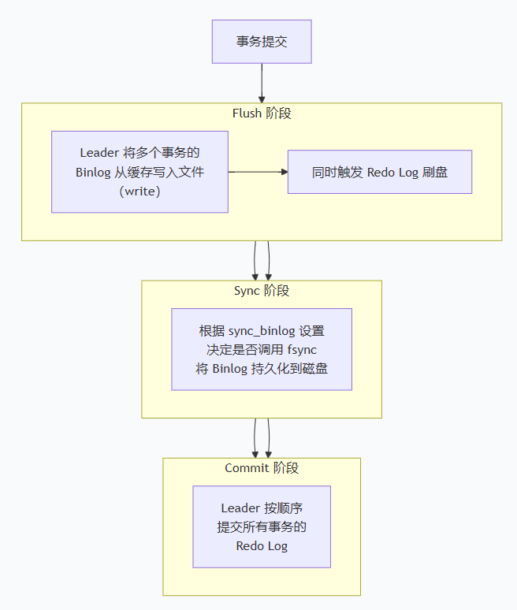

- **Flush 阶段**：每个事务在提交时，会先将自己的binlog内容写入线程私有的binlog缓存（`binlog_cache`）。进入Flush阶段后，**队长**会负责将**自己及所有队员**缓存中的binlog，一次性写入操作系统的文件缓存（`write`系统调用），但此时数据还未真正落盘。同时，队长还会触发Redo Log的刷盘。
- **Sync 阶段**：这是决定数据持久性的关键一步。**队长**会根据`sync_binlog`参数的设置，决定是否调用`fsync`命令，将binlog数据从操作系统缓存真正写入磁盘。如果启用了组提交的延时/计数参数，队长可能会在此短暂等待，以收集更多事务，合并成一次`fsync`操作。
- **Commit 阶段**：队长会按照事务原本的顺序，在存储引擎层（InnoDB）依次提交所有队员的事务（Redo Log的Commit），并通知所有队员提交完成。至此，一个完整的事务提交过程才算结束。

#### 2. 关键控制参数：`sync_binlog` 与组提交参数

MySQL提供了几个关键参数来控制刷盘的频率，你可以在它们之间权衡性能和数据安全性。

##### `sync_binlog`：控制持久化频率的核心

这个参数决定了binlog从操作系统缓存写到磁盘（`fsync`）的频率。

| 设置       | 行为                                    | 性能     | 数据安全性 | 风险场景                                                     |
| :--------- | :-------------------------------------- | :------- | :--------- | :----------------------------------------------------------- |
| **0**      | 事务提交时只`write`，刷盘由操作系统决定 | 最高     | 最低       | 操作系统崩溃或掉电，会丢失未刷盘的binlog数据。<br>表示每次提交事务binlog不会马上写入到磁盘，而是先写到page cache,相对于磁盘写入来说写page cache要快得多,不过在Mysql 崩溃的时候会有丢失日志的风险。 |
| **1**      | 每次事务提交后都执行`fsync`强制刷盘     | **最低** | **最高**   | 保证数据不丢失，但每次提交都会产生一次磁盘I/O，成为性能瓶颈。<br>表示每次提交事务都会执行 fsync 写入到磁盘 |
| **N (>1)** | 每N个事务提交后执行一次`fsync`          | **较高** | 中等       | MySQL或操作系统崩溃时，可能丢失最近N个未触发`fsync`的事务数据。<br>表示每次提交事务都 先写到page cach，只有等到积累了N个事务之后才fsync 写入到磁盘，同样在此设置下Mysql 崩溃的时候会有丢失N个事务日志的风险。 |

##### 组提交优化参数：延迟与凑数

这两个参数进一步优化了`sync_binlog=1`时的性能，通过微小的延迟来换取更多的批量写入机会。

- **`binlog_group_commit_sync_delay`**：设置提交事务前等待的微秒数。在此时间内，更多事务可以加入当前组提交，以减少I/O次数。
- **`binlog_group_commit_sync_no_delay_count`**：设置组提交的最大事务数。如果等待期间事务数达到该值，即使未到等待时间，也会立即进行刷盘。

#### 3. 双一配置与性能权衡

在生产环境中，最经典的配置是**双1配置**，即`sync_binlog=1`和`innodb_flush_log_at_trx_commit=1`。这能确保最高的数据安全性，保证任何已提交事务的日志在崩溃后不会丢失。

然而，"双1"会对性能造成较大影响。如果业务对性能要求更高，且可以容忍极短时间内的少量数据丢失风险，可以考虑以下折中方案：

- **高性能场景**：设置`sync_binlog=1000`，`innodb_flush_log_at_trx_commit=2`。这意味着binlog每1000个事务刷一次盘，Redo Log每秒刷一次盘。此配置可显著提升写入吞吐量，但数据库或操作系统崩溃时，可能丢失最近1秒或最近一批事务的数据。

> 你可以将`sync_binlog=1`看作是"每次都要队长亲自去确认文件已保存到硬盘"，虽然最安全但效率较低；而组提交则像是"队长攒了一批文件，然后一次性跑去确认"，极大地提高了效率。


### 098 redo log刷盘机制是如何实现的？  

MySQL redo log 的刷盘机制，本质上是**在数据安全与写入性能之间做权衡**。它采用 **WAL (Write-Ahead Logging，预写日志)** 技术，在事务提交时，并不直接把修改的数据页刷入磁盘，而是先将描述这些修改的 redo log 持久化。

这个过程的核心，由一个关键参数 `innodb_flush_log_at_trx_commit` 控制，它决定了每次事务提交时，redo log 要以何种力度刷盘。

#### 🔑 核心参数：三种刷盘策略

这个参数有三个可选值，对应着不同的性能与安全级别。下面的表格可以帮你快速理解它们的区别：

| 参数值       | 行为描述                                                     | 性能 (TPS)               | 数据安全性                                                   | 适用场景                                                     |
| :----------- | :----------------------------------------------------------- | :----------------------- | :----------------------------------------------------------- | :----------------------------------------------------------- |
| **1 (默认)** | 每次事务提交，都将 redo log 从 buffer **立即写入并持久化**到磁盘文件。 | 最低（约比`0`值低29%）   | **最高**。保证事务持久性（ACID的D），系统崩溃也不丢数据。    | 金融、订单等对数据一致性要求极高的核心系统。                 |
| 2            | 每次事务提交，将 redo log 写入**操作系统缓存 (Page Cache)**，由操作系统决定何时真正写入磁盘（通常每秒一次）。 | 中等（约比`0`值低12.5%） | **较高**。MySQL崩溃不影响，但操作系统崩溃可能丢失**最近1秒内**的数据。 | 多数业务系统可接受的折中方案，平衡了性能与安全。             |
| 0            | 事务提交时**完全不触发**写盘操作，由后台线程**每隔1秒**统一将 buffer 中的日志写入并持久化。 | **最高**                 | **最低**。数据库崩溃时，可能丢失**最近1秒内**所有未刷盘的事务数据。 | 对数据一致性要求不高的场景，如测试环境、批量数据导入、日志系统等。 |

> **特别说明**：有资料指出，在默认值`1`下，为了优化组提交（Group Commit）性能，redo log 的写入（write）和持久化（fsync）操作可能被拆分，以实现一次磁盘 I/O 刷入多个事务的日志。`2`和`0`的区别在于，`2`保证了 MySQL 自身崩溃后的数据安全，而`0`则完全依赖那每秒一次的刷盘。

#### 🧠 幕后功臣：后台线程与组提交

除了用户事务提交触发的主动刷盘，幕后还有一套协同机制在默默工作：

*   **后台线程**：MySQL 有一个专门的后台线程，每隔1秒就会主动将 redo log buffer 里的内容刷盘。所以，即使一个事务还没提交，它产生的部分 redo log 也可能已经被刷到磁盘了。
*   **空间预警**：当 redo log buffer 的使用空间接近其容量上限（由 `innodb_log_buffer_size` 控制，默认16MB）的一半时，后台线程也会主动触发一次刷盘，以防内存爆满。
*   **组提交 (Group Commit)**：这是提升高并发性能的关键。当多个事务同时提交时，InnoDB 会将它们的刷盘请求合并成一次 fsync 操作，大大减少了磁盘 I/O 次数，从而显著提升吞吐量。

#### 💡 优化建议

*   **核心系统**：建议将参数值设为 **1**，并搭配高性能存储（如SSD）来缓解性能压力。
*   **追求性能**：可将参数值设为 **2**，能获得不错的性能提升，同时风险相对可控。
*   **日志与临时任务**：可以考虑设为 **0**，最大化写入速度。


### 099 undo log刷盘机制是如何实现的？

与 redo log 有明确的刷盘时机和参数控制不同，undo log 的刷盘机制**并没有一个独立、直接的“刷盘参数”**。它的持久化是依托于一个闭环流程，其“刷盘”动作融合在写入和清理的过程中，可以拆解为**写入**、**持久化**和**清理**三个环节来理解。

#### ✍️ 写入机制：事务执行时同步生成，先于数据修改

事务在执行 `INSERT`、`UPDATE`、`DELETE` 等操作时，会**在修改数据页之前，同步生成对应的 undo log 记录**。这些记录是逻辑日志，记录了操作的“逆操作”：

*   `INSERT` 操作生成记录主键的 undo log。
*   `UPDATE` 操作生成记录被更新字段旧值的 undo log。
*   `DELETE` 操作生成记录被删除行完整数据的 undo log。

每个事务都有独立的 undo log 段，通过回滚段（Rollback Segment）进行管理。

#### 🛡️ 持久化机制：依赖自身 Redo Log，非独立刷盘

这是 undo log 和 redo log 刷盘策略最核心的区别。**undo log 本身并不直接触发刷盘，它的持久化是由 redo log 来间接保证的**。

当 undo log 在内存中生成时，InnoDB 会**同时为这个 undo log 的写入操作生成一条对应的 redo log**。因为 undo log 也存储在表空间中，如果只写内存，崩溃时就会丢失。因此，它遵循 WAL（Write-Ahead Logging）原则，**先记录 undo log 的 redo log**，再在后续的刷盘过程中，通过 redo log 的机制来保证其最终能持久化到磁盘。所以，undo log 的数据安全，实际上是和 redo log 的刷盘策略（如 `innodb_flush_log_at_trx_commit=1`）绑定在一起的，并没有自己单独的刷盘参数。

#### 🧹 回收机制：由 Purge 线程在事务提交后异步清理

事务提交后，undo log 并不会立即被删除。因为它还需要为 **MVCC（多版本并发控制）** 服务，可能被其他正在执行的读事务用来构建一致性快照。它被“刷盘”（这里指物理删除或截断）的过程，是由后台的 **Purge 线程**异步完成的。这个回收过程大致如下：

1.  **标记可回收**：事务提交时，其对应的 undo log 会被标记为可回收，并放入一个待清理列表。
2.  **Purge 线程工作**：后台的 Purge 线程会定期检查，**只有当所有可能用到这些旧版本数据的事务都已经结束时**，才会将这些不再需要的 undo log 物理删除或截断（Truncate）。
3.  **Undo 表空间截断**：从 MySQL 5.7 开始，如果使用独立的 undo 表空间，当其大小超过阈值（由 `innodb_max_undo_log_size` 控制，默认1GB），Purge 线程还会对其进行截断（Truncate）操作，将其收缩回初始大小（10MB），以回收磁盘空间。此功能由参数 `innodb_undo_log_truncate` 控制（MySQL 8.0 中默认开启）。

#### 💎 总结：三句话理解 Undo Log 的刷盘

1.  **写入时机**：事务执行 DML 时，**同步写入** undo log 到内存，先于数据修改。
2.  **持久化保障**：**没有独立的刷盘参数**，其持久化是通过自身的 redo log 来间接保证的，与 redo log 的刷盘机制绑定。
3.  **物理删除**：由后台 Purge 线程在事务提交后**异步回收**，回收时机取决于是否还有事务需要读取其历史版本。


刷盘时机顺序： 

- 1 开启事务

- 2 查询数据库中需要更新的字段，加载到内存中 形成数据**脏页**

- 3 记录undo log到内存缓冲区（用于回滚和mvcc）并关联redo log   -> 可刷盘

- 4 记录 redo log到内存缓冲区 （用于失败重放）准备提交事务           -> 可刷盘

- 5 修改内存中的脏页数据

- 6 提交事务触发redolog刷盘

- 7 undo log 和脏页 刷盘

- 8 事务成功

  

  

### 100 binlog 与 redo log 是如何通过“两阶段提交”来保证一致性

这个问题问到了MySQL数据一致性的核心。要理解“两阶段提交”（2PC, Two-Phase Commit），得先明确一个关键前提：**`redo log` 和 `binlog` 是两个独立的日志，如果写一个成功、写另一个失败，就会导致主库数据与从库（或备份）数据不一致。**

“两阶段提交”正是为了解决这个问题而设计的，它将一个事务的提交过程拆分为 **Prepare（准备）** 和 **Commit（提交）** 两个阶段，确保两份日志在逻辑上“同生共死”。

redo log 的写入拆成了两个步骤：prepare 和 commit

- **prepare**：redolog写入log buffer，并fsync持久化到磁盘，在redolog事务中记录2PC的XID，在redolog事务打上prepare标识

- **commit**：binlog写入log buffer，并fsync持久化到磁盘，在binlog事务中记录2PC的XID，同时在redolog事务打上commit标识

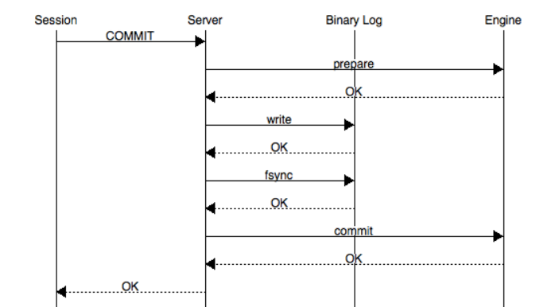

#### 🔄 两阶段提交的完整流程

假设我们执行一条 `UPDATE` 语句，其背后的日志写入流程如下：

1.  **写入 `redo log` (Prepare 阶段)**
    - InnoDB 引擎将修改写入内存并生成 `redo log`。
    - 此时，该 `redo log` 被标记为 **`prepare`（准备）** 状态，并持久化到磁盘。（在redolog事务中记录2PC的XID，在redolog事务打上prepare标识）
    - 此时事务还未提交，数据虽在内存中修改，但对外界还不可见。

2.  **写入 `binlog`**
    - MySQL 服务层将此次变更的逻辑记录（SQL 或行数据）写入 `binlog` 缓存，并**持久化到磁盘**。
    - `binlog` 写入成功，是事务能够最终提交的关键前提。

3.  **提交事务 (Commit 阶段)**
    - InnoDB 引擎收到服务层的提交指令，将刚才处于 `prepare` 状态的 `redo log` **正式标记为 `commit`（提交）** 状态。
    - 至此，事务提交完成，数据修改对外可见。

---

#### 🚦 崩溃恢复时的决策逻辑

如果数据库在步骤 1、2、3 之间的任意时刻崩溃，重启后的恢复机制（**崩溃恢复**）会依据 `binlog` 和 `redo log` 的状态来判断事务是否有效。其决策逻辑非常明确：

| 场景       | `redo log` 状态 | `binlog` 是否存在并完整 | 恢复决策     | 原因                                                         |
| :--------- | :-------------- | :---------------------- | :----------- | :----------------------------------------------------------- |
| **场景 1** | `prepare`       | **有**                  | **提交事务** | `binlog` 已写成功，表示事务已准备好同步到从库，主库必须也提交，保证主从一致。 |
| **场景 2** | `prepare`       | **没有** 或不完整       | **回滚事务** | `binlog` 没写成功，该事务不会同步到从库，主库也应回滚，避免数据不一致。 |
| **场景 3** | `commit`        | 有或无                  | **提交事务** | `commit` 状态表示事务已提交完成，直接应用（或重新应用）即可。 |

通过这个机制，`binlog` 成了最终的“仲裁者”：**如果 `binlog` 写成功了，事务就生效；否则，就回滚**。

---

#### 💡 为什么要先写 `redo log` 的 `prepare`，再写 `binlog`？

这个顺序是经过精心设计的，核心原因是：

-   **`redo log` 是 InnoDB 的“私有日志”**，记录的是物理页的修改，写起来很快，且能保证崩溃后数据不丢失。
-   **`binlog` 是 MySQL 的“公共日志”**，写入和刷盘通常涉及更复杂的逻辑（如网络传输、文件系统同步）。
-   **先写 `redo log` 的 `prepare`**，相当于给这个事务打上了一个“准备就绪”的标签。即使接下来写 `binlog` 时发生崩溃，恢复时也能准确地判断这个事务该不该提交（如上表决策逻辑）。

> **注意**：这里的“两阶段提交”本质上是 MySQL 内部的 XA 事务（分布式事务）的一种简化和应用，目的就是**保证 `redo log` 和 `binlog` 这两个跨组件资源的数据一致性**。

#### 💎 总结

总的来说，`binlog` 和 `redo log` 的“两阶段提交”机制，就是通过 **`prepare` -> 写 `binlog` -> `commit`** 这个严格流程，并将 **`binlog` 是否完整写入作为最终决策依据**，巧妙地解决了单机事务与集群同步之间的数据一致性问题。这是 MySQL 保证高可靠性的基石。


### 100 MySQL的binlog有有几种录入格式？分别有什么区别？

MySQL 的 binlog（二进制日志）有三种记录格式，它们的主要区别在于**记录内容、日志大小**和**数据安全性**之间的权衡。

| 格式               | 记录内容                                                     | 优点                                                         | 缺点                                                         | 适用场景                                                     |
| :----------------- | :----------------------------------------------------------- | :----------------------------------------------------------- | :----------------------------------------------------------- | :----------------------------------------------------------- |
| **STATEMENT**      | 执行修改的 **SQL 语句**本身。                                | **日志量小**，并不需要记录每一 条sql语句和每一行的 数据变化，减少了binlog日志量，节省磁盘和网络IO，性能较好。 | **存在数据不一致风险**，当SQL包含`NOW()`、`UUID()`等非确定性函数时，主从复制结果可能不同。 | 对数据一致性要求不高的场景，或可确保所有SQL都确定性的情况。  |
| **ROW** **(默认)** | 每行数据被修改的**前后镜像** (before/after image)。          | **数据一致性最高**，能精确复制每一行的变更（ 不记录每条sql语句的上下文信息，仅需记录哪条数据被修改了，修改成什么样了），不会因函数导致不一致。 | **日志量可能巨大**，尤其对批量更新、`ALTER TABLE`等操作会产生大量日志，增加IO压力。 | 金融、电商等对数据一致性要求极高的核心系统，或需要通过binlog进行数据订阅同步的场景。 |
| **MIXED**          | **自动切换**。默认用STATEMENT，当判断可能不安全时，自动切换为ROW。 | 在**日志大小**和**数据安全**间取得平衡。                     | 行为由MySQL自动判断，规则复杂，可能在不期望时切换格式。      | 希望兼顾性能和一致性的通用场景。                             |

#### 💡 如何选择？

*   **优先考虑 ROW**：在绝大多数生产环境中，`ROW` 都是强烈推荐的默认选项。虽然会占用更多空间，但它换来了最高的数据一致性和可靠性，这对于主从复制和数据恢复至关重要。
*   **谨慎使用 STATEMENT**：只有当你的业务逻辑**完全不依赖任何非确定性函数**，且对磁盘空间或网络带宽有极端限制时，才考虑使用。
*   **了解 MIXED**：可以看作一个自动化妥协方案，但它的行为有时可能不如直接使用 `ROW` 来得直观。


### 101 Mysql集群同步时为什么使用binlog？优缺点是什么？

这是一个非常经典的问题。要理解为什么MySQL集群同步选择`binlog`，首先要明确一个核心逻辑：**`binlog`是MySQL**服务层（Server层）**的日志，而`redo log`是存储引擎层（InnoDB层）的日志**。

`binlog`之所以成为集群同步的“官方语言”，是因为它是**跨引擎、跨版本、甚至跨异构系统的标准数据流**。

#### 🎯 为什么集群同步使用 binlog？

1. **逻辑日志，跨平台通用**
   `binlog`记录的是**SQL语句**（STATEMENT格式）或**行变更的“前镜像+后镜像”**（ROW格式）。这种逻辑描述与底层存储引擎（InnoDB、MyISAM等）无关，甚至与MySQL版本或操作系统无关。从库（或消费端）收到后，可以“回放”这些逻辑操作来重建数据，这是实现**异构系统同步**（如同步到大数据平台、Elasticsearch、缓存）的基础。
2. **基于提交顺序，保证全局一致性**
   `binlog`严格按照事务的**提交顺序**记录，并且在主库上通过“组提交（Group Commit）”机制，使`binlog`的刷盘顺序与事务的提交顺序完全一致。这保证了从库应用`binlog`时，能重演出与主库完全相同的、全局有序的数据变更状态，是保证主从数据最终一致性的关键。
3. **弥补存储引擎的局限**
   InnoDB的`redo log`是**物理日志**（记录“在某个数据页的某个偏移量上做了什么修改”），它循环写入、空间固定，并且与InnoDB引擎强绑定。它本身不包含完整的逻辑变更信息，也无法用于其他引擎或系统。因此，必须依赖服务层的`binlog`来实现跨引擎、跨实例的数据复制。

#### ✅ 核心优点

- **支持多样化的复制拓扑**：基于`binlog`的同步，可以灵活构建一主多从、级联复制、双主（需注意冲突）等多种架构。
- **实现数据的时间点恢复（PITR）**：配合全量备份，可以回放`binlog`将数据库恢复到任意指定时间点，这是数据容灾的最后一道防线。
- **解耦数据生产与消费**：`binlog`充当了**数据总线**的角色。主库只负责产生日志，下游的从库、缓存、搜索引擎等都可以作为消费者订阅和处理，不影响主库性能。
- **成熟稳定，生态丰富**：围绕`binlog`有非常成熟的同步工具（如`canal`、`DataX`、`Debezium`），生态非常完善。

#### ❌ 核心缺点与挑战

- **存在数据延迟**：`binlog`同步是**异步**的（默认）。主库写`binlog`并返回成功，并不等待从库确认，这必然导致主从之间存在**复制延迟**。在网络抖动或从库压力大时，延迟可能达到数秒甚至更久。
- **增加主库写负担**：所有事务提交时，除了写`redo log`，还必须额外写一份`binlog`（**两阶段提交**中的`prepare`和`commit`阶段），这增加了磁盘I/O（`sync_binlog=1`时）和CPU开销。
- **ROW格式日志膨胀**：在使用最安全的`ROW`格式时，一条`UPDATE`语句可能产生巨大的日志量（记录每一行的前后值），占用大量磁盘空间和网络带宽。
- **无法保证强一致性**：由于是异步逻辑复制，主库宕机时，可能丢失尚未同步到从库的事务，无法满足金融等场景下严格的RPO（恢复点目标）要求。（半同步复制可缓解，但性能会下降）。

#### 💎 总结

`binlog`作为集群同步的“数据总线”，其**通用性**和**灵活性**是核心价值，使它成为MySQL生态中不可或缺的一环。而它的**异步性**和**额外性能开销**则是主要的代价。

在绝大多数业务场景下，`binlog`复制提供的**最终一致性**已经足够，且生态完善、成本可控。只有在极少数对RPO和性能有极致要求的场景，才会考虑更高级的方案（如**Group Replication（MGR）** 的Paxos协议或**双写+MQ**）。


- binlog是mysql提供的日志，所有存储引擎都可用。
- 支持增量同步
- binlog还可以供其他中间件读取，比如同步到hdfs中
- 如果复制表数据：
  - 不支持某个阶段回放
  - 直接复制数据过程中一旦中断复制（比如断网），很难确定复制的offset


## 四、 Mysql开发

### 102 可以使用MySQL直接存储文件吗？

可以使用 BLOB (binary large object)，用来存储二进制大对象的字段类型。

TinyBlob 255 值的长度加上用于记录长度的1个字节(8位)
Blob 65K值的长度加上用于记录长度的2个字节(16位)
MediumBlob 16M值的长度加上用于记录长度的3个字节(24位)
LongBlob 4G 值的长度加上用于记录长度的4个字节(32位)。

#### 103	什么时候存，什么时候不存？

存：需要高效查询并且文件很小的时候

不存：文件比较大，数据量多或变更频繁的时候

#### 104	存储的时候有遇到过什么问题吗？

1. 上传数据过大sql执行失败 调整max_allowed_packet
2. 主从同步数据时比较慢
3. 应用线程阻塞
4. 占用网络带宽
5. 高频访问的图片无法使用浏览器缓存

#### 105	Emoji乱码怎么办？

使用utf8mb4

MySQL在5.5.3之后增加了这个utf8mb4的编码，mb4就是most bytes 4的意思，专门用来兼容四字节的unicode。好在utf8mb4是utf8的超集，除了将编码改为utf8mb4外不需要做其他转换。当然，一般情况下使用utf8也就够了。

### 106 如何存储ip地址？

1. 使用字符串
2. 使用无符号整型

- 4个字节即解决问题
- 可以支持范围查询
- **INET_ATON()** 和 **INET_NTOA()** ipv6 使用 **INET6_ATON()** 和 **INET6_NTOA()**

### 107 长文本如何存储？

可以使用Text存储

**TINYTEXT(255长度)**

**TEXT(65535)**

**MEDIUMTEXT（int最大值16M）**

**LONGTEXT(long最大值4G)**

#### 108	大段文本如何设计表结构？

1. 或将大段文本同时存储到搜索引擎
2. 分表存储
3. 分表后多段存储

#### 109	大段文本查找时如何建立索引？

1. 全文检索，模糊匹配最好存储到搜索引擎中
2. 指定索引长度
3. 分段存储后创建索引

#### 110	有没有在开发中使用过TEXT,BLOB 数据类型

 BLOB 之前做ERP的时候使用过，互联网项目一般不用BLOB 

TEXT  文献，文章，小说类，新闻，会议内容 等

### 111  日期，时间如何存取？

1. 使用 TIMESTAMP，DATETIME
2. 使用字符串

#### 112	TIMESTAMP，DATETIME 的区别是什么？

跨时区的业务使用 TIMESTAMP，TIMESTAMP会有时区转换


1、两者的存储方式不一样:
对于TIMESTAMP，它把客户端插入的时间从当前时区转化为UTC（世界标准时间）进行存储。查询时，将其又转化为客户端当前时区进行返回。
而对于DATETIME，不做任何改变，基本上是原样输入和输出。


2、存储字节大小不同

| 数据类型  | MySQL 5.6.4之前需要存储 | MySQL 5.6.4之后需要存储 |
| --------- | ----------------------- | ----------------------- |
| DATETIME  | 8 bytes                 | 5 bytes + 小数秒存储    |
| TIMESTAMP | 4 bytes                 | 4 bytes + 小数秒存储    |

 

| 分秒数精度 | 存储字节大小 |
| ---------- | ------------ |
| 0          | 0 bytes      |
| 1,2        | 1 bytes      |
| 3,4        | 2 bytes      |
| 5,6        | 3 bytes      |

 3、两者所能存储的时间范围不一样:
timestamp所能存储的时间范围为：'1970-01-01 00:00:01.000000' 到 '2038-01-19 03:14:07.999999'。
datetime所能存储的时间范围为：'1000-01-01 00:00:00.000000' 到 '9999-12-31 23:59:59.999999'。

 

#### 113	为什么不使用字符串存储日期？

字符串无法完成数据库内部的范围筛选

在大数据量存储优化索引时，查询必须加上时间范围

#### 114	如果需要使用时间戳 timestamp和int该如何选择？

**int** 存储空间小，运算查询效率高，不受时区影响，精度低

**timestamp** 存储空间小，可以使用数据库内部时间函数比如更新，精度高，需要注意时区转换，timestamp更易读

一般选择timestamp，两者性能差异不明显，本质上存储都是使用的int

### 115	char与varchar的区别？如何选择？

1.char的优点是存储空间固定（最大255），没有碎片，尤其更新比较频繁的时候，方便数据文件指针的操作，所以存储读取速度快。缺点是空间冗余，对于数据量大的表，非固定长度属性使用char字段，空间浪费。

2.varchar字段，存储的空间根据存储的内容变化，空间长度为L+size，存储内容长度加描述存储内容长度信息，优点就是空间节约，缺点就是读取和存储时候，需要读取信息计算下标，才能获取完整内容。

### 116	财务计算有没有出现过错乱？

第一类：锁包括多线程，数据库，UI展示后超时提交等

第二类：应用与数据库浮点运算精度丢失

1. 应用开发问题：多线程共享数据读写，
2. 之前有过丢失精度的问题，使用decimal解决
3. 使用乘法替换除法
4. 使用事务保证acid特性
5. 更新时使用悲观锁 SELECT … FOR UPDATE
6. 数据只有标记删除
7. 记录详细日志方便溯源


#### 117		decimal与float,double的区别是什么？

float：浮点型，4字节，32bit。

double：双精度实型，8字节，64位

decimal：数字型，128bit，不存在精度损失

对于声明语法DECIMAL(M,D)，自变量的值范围如下：

- M是最大位数（精度），范围是1到65。可不指定，默认值是10。
- D是小数点右边的位数（小数位）。范围是0到30，并且不能大于M，可不指定，默认值是0。

例如字段 salary DECIMAL(5,2)，能够存储具有五位数字和两位小数的任何值，因此可以存储在salary列中的值的范围是从-999.99到999.99。

#### 118		浮点类型如何选型？为什么？

- 需要不丢失精度的计算使用DECIMAL

- 仅用于展示没有计算的小数存储可以使用字符串存储
- 低价值数据允许计算后丢失精度可以使用float double
- 整型记录不会出现小数的不要使用浮点类型


### 119   预编译sql是什么？

完整解释：

https://dev.mysql.com/doc/refman/8.0/en/prepare.html

PreparedStatement


#### 120		预编译sql有什么好处？

- 预编译sql会被mysql缓存下来
- 作用域是每个session，对其他session无效，重新连接也会失效
- 提高安全性防止sql注入
  - select * from user where id =?
  - "1;delete from user where id = 1";
- 编译语句有可能被重复调用，也就是说sql相同参数不同在同一session中重复查询执行效率明显比较高
- mysql 5,8 支持服务器端的预编译

### 121	子查询与join哪个效率高？

join 效率高。join可以使用索引，并且不用创建临时表，子查询会创建临时表，并且还有删除临时表操作

子查询虽然很灵活，但是执行效率并不高。

#### 122		为什么子查询效率低？

在执行子查询的时候，MYSQL创建了临时表，查询完毕后再删除这些临时表

子查询的速度慢的原因是多了一个创建和销毁临时表的过程。
而join 则不需要创建临时表 所以会比子查询快一点

#### 123		join查询可以无限叠加吗？Mysql对join查询有什么限制吗？

建议join不超过3张表关联，mysql对内存敏感，关联过多会占用更多内存空间，使性能下降

Too many tables; MySQL can only use 61 tables in a join；

系统限制最多关联61个表

#### 124  join 查询算法了解吗？

- Simple Nested-Loop Join：SNLJ，简单嵌套循环连接
- Index Nested-Loop Join：INLJ，索引嵌套循环连接
- Block Nested-Loop Join：BNLJ，缓存块嵌套循环连接

#### 125		如何优化过多join查询关联？

- 适当使用冗余字段减少多表关联查询
- 驱动表和被驱动表（小表join大表）
- 业务允许的话 尽量使用inner join 让系统帮忙自动选择驱动表
- 关联字段一定创建索引
- 调整JOIN BUFFER大小


### 126	是否有过mysql调优经验？

调优：

1. sql调优
2. 表（结构）设计调优
3. 索引调优
4. 慢查询调优
5. 操作系统调优
6. 数据库参数调优

#### 127		开发中使用过哪些调优工具？

官方自带：

- EXPLAIN 
- mysqldumpslow
- show profiles 时间
- optimizer_trace

第三方：性能诊断工具，参数扫描提供建议，参数辅助优化

#### 128		如何监控线上环境中执行比较慢的sql？ 129		如何分析一条慢sql？

开启慢查询日志，收集sql

Ø 默认情况下，MySQL数据库没有开启慢查询日志，需要我们手动来设置这个参数。

Ø 当然，如果不是调优需要的话，一般不建议启动该参数，因为开启慢查询日志会或多或少带来一定的性能影响。慢查询**日志支持将日志记录写入文件**。


**查看及开启**

1. 默认关闭

`SHOW VARIABLES LIKE '%slow_query_log%'; `

默认情况下slow_query_log的值为OFF，表示慢查询日志是禁用的， 

​                               

1. 开启：`set global     slow_query_log=1;` 只对窗口生效，重启服务失效

 

1. 慢查询日志记录long_query_time时间

```sql
SHOW VARIABLES LIKE '%long_query_time%';

SHOW GLOBAL VARIABLES LIKE 'long_query_time';
```

l 全局变量设置，对所有客户端有效。但，必须是设置后进行登录的客户端。

SET GLOBAL long_query_time=0.1;

 

l 对当前会话连接立即生效，对其他客户端无效。

SET SESSION long_query_time=0.1; #session可省略

 

假如运行时间正好等于long_query_time的情况，并不会被记录下来。也就是说，

在mysql源码里是判断大于long_query_time，而非大于等于。

1. 永久生效

1. - 修改配置文件my.cnf（其它系统变量也是如此） 
   - [mysqld]下增加或修改参数
   - slow_query_log 和slow_query_log_file后，然后重启MySQL服务器。也即将如下两行配置进my.cnf文件 

slow_query_log =1

slow_query_log_file=/var/lib/mysql/localhost-slow.log

long_query_time=3

log_output=FILE

1. - 关于慢查询的参数slow_query_log_file，它指定慢查询日志文件的存放路径，如果不设置，系统默认文件：[host_name]-slow.log

**case**

Ø 记录慢SQL并后续分析

SELECT * FROM emp;

SELECT * FROM emp WHERE deptid > 1;

Ø 查询当前系统中有多少条慢查询记录或者直接看慢查询日志

/var/lib/mysql/localhost-slow.log

SHOW GLOBAL STATUS LIKE '%Slow_queries%'; 

 

 **日志分析工具mysqldumpslow**

1. 在生产环境中，如果要手工分析日志，查找、分析SQL，显然是个体力活，MySQL提供了日志分析工具mysqldumpslow。

2. 查看mysqldumpslow的帮助信息


```

a)   mysqldumpslow --help

·    -a: 将数字抽象成N，字符串抽象成S

·    -s: 是表示按照何种方式排序；

 c: 访问次数

 l: 锁定时间

 r: 返回记录

 **t:** **查询时间**

 al:平均锁定时间

 ar:平均返回记录数

 at:平均查询时间

·    -t: 即为返回前面多少条的数据；

·    -g: 后边搭配一个正则匹配模式，大小写不敏感的；

  得到返回记录集最多的10个SQL  mysqldumpslow  -s r -t 10 /var/lib/mysql/localhost-slow.log  得到访问次数最多的10个SQL  mysqldumpslow  -s c -t 10 /var/lib/mysql/localhost-slow.log  得到按照时间排序的前10条里面含有左连接的查询语句  mysqldumpslow  -s t -t 10 -g  "left join"  /var/lib/mysql/localhost-slow.log  另外建议在使用这些命令时结合 | 和more 使用 ，否则有可能出现爆屏情况  mysqldumpslow  -s r -t 10 /var/lib/mysql/localhost-slow.log | more  
```


#### 130		如何查看当前sql使用了哪个索引？

可以使用EXPLAIN，选择索引过程可以使用 optimizer_trace

#### 131	索引如何进行分析和调优？

#### 132	EXPLAIN关键字中的重要指标有哪些？


### EXPLAIN是什么

使用EXPLAIN关键字可以`模拟优化器执行SQL查询语句`，从而知道MySQL是如何处理你的SQL语句的。`分析你的查询语句或是表结构的性能瓶颈`。


### EXPLAIN的用法

**用法：**

```sql
EXPLAIN + SQL语句
```


**数据准备：**

```sql
USE atguigudb;
 
CREATE TABLE t1(id INT(10) AUTO_INCREMENT, content VARCHAR(100) NULL, PRIMARY KEY (id));
CREATE TABLE t2(id INT(10) AUTO_INCREMENT, content VARCHAR(100) NULL, PRIMARY KEY (id));
CREATE TABLE t3(id INT(10) AUTO_INCREMENT, content VARCHAR(100) NULL, PRIMARY KEY (id));
CREATE TABLE t4(id INT(10) AUTO_INCREMENT, content1 VARCHAR(100) NULL, content2 VARCHAR(100) NULL, PRIMARY KEY (id));

CREATE INDEX idx_content1 ON t4(content1);  -- 普通索引

# 以下新增sql多执行几次，以便演示
INSERT INTO t1(content) VALUES(CONCAT('t1_',FLOOR(1+RAND()*1000)));
INSERT INTO t2(content) VALUES(CONCAT('t2_',FLOOR(1+RAND()*1000)));
INSERT INTO t3(content) VALUES(CONCAT('t3_',FLOOR(1+RAND()*1000)));
INSERT INTO t4(content1, content2) VALUES(CONCAT('t4_',FLOOR(1+RAND()*1000)), CONCAT('t4_',FLOOR(1+RAND()*1000)));

```


### 各字段解释

#### table

- **单表：**显示这一行的数据是关于哪张表的

```sql
EXPLAIN SELECT * FROM t1;
```

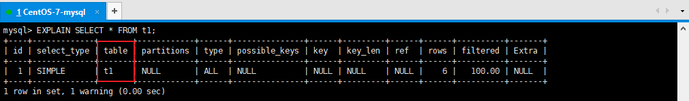


- **多表关联：**t1为驱动表，t2为被驱动表。

`注意：`内连接时，MySQL性能优化器会自动判断哪个表是驱动表，哪个表示被驱动表，和书写的顺序无关

```sql
EXPLAIN SELECT * FROM t1 INNER JOIN t2;
```

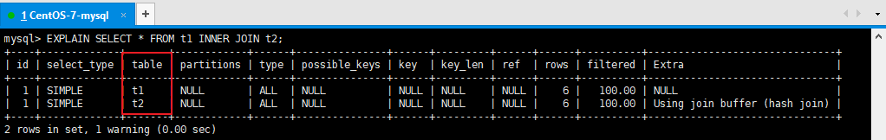


#### id

表示查询中执行select子句或操作表的顺序


- **id相同：**执行顺序由上至下

```sql
EXPLAIN SELECT * FROM t1, t2, t3;
```

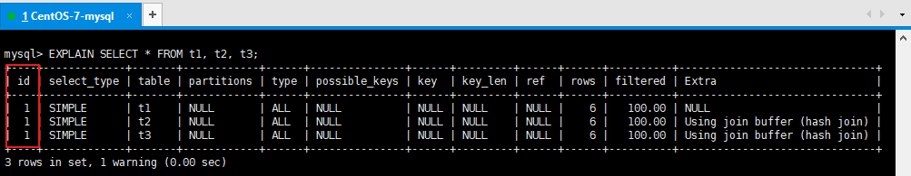


- **id不同：**如果是子查询，id的序号会递增，id值越大优先级越高，越先被执行 

```sql
EXPLAIN SELECT t1.id FROM t1 WHERE t1.id =(
  SELECT t2.id FROM t2 WHERE t2.id =(
    SELECT t3.id FROM t3 WHERE t3.content = 't3_434'
  )
);
```

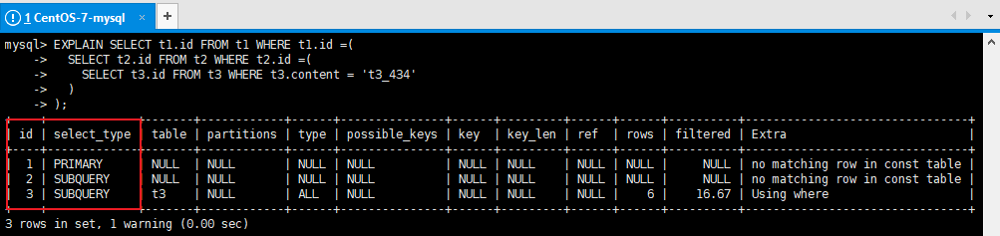

`注意：`查询优化器可能对涉及子查询的语句进行优化，`转为连接查询`

```sql
EXPLAIN SELECT * FROM t1 WHERE content IN (SELECT content FROM t2 WHERE content = 'a');
```

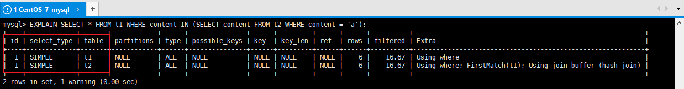


- **id为NULL：**最后执行

```sql
EXPLAIN SELECT * FROM t1 UNION SELECT * FROM t2;
```

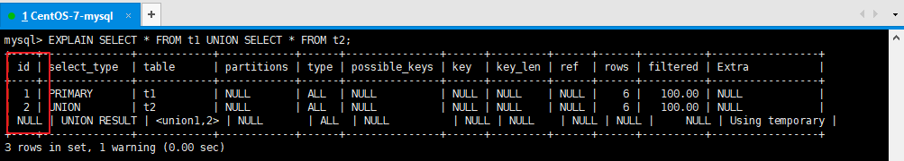


**小结：**

- id如果相同，可以认为是一组，从上往下顺序执行
- 在所有组中，id值越大，优先级越高，越先执行
- 关注点：id号每个号码，表示一趟独立的查询, 一个sql的查询趟数越少越好


#### select_type

查询的类型，主要是用于区别普通查询、联合查询、子查询等的复杂查询。


- **SIMPLE：**简单查询。查询中不包含子查询或者UNION。

```sql
EXPLAIN SELECT * FROM t1;
```

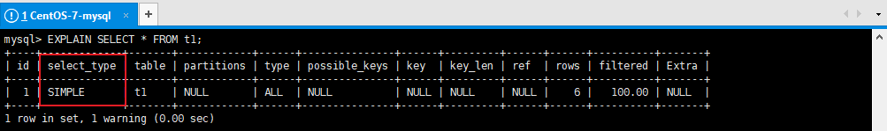


- **PRIMARY：**主查询。查询中若包含子查询，则最外层查询被标记为PRIMARY。
- **SUBQUERY：**子查询。在SELECT或WHERE列表中包含了子查询。

```sql
EXPLAIN SELECT * FROM t3 WHERE id = ( SELECT id FROM t2 WHERE content= 'a');
```

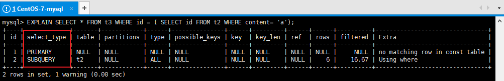


- **DEPENDENT SUBQUREY：**如果包含了子查询，并且查询语句不能被优化器转换为连接查询，并且子查询是`相关子查询（子查询基于外部数据列）`，则子查询就是DEPENDENT SUBQUREY。

```sql
EXPLAIN SELECT * FROM t3 WHERE id = ( SELECT id FROM t2 WHERE content = t3.content);
```

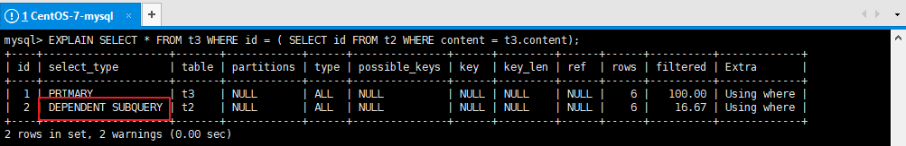


- **UNCACHEABLE SUBQUREY：**表示这个subquery的查询要受到外部系统变量的影响

```sql
EXPLAIN SELECT * FROM t3 
WHERE id = ( SELECT id FROM t2 WHERE content = @@character_set_server);
```

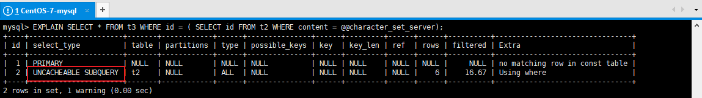


- **UNION：**对于包含UNION或者UNION ALL的查询语句，除了最左边的查询是PRIMARY，其余的查询都是UNION。
- **UNION RESULT：**UNION会对查询结果进行查询去重，MYSQL会使用临时表来完成UNION查询的去重工作，针对这个临时表的查询就是"UNION RESULT"。

```sql
EXPLAIN 
SELECT * FROM t3 WHERE id = 1 
UNION  
SELECT * FROM t2 WHERE id = 1;
```

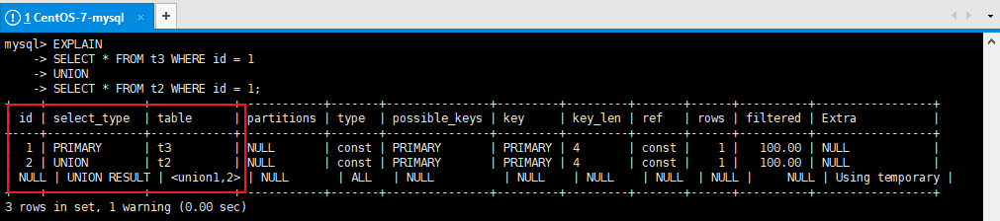


- **DEPENDENT UNION：**子查询中的UNION或者UNION ALL，除了最左边的查询是DEPENDENT SUBQUREY，其余的查询都是DEPENDENT UNION。

```sql
 EXPLAIN SELECT * FROM t1 WHERE content IN
 (
 SELECT content FROM t2 
 UNION 
 SELECT content FROM t3
 );
```

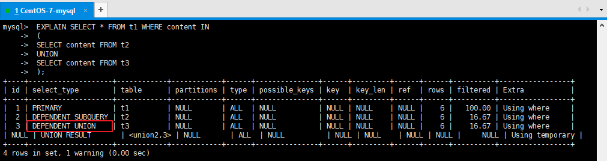


- **DERIVED：**在包含`派生表（子查询在from子句中）`的查询中，MySQL会递归执行这些子查询，把结果放在临时表里。

```sql
EXPLAIN SELECT * FROM (
   SELECT content, COUNT(*) AS c FROM t1 GROUP BY content
) AS derived_t1 WHERE c > 1;
```

这里的`<derived2>`就是在id为2的查询中产生的派生表。

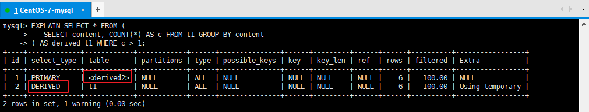


**补充：**MySQL在处理带有派生表的语句时，优先尝试把派生表和外层查询进行合并，如果不行，再把派生表`物化掉（执行子查询，并把结果放入临时表）`，然后执行查询。下面的例子就是就是将派生表和外层查询进行合并的例子：

```sql
EXPLAIN SELECT * FROM (SELECT * FROM t1 WHERE content = 't1_832') AS derived_t1;
```

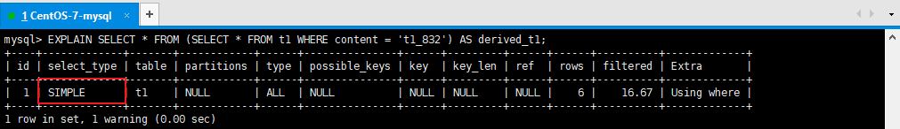


- **MATERIALIZED：**优化器对于包含子查询的语句，`如果选择将子查询物化后再与外层查询连接查询`，该子查询的类型就是MATERIALIZED。如下的例子中，查询优化器先将子查询转换成物化表，然后将t1和物化表进行连接查询。

```sql
 EXPLAIN SELECT * FROM t1 WHERE content IN (SELECT content FROM t2);
```

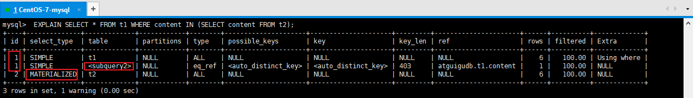


#### partitions

代表分区表中的命中情况，非分区表，该项为NULL


#### type **☆** 

> **说明：**
>
> 结果值从最好到最坏依次是： 
>
> `system > const > eq_ref > ref` > fulltext > ref_or_null > index_merge > unique_subquery > index_subquery > `range > index > ALL` 
>
> `比较重要的包含：system、const 、eq_ref 、ref、range > index > ALL`
>
> SQL 性能优化的目标：至少要达到 `range` 级别，要求是 `ref` 级别，最好是 `consts`级别。（阿里巴巴
> 开发手册要求）


- **ALL：**全表扫描。Full Table Scan，将遍历全表以找到匹配的行

```sql
EXPLAIN SELECT * FROM t1;
```

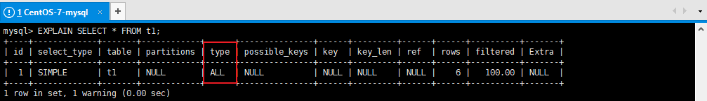


- **index：**当使用`覆盖索引`，但需要扫描全部的索引记录时

`覆盖索引：`如果能通过读取索引就可以得到想要的数据，那就不需要读取用户记录，或者不用再做回表操作了。一个索引包含了满足查询结果的数据就叫做覆盖索引。 

```sql
-- 只需要读取聚簇索引部分的非叶子节点，就可以得到id的值，不需要查询叶子节点
EXPLAIN SELECT id FROM t1;
```

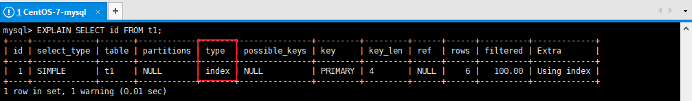

```sql
-- 只需要读取二级索引，就可以在二级索引中获取到想要的数据，不需要再根据叶子节点中的id做回表操作
EXPLAIN SELECT id, deptId FROM t_emp;
```

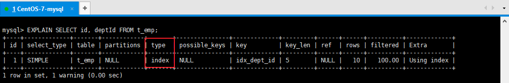


- **range：**只检索给定范围的行，使用一个索引来选择行。key 列显示使用了哪个索引，一般就是在你的where语句中出现了between、<、>、in等的查询。这种范围扫描索引扫描比全表扫描要好，因为它只需要开始于索引的某一点，而结束于另一点，不用扫描全部索引。

```sql
EXPLAIN SELECT * FROM t1 WHERE id IN (1, 2, 3);
```

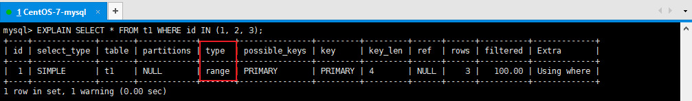


- **ref：**通过普通二级索引列与常量进行等值匹配时

```sql
EXPLAIN SELECT * FROM t_emp WHERE deptId = 1;
```

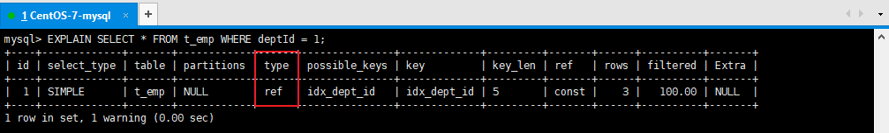


- **eq_ref：**连接查询时通过主键或不允许NULL值的唯一二级索引列进行等值匹配时

```sql
EXPLAIN SELECT * FROM t1, t2 WHERE t1.id = t2.id;
```

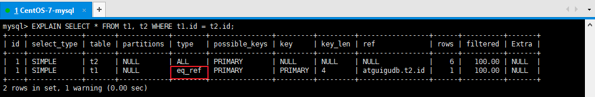


- **const：**根据`主键`或者`唯一二级索引`列与`常数`进行匹配时

```sql
EXPLAIN SELECT * FROM t1 WHERE id = 1;
```

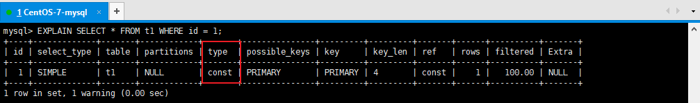


- **system：**MyISAM引擎中，当表中只有一条记录时。`（这是所有type的值中性能最高的场景）`

```sql
CREATE TABLE t(i int) Engine=MyISAM;
INSERT INTO t VALUES(1);
EXPLAIN SELECT * FROM t;
```

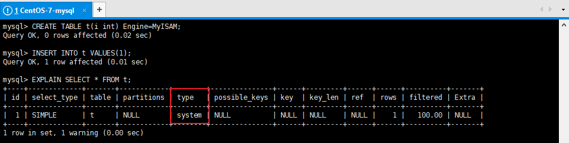


**其他不太常见的类型（了解）：**

- **index_subquery**：利用`普通索引`来关联子查询，针对包含有IN子查询的查询语句。`content1是普通索引字段`

```sql
EXPLAIN SELECT * FROM t1 WHERE content IN (SELECT content1 FROM t4 WHERE t1.content = t4.content2) OR content = 'a';
```

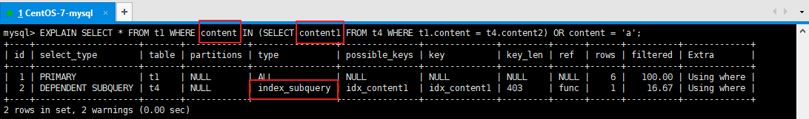


- **unique_subquery**：类似于index_subquery，利用`唯一索引`来关联子查询。`t2的id是主键，也可以理解为唯一的索引字段`

```sql
EXPLAIN SELECT * FROM t1 WHERE id IN (SELECT id FROM t2 WHERE t1.content = t2.content) OR content = 'a';
```

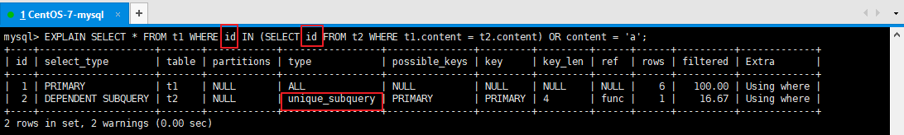


- **index_merge**：在查询过程中需要`多个索引组合使用`，通常出现在有 or 的关键字的sql中。

```sql
EXPLAIN SELECT * FROM t_emp WHERE deptId = 1 OR id = 1;
```

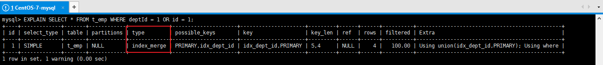


- **ref_or_null**：当对普通二级索引进行等值匹配，且该索引列的值也可以是NULL值时。

```sql
EXPLAIN SELECT * FROM t_emp WHERE deptId = 1 OR deptId IS NULL;
```

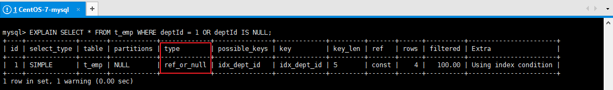


- **fulltext：**全文索引。`一般通过搜索引擎实现，这里我们不展开。`


#### possible_keys 和 keys **☆**

- `possible_keys`表示执行查询时可能用到的索引，一个或多个。 查询涉及到的字段上若存在索引，则该索引将被列出，**但不一定被查询实际使用**。

- `keys`表示实际使用的索引。如果为NULL，则没有使用索引。

```sql
EXPLAIN SELECT id FROM t1 WHERE id = 1;
```

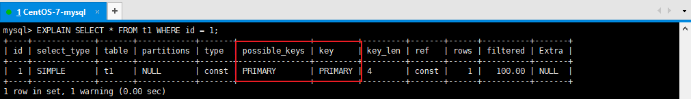


#### key_len **☆** 

表示索引使用的字节数，根据这个值可以判断索引的使用情况，`检查是否充分利用了索引，针对联合索引值越大越好。`

**如何计算：**

1. 先看索引上字段的类型+长度。比如：int=4 ; varchar(20) =20 ; char(20) =20 
2. 如果是varchar或者char这种字符串字段，视字符集要乘不同的值，比如utf8要乘 3，如果是utf8mb4要乘4，GBK要乘2
3. varchar这种动态字符串要加2个字节
4. 允许为空的字段要加1个字节 

```sql
-- 创建索引
CREATE INDEX idx_age_name ON t_emp(age, `name`);
-- 测试1
EXPLAIN SELECT * FROM t_emp WHERE age = 30 AND `name` = 'ab%';
-- 测试2
EXPLAIN SELECT * FROM t_emp WHERE age = 30;
```

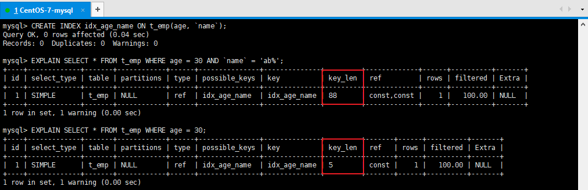


#### ref

显示与key中的索引进行比较的列或常量。

```sql
-- ref=atguigudb.t1.id   关联查询时出现，t2表和t1表的哪一列进行关联
EXPLAIN SELECT * FROM t1, t2 WHERE t1.id = t2.id;

-- ref=const  与索引列进行等值比较的东西是啥，const表示一个常数
EXPLAIN SELECT * FROM t_emp WHERE age = 30;
```

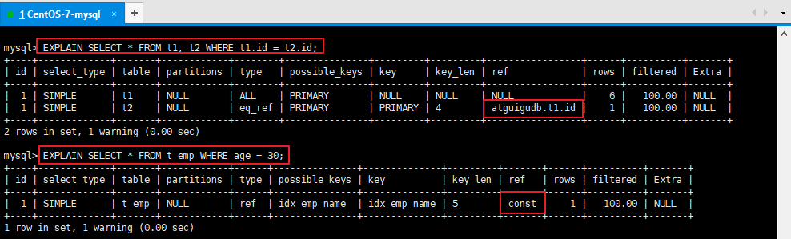


#### rows **☆**

MySQL认为它执行查询时必须检查的行数。值越小越好。

```sql
-- 如果是全表扫描，rows的值就是表中数据的估计行数
EXPLAIN SELECT * FROM t_emp WHERE empno = '10001';

-- 如果是使用索引查询，rows的值就是预计扫描索引记录行数
EXPLAIN SELECT * FROM t_emp WHERE deptId = 1;
```

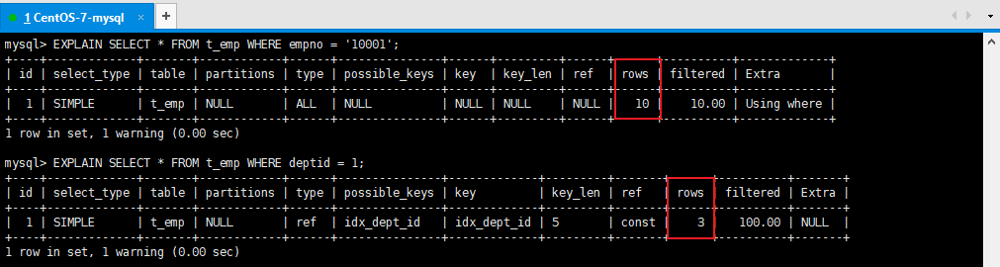


#### filtered

最后查询出来的数据占所有服务器端检查行数（rows）的`百分比`。值越大越好。

```sql
-- 先根据二级索引deptId找到数据的主键，有3条记录满足条件，
-- 再根据主键进行回表，最终找到3条记录，有100%的记录满足条件
EXPLAIN SELECT * FROM t_emp WHERE deptId = 1;

-- 这个例子如果name列是索引列则 filtered = 100 否则filtered = 10(全表扫描)
EXPLAIN SELECT * FROM t_emp WHERE `name` = '风清扬';
```

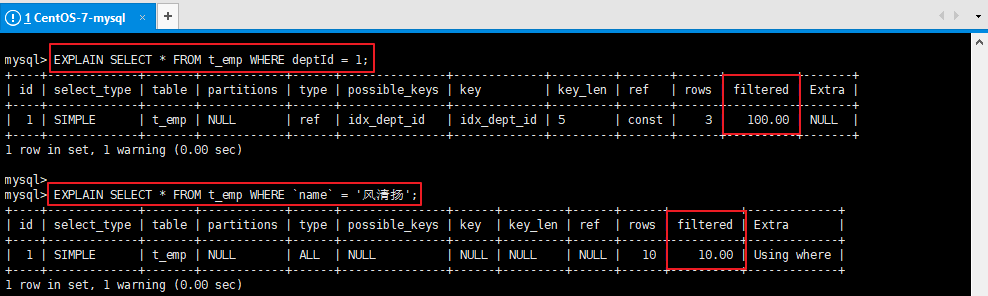


#### Extra **☆** 

包含不适合在其他列中显示但十分重要的额外信息。通过这些额外信息来`理解MySQL到底将如何执行当前的查询语句`。MySQL提供的额外信息有好几十个，这里只挑介绍比较重要的介绍。


- **Impossible WHERE**：where子句的值总是false

```sql
EXPLAIN SELECT * FROM t_emp WHERE 1 != 1;
```

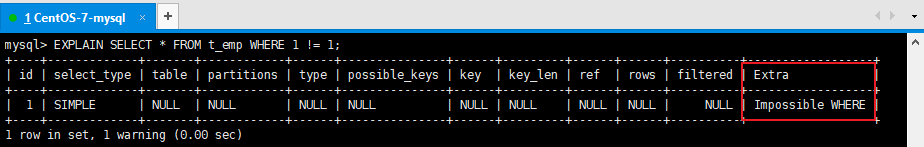


- **Using where：**使用了where，但在where上有字段没有创建索引

```sql
EXPLAIN SELECT * FROM t_emp WHERE `name` = '风清扬';
```

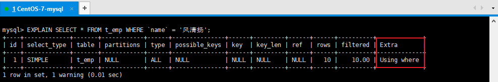


- **Using temporary：**使了用临时表保存中间结果

```sql
EXPLAIN SELECT DISTINCT content FROM t1;
```

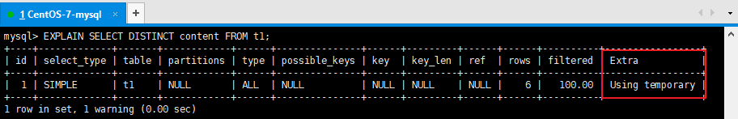


- **Using filesort：**

在对查询结果中的记录进行排序时，是可以使用索引的，如下所示：

```sql
EXPLAIN SELECT * FROM t1 ORDER BY id;
```

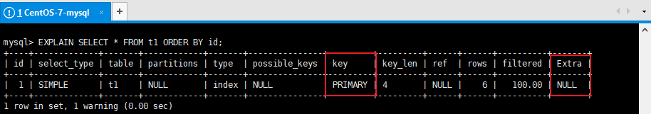

如果排序操作无法使用到索引，只能在内存中（记录较少时）或者磁盘中（记录较多时）进行排序（filesort），如下所示：

```sql
EXPLAIN SELECT * FROM t1 ORDER BY content;
```

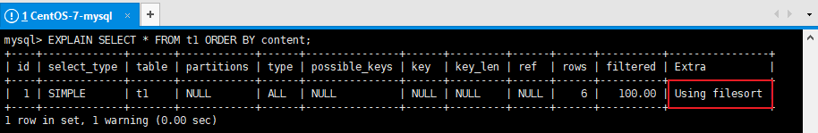


- **Using index：**使用了覆盖索引，表示直接访问索引就足够获取到所需要的数据，不需要通过索引回表

```sql
 EXPLAIN SELECT id, content1 FROM t4;
```

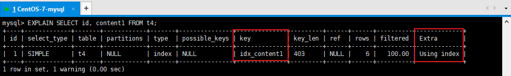

```sql
EXPLAIN SELECT id FROM t1;
```

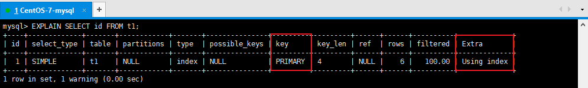


- **Using index condition：**叫作  `Index Condition Pushdown Optimization （索引下推优化）`
  - `如果没有索引下推（ICP）`，那么MySQL在存储引擎层找到满足`content1 > 'z'`条件的第一条二级索引记录。`主键值进行回表`，返回完整的记录给server层，server层再判断其他的搜索条件是否成立。如果成立则保留该记录，否则跳过该记录，然后向存储引擎层要下一条记录。
  - `如果使用了索引下推（ICP`），那么MySQL在存储引擎层找到满足`content1 > 'z'`条件的第一条二级索引记录。`不着急执行回表`，而是在这条记录上先判断一下所有关于`idx_content1`索引中包含的条件是否成立，也就是`content1 > 'z' AND content1 LIKE '%a'`是否成立。如果这些条件不成立，则直接跳过该二级索引记录，去找下一条二级索引记录；如果这些条件成立，则执行回表操作，返回完整的记录给server层。

```sql
-- content1列上有索引idx_content1
EXPLAIN SELECT * FROM t4 WHERE content1 > 'z' AND content1 LIKE '%a';
```

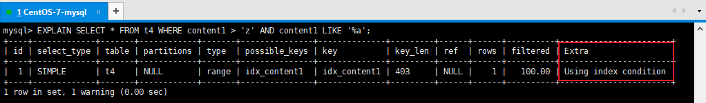

**注意：**如果这里的查询条件`只有content1 > 'z'`，那么找到满足条件的索引后也会进行一次索引下推的操作，判断content1 > 'z'是否成立（这是源码中为了编程方便做的冗余判断）

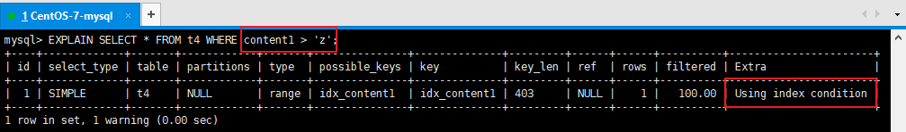


- **Using join buffer：**在连接查询时，当被驱动表不能有效的利用索引时，MySQL会为其分配一块名为连接缓冲区（join buffer）的内存来加快查询速度

```sql
EXPLAIN  SELECT * FROM t1, t2 WHERE t1.content = t2.content;
```

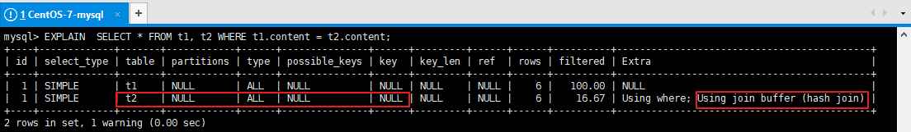

下面这个例子就是被驱动表使用了索引：

```sql
EXPLAIN SELECT * FROM t_emp, t_dept WHERE t_dept.id = t_emp.deptId;
```

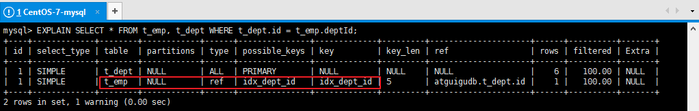


### 133 MySQL数据库cpu飙升的话你会如何分析

重点是定位问题。

先

**1 使用top观察mysqld的cpu利用率**

1. 切换到常用的数据库

2. 使用show full processlist;查看会话

3. 观察是哪些sql消耗了资源，其中重点观察state指标

4. 定位到具体sql


**2 pidstat** 

1. 定位到线程
2. 在PERFORMANCE_SCHEMA.THREADS中记录了thread_os_id 找到线程执行的sql
3. 根据操作系统id可以到processlist表找到对应的会话
4. 在会话中即可定位到问题sql

**3 使用show profile观察sql各个阶段耗时**

**4 服务器上是否运行了其他程序**

**5 检查一下是否有慢查询**

**6 pref top**

使用pref 工具分析哪些函数引发的cpu过高来追踪定位

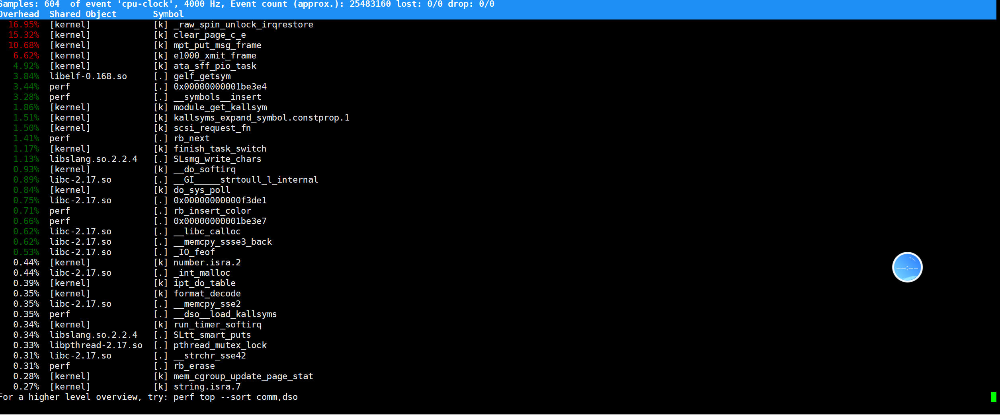


### 134 有没有进行过分库分表？

#### 135 	什么是分库分表？

**垂直分库**

一个数据库由很多表的构成，每个表对应着**不同的业务**，垂直切分是指按照业务将表进行分类，分布到不同 的数据库上面，这样也就将数据或者说压力分担到不同的库上面，如下图：       

​                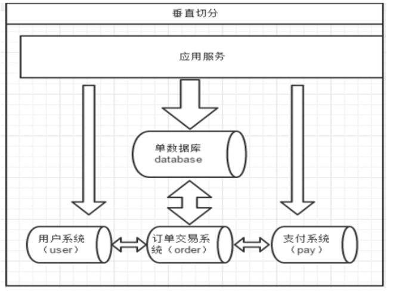   

系统被切分成了，用户，订单交易，支付几个模块。

**水平分表**

把一张表里的内容按照不同的规则 写到不同的库里

相对于垂直拆分，水平拆分不是将表做分类，而是按照某个字段的某种规则来分散到多个库之中，每个表中包含一部分数据。简单来说，我们可以将数据的水平切分理解为是按照数据行的切分，就是将表中的某些行切分 到一个数据库，而另外的某些行又切分到其他的数据库中，如图： 

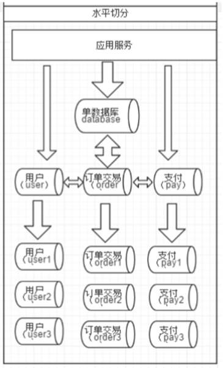


#### 136 	什么时候进行分库分表？有没有配合es使用经验？

1. 能不分就不分
2. 单机性能下降明显的时候
3. 增加缓存（通常查询量比较大），细分业务
4. 首先尝试主被集群，读写分离
5. 尝试分库
6. 尝试分表 -> 冷热数据分离

大数据量下可以配合es完成高效查询

#### 137 	说一下实现分库分表工具的实现思路

1. 伪装成mysql服务器，代理用户请求转发到真实服务器
2. 基于本地aop实现，拦截sql，改写，路由和结果归集处理。

#### 138 	用过哪些分库分表工具？

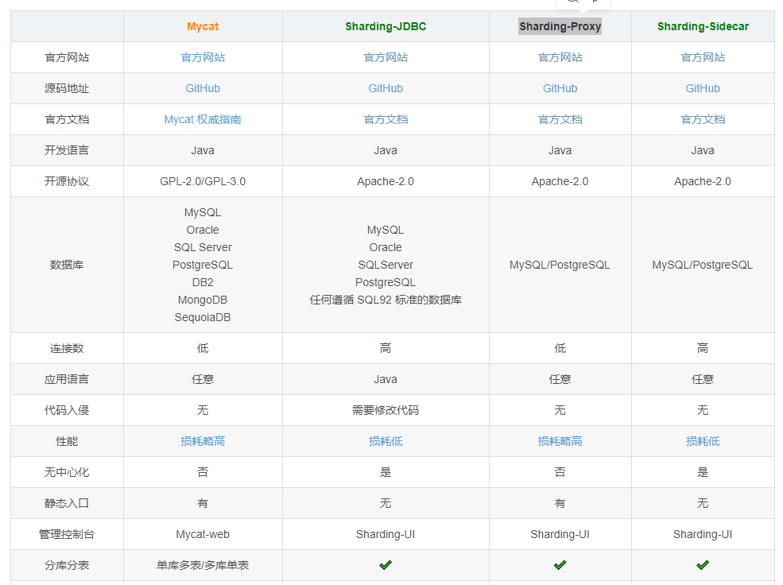

#### 139 	分库分表后可能会有哪些问题？

经典的问题

1. 执行效率明显降低
2. 表结构很难再次调整
3. 引发分布式id问题
4. 产生跨库join
5. 代理类中间件网络io成为瓶颈

#### 140 	说一下读写分离常见方案？

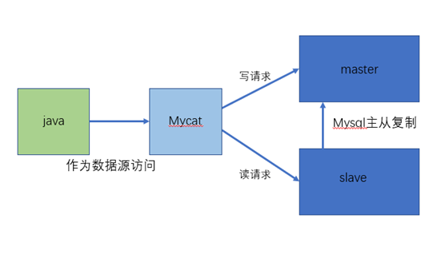

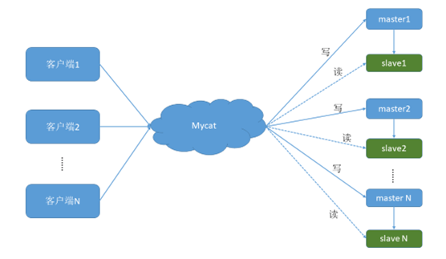


### 141 为什么要使用视图？ 什么是视图？

视图定义：
1、视图是一个虚表，是从一个或几个基本表（或视图）导出的表。
2、只存放视图的定义，不存放视图对应的数据。
3、基表中的数据发生变化，从视图中查询出的数据也随之改变。
视图的作用：
1、视图能够简化用户的操作
2、视图使用户能以多种角度看待同一数据
3、视图对重构数据库提供了一定程度的逻辑独立性
4、视图能够对机密数据提供安全保护
5、适当的利用视图可以更清晰的表达查询

### 142 什么是存储过程？有没有使用过？

项目中禁止使用存储过程，存储过程难以调试和扩展，更没有移植性

### 143 有没有使用过外键？有什么需要注意的地方？

不得使用外键与级联，一切外键概念必须在应用层解决。 

说明：以学生和成绩的关系为例，学生表中的 student_id是主键，那么成绩表中的 student_id 则为外键。如果更新学生表中的 student_id，同时触发成绩表中的 student_id 更新，即为 级联更新。外键与级联更新适用于单机低并发，不适合分布式、高并发集群；级联更新是强阻 塞，存在数据库更新风暴的风险；外键影响数据库的插入速度。

### 144 用过processlist吗？

关键的就是state列，mysql列出的状态主要有以下几种：

- Checking table
  正在检查数据表（这是自动的）。
- Closing tables
  正在将表中修改的数据刷新到磁盘中，同时正在关闭已经用完的表。这是一个很快的操作，如果不是这样的话，就应该确认磁盘空间是否已经满了或者磁盘是否正处于重负中。
- Connect Out
  复制从服务器正在连接主服务器。
- Copying to tmp table on disk
  由于临时结果集大于tmp_table_size，正在将临时表从内存存储转为磁盘存储以此节省内存。
- Creating tmp table
  正在创建临时表以存放部分查询结果。
- deleting from main table
  服务器正在执行多表删除中的第一部分，刚删除第一个表。
- deleting from reference tables
  服务器正在执行多表删除中的第二部分，正在删除其他表的记录。
- Flushing tables
  正在执行FLUSH TABLES，等待其他线程关闭数据表。
- Killed
  发送了一个kill请求给某线程，那么这个线程将会检查kill标志位，同时会放弃下一个kill请求。MySQL会在每次的主循环中检查kill标志位，不过有些情况下该线程可能会过一小段才能死掉。如果该线程程被其他线程锁住了，那么kill请求会在锁释放时马上生效。
- Locked
  被其他查询锁住了。
- Sending data
  正在处理Select查询的记录，同时正在把结果发送给客户端。Sending data”状态的含义，原来这个状态的名称很具有误导性，所谓的“Sending data”并不是单纯的发送数据，而是包括“收集 + 发送 数据”。
- Sorting for group
  正在为GROUP BY做排序。
- Sorting for order
  正在为ORDER BY做排序。
- Opening tables
  这个过程应该会很快，除非受到其他因素的干扰。例如，在执Alter TABLE或LOCK TABLE语句行完以前，数据表无法被其他线程打开。正尝试打开一个表。
- Removing duplicates
  正在执行一个Select DISTINCT方式的查询，但是MySQL无法在前一个阶段优化掉那些重复的记录。因此，MySQL需要再次去掉重复的记录，然后再把结果发送给客户端。
- Reopen table
  获得了对一个表的锁，但是必须在表结构修改之后才能获得这个锁。已经释放锁，关闭数据表，正尝试重新打开数据表。
- Repair by sorting
  修复指令正在排序以创建索引。
- Repair with keycache
  修复指令正在利用索引缓存一个一个地创建新索引。它会比Repair by sorting慢些。
- Searching rows for update
  正在讲符合条件的记录找出来以备更新。它必须在Update要修改相关的记录之前就完成了。
- Sleeping
  正在等待客户端发送新请求.
- System lock
  正在等待取得一个外部的系统锁。如果当前没有运行多个mysqld服务器同时请求同一个表，那么可以通过增加--skip-external-locking参数来禁止外部系统锁。
- Upgrading lock
  Insert DELAYED正在尝试取得一个锁表以插入新记录。=
- Updating
  正在搜索匹配的记录，并且修改它们。
- User Lock
  正在等待GET_LOCK()。
- Waiting for tables
  该线程得到通知，数据表结构已经被修改了，需要重新打开数据表以取得新的结构。然后，为了能的重新打开数据表，必须等到所有其他线程关闭这个表。以下几种情况下会产生这个通知：FLUSH TABLES tbl_name, Alter TABLE, RENAME TABLE, REPAIR TABLE, ANALYZE TABLE,或OPTIMIZE TABLE。
- waiting for handler insert
  Insert DELAYED已经处理完了所有待处理的插入操作，正在等待新的请求。

### 145 某个表有数千万数据，查询比较慢，如何优化？说一下思路

1. 前端优化 减少查询
   1. 合并请求:多个请求需要的数据尽量一条sql拿出来
   2. 会话保存：和用户会话相关的数据尽量一次取出重复使用
   3. 避免无效刷新
2. 多级缓存 不要触及到数据库
   1. 应用层热点数据高速查询缓存（低一致性缓存）
   2. 高频查询大数据量镜像缓存（双写高一致性缓存）
   3. 入口层缓存（几乎不变的系统常量）
3. 使用合适的字段类型，比如varchar换成char
4. 一定要高效使用索引。
   1. 使用explain 深入观察索引使用情况
   2. 检查select 字段最好满足索引覆盖
   3. 复合索引注意观察key_len索引使用情况
   4. 有分组，排序，注意file sort，合理配置相应的buffer大小
5. 检查查询是否可以分段查询，避免一次拿出过多无效数据
6. 多表关联查询是否可以设置冗余字段，是否可以简化多表查询或分批查询
7. 分而治之：把服务拆分成更小力度的微服务
8. 冷热数据分库存储
9. 读写分离，主被集群 然后再考虑分库分表
10. 等

### 146 count(列名)和 count(*)有什么区别？

count(*)是 SQL92 定义的
标准统计行数的语法，跟数据库无关，跟 NULL 和非 NULL 无关。
说明：count(*)会统计值为 NULL 的行，而 count(列名)不会统计此列为 NULL 值的行。


### 147 如果有超大分页改怎么处理？

- `select name from user limit 10000,10;`在 使用的时候并不是跳过 offset 行，而是取 offset+N 行，然后返回放弃前 offset 行，返回 N 行

- 通过索引优化的方案：

  - 如果主键自增可以 `select name from user where id > 10000 limit 10;`
  - 延迟关联
  - 需要order by时
    - 一定注意增加筛选条件，避免全表排序
      - where  -》 order by -》 limit
    - 减少select字段
    - 优化相关参数避免filesort

- 一般大分页情况比较少（很少有人跳转到几百万页去查看数据），实际互联网业务中多数还是按顺序翻页，可以使用缓存提升前几页的查询效率，实际上大多数知名互联网项目也都是这么做的

  

在阿里巴巴《Java开发手册》中的建议：

【推荐】利用延迟关联或者子查询优化超多分页场景。 说明：MySQL 并不是跳过 offset 行，而是取 offset+N 行，然后返回放弃前 offset 行，返回 N 行，那当 offset 特别大的时候，效率就非常的低下，要么控制返回的总页数，要么对超过 特定阈值的页数进行 SQL 改写。 正例：先快速定位需要获取的 id 段，然后再关联： SELECT a.* FROM 表 1 a, (select id from 表 1 where 条件 LIMIT 100000,20 ) b where a.id=b.id

### 148 mysql服务器毫无规律的异常重启如何排查问题？

首先是查看mysql和系统日志来定位错误

**最常见的是关闭swap分区后OOM问题：**

mysql 分为应用进程和守护进程

当应用进程内存占用过高的时候操作系统可能会kill掉进程，此时守护进程又帮我们重启了应用进程，运行一段时间后又出现OOM如此反复

可以排查以下几个关键点

- 运行时内存占用率
- mysql buffer相关参数
- mysql 网络连接相关参数

**异常关机或kill -9 mysql 后导致表文件损坏**

- 直接使用备份
- 配置 innodb_force_recovery 跳过启动恢复过程

#### 149 mysql 线上修改表结构有哪些风险?

针对ddl命令，有以下几种方式

- copy table  锁原表，创建临时表并拷贝数据
- inplace 针对索引修改删除的优化，不需要拷贝所有数据
- Online DDL 细分DDL命令来决定是否锁表


- 可能会锁表，导致无法读写
- ORM中的映射失效
- 索引失效

建议：建个新表，导入数据后重命名

### 150 什么是mysql多实例部署？

指的是在一台主机上部署多个实例

主要目的是压榨服务器性能

缺点是互相影响
