## 01: pytest介绍及基本使用

官网：https://www.osgeo.cn/pytest/contents.html

pytest是python语言下的一种单元测试框架，与python自带的unittest单元测试框架类似，相比于unittest框架使用起来更简洁，效率更高。

（补充：java语言下的单元测试框架是junit和testng）

pytest可以结合requests实现接口测试，结合selenium/playwright、appium实现自动化功能测试。

 

### pytest特点

```py
具有unittest绝大部分功能，非常容易上手，入门简单，功能灵活，文档丰富，文档中有很多实例可以参考
具有强大灵活的fixture固件，支持简单的单元测试和复杂的功能测试；
支持参数化（parametrize）、数据驱动
执行测试过程中可以将某些测试跳过（skip），或者对某些预期失败的case标记成失败（xfail）
支持重复执行（rerun）失败的case
支持运行由nose ，unittest编写的测试case
支持执行部分用例（比如：根据标记，或者features、stories，后者一来allure-pytest插件）
具有很多第三方插件（顺序控制pytest-ordering、allure报告allure-pytest、多线程pytest-xdist、......），并且可以自定义开发插件
可生成html报告，也可以结合allure生成精美的测试报告10.方便的和持续集成工具jenkins集成
```

#### 和unittest区别

| **不同点** | **unittest**                                     | **pytest**                                                   |
| ---------- | ------------------------------------------------ | ------------------------------------------------------------ |
| 命名       | 测试方法以test开头                               | 模块名必须以test_开头，或者_test结尾类以Test开头方法/函数以test开头 |
| 框架结构   | 写case必须定义类，测试类要继承unitttest.TestCase | 不需要继承，可以是函数也可以是类中方法                       |
| 测试报告   | 使用HTMLTestRunner                               | 使用allure-pytest                                            |
| 数据驱动   | 参数化使用第三方ddt                              | 参数化使用自带的parametrize                                  |
| 断言       | 断言库丰富                                       | 采用python断言：使用assert关键字                             |
| 失败重试   | 不支持                                           | 支持                                                         |
| 固件       | -                                                | 灵活的fixture固件                                            |
| 扩展性     | -                                                | 快速自定义插件开发                                           |

#### pytest测试用例编写规则

测试框架在识别、加载用例的过程，称之为:**用例发现**
pytest的用例发现步骤:
	1.遍历所有的目录，例外: venv，.开头的目录
	2.打开**python文件**，test_开头 或  _test结尾
	3.遍历所有的Test开头**类**
	4.收集所有的 test_开头 的**函数或方法**

2.用例内容规则

pytest8.4增加了一个强制要求
pytest对用例的要求:
	1.可调用的(函数、方法、类、对象)
	2.名字test_开头
	3.没有参数(参数有另外含义)


| **类型**  | **规则**                                                     |
| --------- | ------------------------------------------------------------ |
| 模块      | 模块名必须以test_开头 或者  _test结尾：test_XXXXXX.py  或 XXXX_test.py |
| 类        | 测试类类名以Test开头：测试类中不能包含__init__构造方法，添加构造方法后就不是测试类了，里面的测试方法都识别不到 |
| 方法/函数 | test_开头：test_xxxxx                                        |
| 包        | 包名无特殊要求包必项要有__init__.py文件                      |
| 其他规则  | 1.执行时会遍历所有的目录，例外: venv，.开头的目录            |

 

### 安装pytest

前提：已经安装、配置python环境

参考：https://www.cnblogs.com/uncleyong/p/10778792.html

#### 通过命令安装

安装命令：pip install pytest

如果安装不了，请更换pip源，参考：https://www.cnblogs.com/uncleyong/p/17997261

如果已经安装，升级到最新版本：pip install -U pytest

#### 通过pycharm安装

pycharm中安装需要的包，在settings中，选择Python Interpreter，然后点击“+”


 

搜索要安装的包，右下角可以选择需要的版本，最后左下角安装即可


 

#### 验证是否安装成功

pytest --version

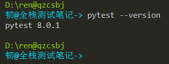

 

#### pycharm默认测试执行器

settings中，进入Tools -> Python Intergrated Tools，Default test runner默认是自动发现的，可以直接选择pytest


也可以settings中搜索pytest快速进入Python Intergrated Tools


 总结

- 用pytest的解释器执行用例：1、命令行中直接执行pytest；2、pycharm中方法和类，直接点绿色执行按钮运行；模块和包，选中模块或者包，然后右键运行；或者非测试方法处点右键执行（因为pycharm已设置默认测试执行器是pytest）


- 用python的解释器执行用例：1、命令中执行python -m pytest调用pytest（jenkins持续集成可用到，可指定不同版本的python）；2、有main函数，命令中执行python xxx.py，调用py文件中main函数中的pytest.main()；说明：直接执行这个模块，被执行的模块是main（可print(__name__)查看结果），如果此模块被其它模块导入，这个模块就不是main了。

### pytest执行主要命令参数

| 参数           | 说明                                                         |
| -------------- | ------------------------------------------------------------ |
| --help         | 查看帮助，等同-h                                             |
| -q             | 简化控制台的输出，只输出执行结果，几条用例通过或不通过       |
| -v             | 详细输出，打印详细日志，可以看到用例执行的先后顺序、结果；如果不加-v，成功看到的是绿色.，失败看到的是红色F |
| -s             | 调试输出，就是输出print的内容，等价于pytest --capture=no，可以捕获print函数的输出一般和-v一起用，-vs |
| -k             | 测试方法名中包含指定关键字的测试用例，支持and、or、not比如：　　pytest -k test_2，或者pytest -k "test_2"　　pytest -k "test_2 or test_1"，这里要用双引号　　pytest -k "not test_1" |
| -m             | 通过标志表达式运行比如：pytest -m user，pytest -m "user"，将运行 @pytest.mark.user装饰器修饰的所有用例　　等价main中，pytest.main(["-m","user"])，一般加上-vs，pytest.main(["-vs","-m","user"]) |
| -n=2           | 多线程运行(依赖于插件)                                       |
| -x             | 用例一旦失败(fail/error)就立即停止测试（相当于冒烟测试，失败就停止，哪怕没执行完，也不用关心后面的执行结果），等价于pytest --exitfirst |
| --maxfail=n    | 在第n次失败后停止测试，也就是失败数达到num就停止             |
| --lf           | 重跑上次失败用例，等价于--last-failed；命令行参数使用缓存状态如果这些失败的都成功了，再次运行，会把所有成功的都运行，而不是没有失败的了就不运行了 |
| --collect-only | 收集测试用例(不执行)                                         |

#### 1、命令行参数

用于pytest运行时的参数，比如-k、-m等，有通用类、报告类、收集类、调试类、日志类等

==-h参数:pytest -h的结果分类：==

通用类

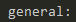

 

报告类


 

告警


 

收集


 

调试


 

日志


 

#### 2、元数据


#### 3、配置参数：pytest.ini中配置的参数


 

4.环境变量


 

5.重跑失败


 

#### -s参数

示例：上面示例发现，如果用例执行成功，print内容没显示，可以加-s参数捕获print函数的输出


 

## 02: 用例查找规则

### 规则

pytest命令方式运行时，用例查找规则如下：

| **命令**                               | **说明**                        |
| -------------------------------------- | ------------------------------- |
| pytest（等价于：python -m pytest）     | 运行当前目录及子目录下所有用例  |
| pytest ./                              | 运行当前目录及子目录下所有用例  |
| pytest .\test_00.py -vs                | 指定模块运行                    |
| pytest -k test_2                       | 按关键字（函数/方法名）匹配运行 |
| pytest .\test_00.py::test_a            | 指定函数运行                    |
| pytest .\test_00.py::TestDemo1         | 指定类运行                      |
| pytest .\test_00.py::TestDemo1::test_c | 指定类方法运行                  |

### 执行演示

创建My_Pytest工程，添加测试Demo。以测试add函数为例子，创建测试用例

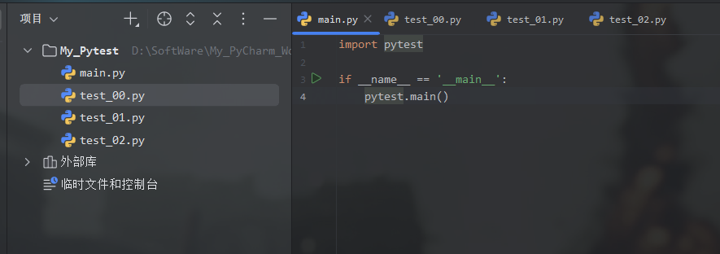

`Testcase/test_00.py`

```python
import pytest

def inc (x):
    return x + 1

def test_a ( ):
    print("---test_a")
    assert inc(0) == 1


class TestDemo1:
    def test_b (self):
        print("---test_b")
        assert "D" in "Demo"

    def test_c (self):
        print("---test_c")
        assert "em" in "Demo"


class TestDemo2:
    def test_d (self):
        print("---test_d")
        assert "mo" in "Demo"


def add(a,b):
    return a + b

class TestAdd:
    def test_add_int(self):
        print("---test_add_int")
        res = add(1,3)
        assert res == 4

    def test_add_str(self):
        print("---test_add_str")
        res = add("aaa","bbb")
        assert res == "aaabbb"

    def test_add_list(self):
        print("---test_add_list")
        res = add([1],[2,3,4])
        assert res == [1,2,3,4]
```

`Testcase/test_01.py`

```python
import pytest

def test_1():
    print("---test_1")
    assert 1 == 1
```

`Testcase/test_02.py`

```python
import pytest

def test_2 ( ):
    print("---test_2")
    assert 1 == 1
```


测试结果：下面命令都统一加上了-vs参数

(1) pytest

运行当前目录及子目录下所有用例 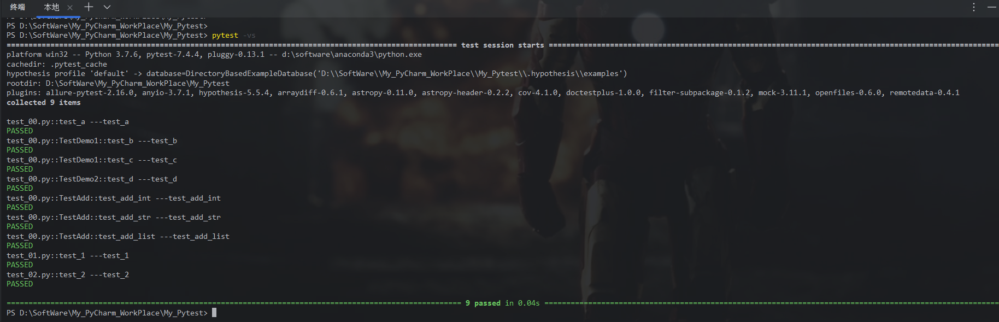

(2) pytest ./ -vs

运行了当前目录及子目录下所有用例


(3) pytest .\test_00.py -vs

指定模块运行 

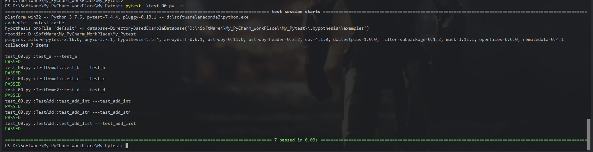

(4) pytest -k test_2 -vs

按关键字（函数/方法名）匹配运行

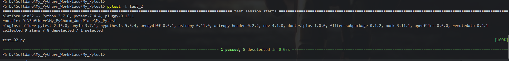

(5) pytest .\test_00.py::test_a

指定函数运行

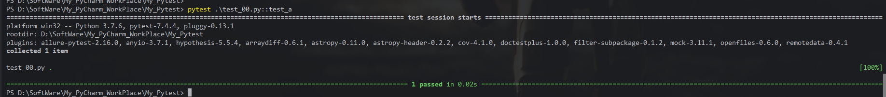

(6) pytest .\test_00.py::TestDemo1

指定类运行

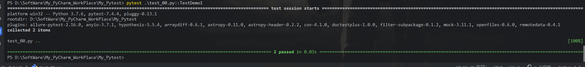

(7) pytest .\test_00.py::TestDemo1::test_c

指定方法运行

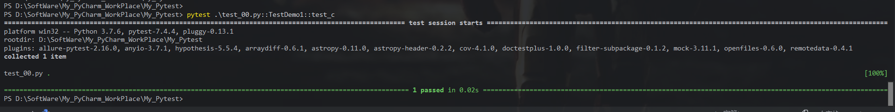

## 03: pytest固件、及用例执行顺序

### 固件分类

固件用于执行前的初始化参数、执行后的清理动作。

| 类型                                          | 规则                                                         |
| --------------------------------------------- | ------------------------------------------------------------ |
| setup_module/teardown_module                  | 全局模块级模块运行前/后运行（只运行一次）                    |
| setup_function/teardown_function              | 函数级每个函数用例运行前/后运行                              |
| setup_class/teardown_class                    | 类级每个class运行前/后运行(只运行一次)                       |
| setup_method(setup)/teardown_method(teardown) | 方法级类中每个方法用例执行前/后运行，setup_method和setup、teardown_method和teardown二选一即可 |


示例（Testcase/test_03.py）：一个module，两个函数，两个类，每个类两个方法

```python
## 一个module，两个函数，两个类，每个类两个方法

import pytest

def setup_module ( ):
    print("初始化：setup_module")

def teardown_module ( ):
    print("清理：teardown_module")

def setup_function ( ):
    print("初始化：setup_function")

def teardown_function ( ):
    print("清理：teardown_function")


def test_f ( ):
    print("--------------test_f")

class Test01:
    def setup_class (self):
        print("初始化：setup_class1")

    def teardown_class (self):
        print("清理：teardown_class1")

    def setup_method (self):
        print("初始化：setup_method1")

    def teardown_method (self):
        print("清理：teardown_method1")

    def test_c (self):
        print("--------------test_c")

    def test_d (self):
        print("--------------test_d")


class Test02:
    def setup_class (self):
        print("初始化：setup_class2")

    def teardown_class (self):
        print("清理：teardown_class2")

    def setup_method (self):
        print("初始化：setup_method2")

    def teardown_method (self):
        print("清理：teardown_method2")

    def test_a (self):
        print("--------------test_a")

    def test_b (self):
        print("--------------test_b")


def test_e ( ):
    print("--------------test_e")
```


运行结果：通过结果可以看到，固件执行规则和我们最开始描述的一致

全集模块级(setup/teardown)  --> 函数级别(setup/teardown)  --> 模块级(setup/teardown)


默认用例执行顺序

**pytest框架默认根据书写代码的先后顺序来执行**

```python
## 默认用例执行顺序

import pytest

def setup_module ():
    print("初始化：setup_module")

def teardown_module ():
    print("清理：teardown_module")

def setup_function ():
    print("初始化：setup_function")

def teardown_function ():
    print("清理：teardown_function")


def test_f ( ):
    print("--------------test_f")


class Test01:
    def setup_class (self):
        print("初始化：setup_class1")

    def teardown_class (self):
        print("清理：teardown_class1")

    def setup_method (self):
        print("初始化：setup_method1")

    def teardown_method (self):
        print("清理：teardown_method1")

    def test_d (self):
        print("--------------test_d")

    def test_c (self):
        print("--------------test_c")


class Test02:
    def setup_class (self):
        print("初始化：setup_class2")

    def teardown_class (self):
        print("清理：teardown_class2")

    def setup_method (self):
        print("初始化：setup_method2")

    def teardown_method (self):
        print("清理：teardown_method2")

    def test_b (self):
        print("--------------test_b")

    def test_a (self):
        print("--------------test_a")


def test_e ():
    print("--------------test_e")
```

执行结果：pytest框架默认根据书写代码的先后顺序来执行

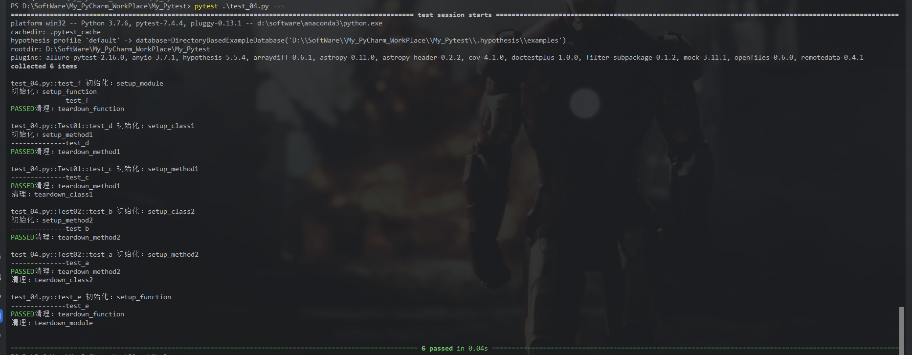


## 04: mark标记测试用例

### 前言

通常，我们通过分包或者分模块来对用例进行分类管理，如果只想执行符合某要求的部分用例，该如何实现呢？

可以使用装饰器@pytest.mark.xxx给用例打标签（自定义标记）。

### 1、用户自定义标记

**作用**：只能用于实现用例筛选（既类似 -m 参数的的作用）

> **使用流程**：
>
> 1、注册自定义标记（通过pytest.ini进行管理）/ 直接在命令参数中使用
> 2、将模块、函数、类、方法进行业务标记
> 3、根据自定义标记运行用例

（1）命令参数配置

```python
## 常用参数
-v : 增加结果详细程度
-s : 在用例中正常使用输入输出
-x : 当遇到失败用例时，快速推出
-m : 用例筛选（指定执行哪些用例）
```

（2）pytest.ini 配置

```python
pytest
```

查看配置

```python
pytest -h
## 以 -/--开头：命令行参数
## 小写字母开头：ini配置
## 大写字母开头：环境遍历
```

- 以 -/--开头：命令行参数


- 小写字母开头：ini配置

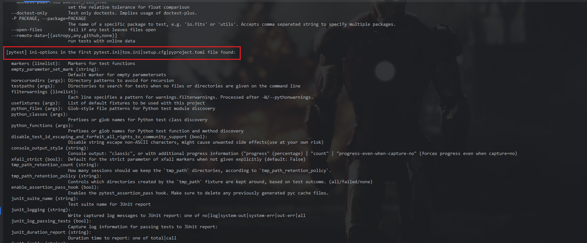

- 大写字母开头：环境遍历

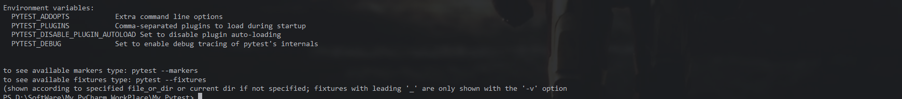


#### Demo:注册自定义标记

> **步骤：**
>
> （1）先注册：在ini文件中进行声明
> （2）再标记：在用例文件中，对用例进行标记
> （3）后筛选

##### (1) 注册自定义标记

在pytest.ini文件中注册

```python
[pytest]
markers =
    api:接口相关
    web:UI相关
    ut:单元测试
    login:登陆相关
    pay:支付相关
```

说明：

```
1.标记名要是英文命名，建议参考模块命名，要有业务含义
2.所有自定义标记，建议在pytest.ini中进行统一管理，并通过命令参数--strict-markers进行授权（非必须）
3.pytest中的markers配置相当于我们对用例的一种归类
```

###### 获取现有标记（所有）

```python
pytest --markers
```

 包含自定义和内置，前面几个是我们刚刚创建的

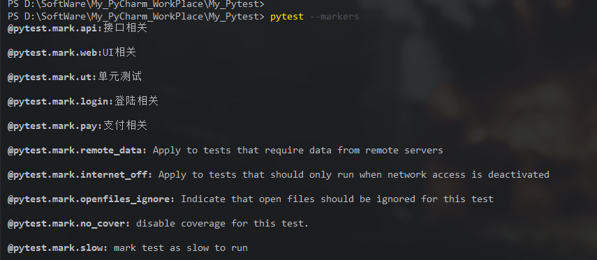

开启严格标记，如果标记不在配置文件中，会报错；

不开启严格标记，如果标记不在配置文件中，会warning；

```python
[pytest]
addopts = --strict-markers
markers =
    user: user marker
    product: product marker
    findproduct
    deleteproduct
    modulex: modulex marker
```


##### (2) 在测试用例中，使用自定义标记

Testcase/test_04.py

```python
import pytest
# 使用用户自定义标记

def add(a,b):
    return a + b

class TestAdd:
    @pytest.mark.api
    def test_add_int(self):
        print("---test_add_int")
        res = add(1,3)
        assert res == 4

    @pytest.mark.web
    def test_add_str(self):
        print("---test_add_str")
        res = add("aaa","bbb")
        assert res == "aaabbb"

    @pytest.mark.ut
    def test_add_list(self):
        print("---test_add_list")
        res = add([1],[2,3,4])
        assert res == [1,2,3,4]

    @pytest.mark.login
    def test_add_float(self):
        print("---test_add_float")
        res = add(1.2,3.4)
        assert res == 3.6

    @pytest.mark.pay
    def test_add_number(self):
        print("---test_add_number")
        res = add(11,33)
        assert res == 44
```

##### (3) 执行用例

###### (A) 直接执行，无 `-m`参数

作用： 与pytest直接运行类似，**没有起到筛选功能**

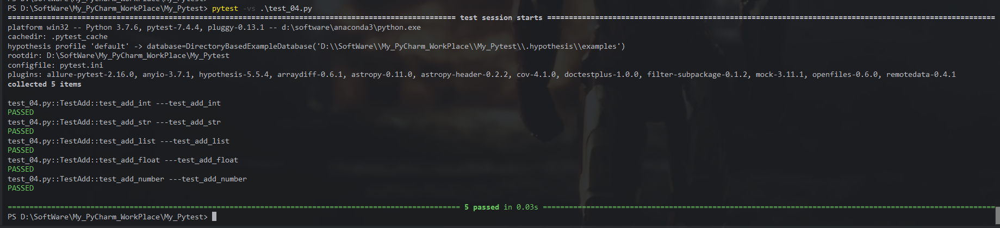

###### (B) 使用 -m 参数，加上自定义标记，起到筛选功能

命令：`pytest -vs test_04.py -m [自定义标记名]`


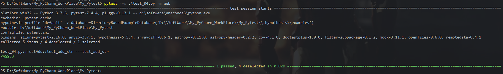

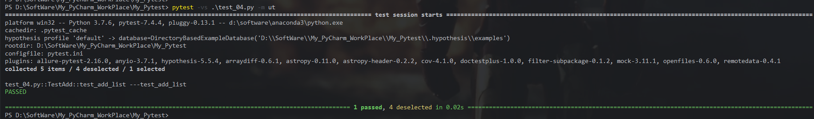


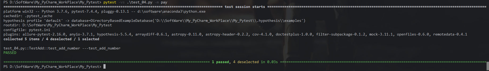


### 2、框架内置标记使用流程

框架内置标记可以为用例增加特殊执行效果

和用户自定义标记区别:

> 1.无需注册，直接使用
> 2.不仅可以筛选，还可以增加特殊效果
> 3.不同标记，增加不同的特殊效果

💡常用的几个内置标记及其含义如下：

| 标记 (Marker)                     | 含义与核心作用                                               |
| :-------------------------------- | :----------------------------------------------------------- |
| **`@pytest.mark.parametrize`**    | **参数化测试**：允许用一个测试函数，通过传入不同的参数组合来执行多次，能极大地减少重复代码。 |
| **`@pytest.mark.skip`**           | **无条件跳过**：无论什么情况，都会跳过被标记的测试用例，可以指定跳过的原因 。 |
| **`@pytest.mark.skipif`**         | **条件跳过**：只有当给定的条件为 `True` 时，才会跳过该测试用例，用于处理环境依赖等问题 。 |
| **`@pytest.mark.xfail`**          | **预期失败**：用于标记一个预期会失败的测试。这个标记主要用于测试某个已知但尚未修复的缺陷 。<br>如果它真的失败了，结果会被记录为 `xfail`；<br>如果它意外成功了，结果会记录为 `xpass`。 |
| **`@pytest.mark.usefixtures`**    | **自动使用夹具**：为被标记的测试函数或类，自动应用指定的夹具（fixture），即使测试函数本身的参数列表里没有显式声明要用它 。 |
| **`@pytest.mark.filterwarnings`** | **过滤警告**：在测试函数级别，对执行期间产生的警告进行过滤，可以忽略某些已知的、不重要的警告信息 。 |

#### 测试用例

Testcase/test_05.py

```python

import pytest

# 使用pytest框架内置标记

def add(a,b):
    return a + b

class TestAdd:
    @pytest.mark.skip
    def test_add_int(self):
        print("---test_add_int")
        res = add(1,3)
        assert res == 4

    # 使用满足条件跳过，其中条件为1=2，显然是不满足的，因此该用例仍会执行
    @pytest.mark.skipif("1==2")
    def test_add_str(self):
        print("---test_add_str")
        res = add("aaa","bbb")
        assert res == "aaabbb"

    # 断言相等，用例通过
    @pytest.mark.xfail
    def test_add_list_01(self):
        print("---test_add_list_01")
        res = add([1],[2,3,4])
        assert res == [1,2,3,4]

    # 断言不相等，用例失败
    @pytest.mark.xfail
    def test_add_list_02(self):
        print("---test_add_list_02")
        res = add([1],[2,3,4])
        assert res != [1,2,3,4]
```

#### 运行结果


 

## 05: pytest的配置文件pytest.ini

### 简介

pytest.ini是pytest的主配置文件，可以添加配置改变pytest的默认行为，这样不用我们每次执行都在命令行中指定很多参数；

此配置文件通常放到项目根目录下。

### 配置项

行`pytest -h`,查看可用于pytest.ini的配置

```python
PS D:\SoftWare\My_PyCharm_WorkPlace\My_Pytest> pytest -h
usage: pytest [options] [file_or_dir] [file_or_dir] [...]

positional arguments:
  file_or_dir

general:
  -k EXPRESSION         Only run tests which match the given substring expression. An expression is a Python evaluatable expression where all names are substring-matched against test names and their parent classes. Example: -k
                        'test_method or test_other' matches all test functions and classes whose name contains 'test_method' or 'test_other', while -k 'not test_method' matches those that don't contain 'test_method' in their
                        names. -k 'not test_method and not test_other' will eliminate the matches. Additionally keywords are matched to classes and functions containing extra names in their 'extra_keyword_matches' set, as well
                        as functions which have names assigned directly to them. The matching is case-insensitive.
  -m MARKEXPR           Only run tests matching given mark expression. For example: -m 'mark1 and not mark2'.
  --markers             show markers (builtin, plugin and per-project ones).
  -x, --exitfirst       Exit instantly on first error or failed test
  --fixtures, --funcargs
                        Show available fixtures, sorted by plugin appearance (fixtures with leading '_' are only shown with '-v')
  --fixtures-per-test   Show fixtures per test
  --pdb                 Start the interactive Python debugger on errors or KeyboardInterrupt
  --pdbcls=modulename:classname
                        Specify a custom interactive Python debugger for use with --pdb.For example: --pdbcls=IPython.terminal.debugger:TerminalPdb
  --trace               Immediately break when running each test
  --capture=method      Per-test capturing method: one of fd|sys|no|tee-sys
  -s                    Shortcut for --capture=no
  --runxfail            Report the results of xfail tests as if they were not marked
  --lf, --last-failed   Rerun only the tests that failed at the last run (or all if none failed)
  --ff, --failed-first  Run all tests, but run the last failures first. This may re-order tests and thus lead to repeated fixture setup/teardown.
  --nf, --new-first     Run tests from new files first, then the rest of the tests sorted by file mtime
  --cache-show=[CACHESHOW]
                        Show cache contents, don't perform collection or tests. Optional argument: glob (default: '*').
  --cache-clear         Remove all cache contents at start of test run
  --lfnf={all,none}, --last-failed-no-failures={all,none}
                        With ``--lf``, determines whether to execute tests when there are no previously (known) failures or when no cached ``lastfailed`` data was found. ``all`` (the default) runs the full test suite again.
                        ``none`` just emits a message about no known failures and exits successfully.
  --sw, --stepwise      Exit on test failure and continue from last failing test next time
  --sw-skip, --stepwise-skip
                        Ignore the first failing test but stop on the next failing test. Implicitly enables --stepwise.
  --allure-severities=SEVERITIES_SET
                        Comma-separated list of severity names.
                        Tests only with these severities will be run.
                        Possible values are: blocker, critical, normal, minor, trivial.
  --allure-epics=EPICS_SET
                        Comma-separated list of epic names.
                        Run tests that have at least one of the specified feature labels.
  --allure-features=FEATURES_SET
                        Comma-separated list of feature names.
                        Run tests that have at least one of the specified feature labels.
  --allure-stories=STORIES_SET
                        Comma-separated list of story names.
                        Run tests that have at least one of the specified story labels.
  --allure-ids=IDS_SET  Comma-separated list of IDs.
                        Run tests that have at least one of the specified id labels.
  --allure-label=LABELS_SET
                        List of labels to run in format label_name=value1,value2.
                        "Run tests that have at least one of the specified labels.
  --allure-link-pattern=LINK_TYPE:LINK_PATTERN
                        Url pattern for link type. Allows short links in test,
                        like 'issue-1'. Text will be formatted to full url with python
                        str.format().
  --arraydiff           Enable comparison of arrays to reference arrays stored in files
  --arraydiff-generate-path=ARRAYDIFF_GENERATE_PATH
                        directory to generate reference files in, relative to location where py.test is run
  --arraydiff-reference-path=ARRAYDIFF_REFERENCE_PATH
                        directory containing reference files, relative to location where py.test is run
  --arraydiff-default-format=ARRAYDIFF_DEFAULT_FORMAT
                        Default format for the reference arrays (can be 'fits' or 'text' currently)

Reporting:
  --durations=N         Show N slowest setup/test durations (N=0 for all)
  --durations-min=N     Minimal duration in seconds for inclusion in slowest list. Default: 0.005.
  -v, --verbose         Increase verbosity
  --no-header           Disable header
  --no-summary          Disable summary
  -q, --quiet           Decrease verbosity
  --verbosity=VERBOSE   Set verbosity. Default: 0.
  -r chars              Show extra test summary info as specified by chars: (f)ailed, (E)rror, (s)kipped, (x)failed, (X)passed, (p)assed, (P)assed with output, (a)ll except passed (p/P), or (A)ll. (w)arnings are enabled by
                        default (see --disable-warnings), 'N' can be used to reset the list. (default: 'fE').
  --disable-warnings, --disable-pytest-warnings
                        Disable warnings summary
  -l, --showlocals      Show locals in tracebacks (disabled by default)
  --no-showlocals       Hide locals in tracebacks (negate --showlocals passed through addopts)
  --tb=style            Traceback print mode (auto/long/short/line/native/no)
  --show-capture={no,stdout,stderr,log,all}
                        Controls how captured stdout/stderr/log is shown on failed tests. Default: all.
  --full-trace          Don't cut any tracebacks (default is to cut)
  --color=color         Color terminal output (yes/no/auto)
  --code-highlight={yes,no}
                        Whether code should be highlighted (only if --color is also enabled). Default: yes.
  --pastebin=mode       Send failed|all info to bpaste.net pastebin service
  --junit-xml=path      Create junit-xml style report file at given path
  --junit-prefix=str    Prepend prefix to classnames in junit-xml output

pytest-warnings:
  -W PYTHONWARNINGS, --pythonwarnings=PYTHONWARNINGS
                        Set which warnings to report, see -W option of Python itself
  --maxfail=num         Exit after first num failures or errors
  --strict-config       Any warnings encountered while parsing the `pytest` section of the configuration file raise errors
  --strict-markers      Markers not registered in the `markers` section of the configuration file raise errors
  --strict              (Deprecated) alias to --strict-markers
  -c FILE, --config-file=FILE
                        Load configuration from `FILE` instead of trying to locate one of the implicit configuration files.
  --continue-on-collection-errors
                        Force test execution even if collection errors occur
  --rootdir=ROOTDIR     Define root directory for tests. Can be relative path: 'root_dir', './root_dir', 'root_dir/another_dir/'; absolute path: '/home/user/root_dir'; path with variables: '$HOME/root_dir'.

collection:
  --collect-only, --co  Only collect tests, don't execute them
  --pyargs              Try to interpret all arguments as Python packages
  --ignore=path         Ignore path during collection (multi-allowed)
  --ignore-glob=path    Ignore path pattern during collection (multi-allowed)
  --deselect=nodeid_prefix
                        Deselect item (via node id prefix) during collection (multi-allowed)
  --confcutdir=dir      Only load conftest.py's relative to specified dir
  --noconftest          Don't load any conftest.py files
  --keep-duplicates     Keep duplicate tests
  --collect-in-virtualenv
                        Don't ignore tests in a local virtualenv directory
  --import-mode={prepend,append,importlib}
                        Prepend/append to sys.path when importing test modules and conftest files. Default: prepend.
  --doctest-modules     Run doctests in all .py modules
  --doctest-report={none,cdiff,ndiff,udiff,only_first_failure}
                        Choose another output format for diffs on doctest failure
  --doctest-glob=pat    Doctests file matching pattern, default: test*.txt
  --doctest-ignore-import-errors
                        Ignore doctest ImportErrors
  --doctest-continue-on-failure
                        For a given doctest, continue to run after the first failure

test session debugging and configuration:
  --basetemp=dir        Base temporary directory for this test run. (Warning: this directory is removed if it exists.)
  -V, --version         Display pytest version and information about plugins. When given twice, also display information about plugins.
  -h, --help            Show help message and configuration info
  -p name               Early-load given plugin module name or entry point (multi-allowed). To avoid loading of plugins, use the `no:` prefix, e.g. `no:doctest`.
  --trace-config        Trace considerations of conftest.py files
  --debug=[DEBUG_FILE_NAME]
                        Store internal tracing debug information in this log file. This file is opened with 'w' and truncated as a result, care advised. Default: pytestdebug.log.
  -o OVERRIDE_INI, --override-ini=OVERRIDE_INI
                        Override ini option with "option=value" style, e.g. `-o xfail_strict=True -o cache_dir=cache`.
  --assert=MODE         Control assertion debugging tools.
                        'plain' performs no assertion debugging.
                        'rewrite' (the default) rewrites assert statements in test modules on import to provide assert expression information.
  --setup-only          Only setup fixtures, do not execute tests
  --setup-show          Show setup of fixtures while executing tests
  --setup-plan          Show what fixtures and tests would be executed but don't execute anything

logging:
  --log-level=LEVEL     Level of messages to catch/display. Not set by default, so it depends on the root/parent log handler's effective level, where it is "WARNING" by default.
  --log-format=LOG_FORMAT
                        Log format used by the logging module
  --log-date-format=LOG_DATE_FORMAT
                        Log date format used by the logging module
  --log-cli-level=LOG_CLI_LEVEL
                        CLI logging level
  --log-cli-format=LOG_CLI_FORMAT
                        Log format used by the logging module
  --log-cli-date-format=LOG_CLI_DATE_FORMAT
                        Log date format used by the logging module
  --log-file=LOG_FILE   Path to a file when logging will be written to
  --log-file-level=LOG_FILE_LEVEL
                        Log file logging level
  --log-file-format=LOG_FILE_FORMAT
                        Log format used by the logging module
  --log-file-date-format=LOG_FILE_DATE_FORMAT
                        Log date format used by the logging module
  --log-auto-indent=LOG_AUTO_INDENT
                        Auto-indent multiline messages passed to the logging module. Accepts true|on, false|off or an integer.
  --log-disable=LOGGER_DISABLE
                        Disable a logger by name. Can be passed multiple times.

reporting:
  --alluredir=DIR       Generate Allure report in the specified directory (may not exist)
  --clean-alluredir     Clean alluredir folder if it exists
  --allure-no-capture   Do not attach pytest captured logging/stdout/stderr to report
  --inversion=INVERSION
                        Run tests not in testplan

Hypothesis:
  --hypothesis-profile=HYPOTHESIS_PROFILE
                        Load in a registered hypothesis.settings profile
  --hypothesis-verbosity={quiet,normal,verbose,debug}
                        Override profile with verbosity setting specified
  --hypothesis-show-statistics
                        Configure when statistics are printed
  --hypothesis-seed=HYPOTHESIS_SEED
                        Set a seed to use for all Hypothesis tests

astropy header options:
  --astropy-header      Show the pytest-astropy header
  --astropy-header-packages=ASTROPY_HEADER_PACKAGES
                        Comma-separated list of packages to include in the header

coverage reporting with distributed testing support:
  --cov=[SOURCE]        Path or package name to measure during execution (multi-allowed). Use --cov= to not do any source filtering and record everything.
  --cov-reset           Reset cov sources accumulated in options so far.
  --cov-report=TYPE     Type of report to generate: term, term-missing, annotate, html, xml, json, lcov (multi-allowed). term, term-missing may be followed by ":skip-covered". annotate, html, xml, json and lcov may be followed
                        by ":DEST" where DEST specifies the output location. Use --cov-report= to not generate any output.
  --cov-config=PATH     Config file for coverage. Default: .coveragerc
  --no-cov-on-fail      Do not report coverage if test run fails. Default: False
  --no-cov              Disable coverage report completely (useful for debuggers). Default: False
  --cov-fail-under=MIN  Fail if the total coverage is less than MIN.
  --cov-append          Do not delete coverage but append to current. Default: False
  --cov-branch          Enable branch coverage.
  --cov-context=CONTEXT
                        Dynamic contexts to use. "test" for now.

Custom options:
  --run-slow            run slow tests
  --run-hugemem         run memory intensive tests
  -R [{astropy,any,github,none}]
                        run tests with online data, requires pytest-remotedata
  --doctest-plus        enable running doctests with additional features not found in the normal doctest plugin
  --doctest-ufunc       enable running doctests in docstrings of Numpy ufuncs
  --doctest-rst         Enable running doctests in .rst documentation. This is no longer recommended, use --doctest-glob instead.
  --text-file-format=TEXT_FILE_FORMAT
                        Text file format for narrative documentation. Options accepted are 'txt', 'tex', and 'rst'. This is no longer recommended, use --doctest-glob instead.
  --doctest-plus-atol=DOCTEST_PLUS_ATOL
                        set the absolute tolerance for float comparison
  --doctest-plus-rtol=DOCTEST_PLUS_RTOL
                        set the relative tolerance for float comparison
  --doctest-only        Test only doctests. Implies usage of doctest-plus.
  -P PACKAGE, --package=PACKAGE
                        The name of a specific package to test, e.g. 'io.fits' or 'utils'. Accepts comma separated string to specify multiple packages.
  --open-files          fail if any test leaves files open
  --remote-data=[{astropy,any,github,none}]
                        run tests with online data

[pytest] ini-options in the first pytest.ini|tox.ini|setup.cfg|pyproject.toml file found:

  markers (linelist):   Markers for test functions
  empty_parameter_set_mark (string):
                        Default marker for empty parametersets
  norecursedirs (args): Directory patterns to avoid for recursion
  testpaths (args):     Directories to search for tests when no files or directories are given on the command line
  filterwarnings (linelist):
                        Each line specifies a pattern for warnings.filterwarnings. Processed after -W/--pythonwarnings.
  usefixtures (args):   List of default fixtures to be used with this project
  python_files (args):  Glob-style file patterns for Python test module discovery
  python_classes (args):
                        Prefixes or glob names for Python test class discovery
  python_functions (args):
                        Prefixes or glob names for Python test function and method discovery
  disable_test_id_escaping_and_forfeit_all_rights_to_community_support (bool):
                        Disable string escape non-ASCII characters, might cause unwanted side effects(use at your own risk)
  console_output_style (string):
                        Console output: "classic", or with additional progress information ("progress" (percentage) | "count" | "progress-even-when-capture-no" (forces progress even when capture=no)
  xfail_strict (bool):  Default for the strict parameter of xfail markers when not given explicitly (default: False)
  tmp_path_retention_count (string):
                        How many sessions should we keep the `tmp_path` directories, according to `tmp_path_retention_policy`.
  tmp_path_retention_policy (string):
                        Controls which directories created by the `tmp_path` fixture are kept around, based on test outcome. (all/failed/none)
  enable_assertion_pass_hook (bool):
                        Enables the pytest_assertion_pass hook. Make sure to delete any previously generated pyc cache files.
  junit_suite_name (string):
                        Test suite name for JUnit report
  junit_logging (string):
                        Write captured log messages to JUnit report: one of no|log|system-out|system-err|out-err|all
  junit_log_passing_tests (bool):
                        Capture log information for passing tests to JUnit report:
  junit_duration_report (string):
                        Duration time to report: one of total|call
  junit_family (string):
                        Emit XML for schema: one of legacy|xunit1|xunit2
  doctest_optionflags (args):
                        option flags for doctests
  doctest_encoding (string):
                        Encoding used for doctest files
  cache_dir (string):   Cache directory path
  log_level (string):   Default value for --log-level
  log_format (string):  Default value for --log-format
  log_date_format (string):
                        Default value for --log-date-format
  log_cli (bool):       Enable log display during test run (also known as "live logging")
  log_cli_level (string):
                        Default value for --log-cli-level
  log_cli_format (string):
                        Default value for --log-cli-format
  log_cli_date_format (string):
                        Default value for --log-cli-date-format
  log_file (string):    Default value for --log-file
  log_file_level (string):
                        Default value for --log-file-level
  log_file_format (string):
                        Default value for --log-file-format
  log_file_date_format (string):
                        Default value for --log-file-date-format
  log_auto_indent (string):
                        Default value for --log-auto-indent
  pythonpath (paths):   Add paths to sys.path
  faulthandler_timeout (string):
                        Dump the traceback of all threads if a test takes more than TIMEOUT seconds to finish
  addopts (args):       Extra command line options
  minversion (string):  Minimally required pytest version
  required_plugins (args):
                        Plugins that must be present for pytest to run
  astropy_header (bool):
                        Show the pytest-astropy header
  astropy_header_packages (linelist):
                        Comma-separated list of packages to include in the header
  text_file_format (string):
                        Default format for docs. This is no longer recommended, use --doctest-glob instead.
  doctest_optionflags (args):
                        option flags for doctests
  doctest_plus (string):
                        enable running doctests with additional features not found in the normal doctest plugin
  doctest_ufunc (string):
                        enable running doctests in docstrings of Numpy ufuncs
  doctest_norecursedirs (args):
                        like the norecursedirs option but applies only to doctest collection
  doctest_rst (string): Run the doctests in the rst documentation
  doctest_plus_atol (string):
                        set the absolute tolerance for float comparison
  doctest_plus_rtol (string):
                        set the relative tolerance for float comparison
  text_file_comment_chars (linelist):
                        list of pairs in format file_extension=comment_chars, eg: .rst=..
  doctest_subpackage_requires (linelist):
                        A list of paths to skip if requirements are not satisfied.Each item in the list should have the syntax path=req1;req2
  mock_traceback_monkeypatch (string):
                        Monkeypatch the mock library to improve reporting of the assert_called_... methods
  mock_use_standalone_module (string):
                        Use standalone "mock" (from PyPI) instead of builtin "unittest.mock" on Python 3
  open_files_ignore (args):
                        when used with the --open-files option, allows specifying names of files that may be ignored when left open between tests--files in this list are matched may be specified by their base name (ignoring
                        their full path) or by absolute path
  remote_data_strict (bool):
                        If 'True', tests will fail if they attempt to access the internet but are not explicitly marked with 'remote_data'

Environment variables:
  PYTEST_ADDOPTS           Extra command line options
  PYTEST_PLUGINS           Comma-separated plugins to load during startup
  PYTEST_DISABLE_PLUGIN_AUTOLOAD Set to disable plugin auto-loading
  PYTEST_DEBUG             Set to enable debug tracing of pytest's internals


to see available markers type: pytest --markers
to see available fixtures type: pytest --fixtures
(shown according to specified file_or_dir or current dir if not specified; fixtures with leading '_' are only shown with the '-v' option
PS D:\SoftWare\My_PyCharm_WorkPlace\My_Pytest> 
```

### 配置文件样例

```python
[pytest]
# 命令行执行参数
addopts = -vs --strict-markers
# 排除目录
norecursedirs = xxx
# 默认执行目录
testpaths = case
# 执行规则：class
python_classes = Test*
# 执行规则：py文件
python_files = test_* *_test
# 执行规则：function
python_functions = test_*
# 自定义注册标记
markers =
    user: 用户模块
    order: 订单模块
```

### addopts：命令行参数

pytest命令行运行参数可以写入到pytest.ini中的addopts参数值中，addopts参数几乎支持所有参数，这样避免每一次运行的时候都需要输入参数；

多个参数用空格分隔。

```python
[pytest]
addopts = -vs --strict-markers
 
## 等价于命令行参数：
pytest -vs --strict-markers
 
## 等价于main：
if __name__ == "__main__":
    pytest.main(["-vs","--strict-markers"])
```

### 目录规则

```python
norecursedirs = sub_case
testpaths = case
```

#### 规则

> norecursedirs：配置测试不搜索路径（也就是不访问哪些目录）
> testpaths：配置测试搜索路径（也就是要访问的目录）
> 当两者有冲突时，比如二者配置的一样，testpaths优先，也就是执行testpaths下的所有用例
> testpaths包含norecursedirs，执行testpaths下除了norecursedirs的用例
> norecursedirs包含testpaths，不执行任何用例，并给出警告
> testpaths可以配置多个路径，用空格分隔

#### 验证

pytest.ini配置文件内容：

```python
[pytest]
# 命令行执行参数
addopts = -vs --strict-markers
# 排除目录
; norecursedirs = case
norecursedirs = sub_case
# 默认执行目录
testpaths = case
; testpaths = sub_case
# 执行规则：class
python_classes = Test*
# 执行规则：py文件
python_files = test_* *_test
# 执行规则：function
python_functions = test_*
```


Testcase/test_06.py

```python
import pytest
 
class Test01:
    def test_case2(self):
        print("--------------test_case2")
 
    def test_case1(self):
        print("--------------test_case1")
```

Testcase/sub_dir_rules/test_01.py

```python
import pytest
 
class TestCase:
    def test_a(self):
        print("---test_a")
    def test_b(self):
        print("---test_b")
```

Testcase/sub_dir_rules/test_02.py

```python
def test_c():
    print("---test_c")
    assert 1 == 1
```


##### (1) testpaths 包含 norecursedirs

结果是：**执行Testcase下除了sub_dir_rules目录的用例**

```python
norecursedirs = sub_dir_rules
testpaths = Testcase
```


##### (2) testpaths  == norecursedirs

当两者有冲突时，比如二者配置的一样，testpaths优先，也就是执行testpaths下的所有用例.（实际不会这么配置，这里只是为了测试）

结果是：**执行Testcase目录下的用例**

```python
norecursedirs = Testcase
testpaths = Testcase
```


结果：测试所有用例

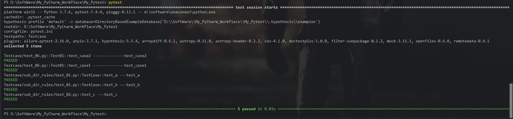

##### (3) norecursedirs 包含 testpaths

norecursedirs包含testpaths，不执行任何用例，并给出警告

结果是：**不执行任何用例**

```python
norecursedirs = case
testpaths = sub_case
```

结果：不执行任何用例


### 执行规则

```python
[pytest]
python_classes = Test*
python_files = test_*.py *_test.py
python_functions = test_*
```

说明：

python_files = test_*.py，表示配置测试搜索的文件名

python_classes = Test*，表示配置测试搜索的类名

python_functions = test_*，表示配置测试搜索的函数名

我们可以修改规则，比如function除了 test_ 开头，还可以 ceshi_ 开头，不过，不建议修改。

另外，如果不加通配符，表示执行指定内容，比如python_files = test_qzcsbj.py，表示执行test_qzcsbj.py文件。


### xfail：标志规则

Testcase/test_05.py

```python
import pytest
# 使用pytest框架内置标记

def add(a,b):
    return a + b

class TestAdd:
    # 断言相等，用例通过
    @pytest.mark.xfail
    def test_add_list_01(self):
        print("---test_add_list_01")
        res = add([1],[2,3,4])
        assert res == [1,2,3,4]

    # 断言不相等，用例失败
    @pytest.mark.xfail
    def test_add_list_02(self):
        print("---test_add_list_02")
        res = add([1],[2,3,4])
        assert res != [1,2,3,4]
```

(1) xfail_strict默认是false，标记为@pytest.mark.xfail的测试用例，如果是通过，显示XPASS

```python
[pytest]
xfail_strict = false
```


(2) 设置xfail_strict = true，标记为@pytest.mark.xfail且实际是通过（显示XPASS）的测试用例会被报告为失败FAILED

```python
[pytest]
xfail_strict = true
```

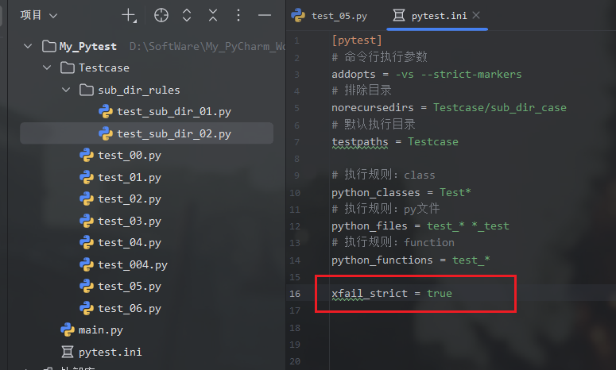

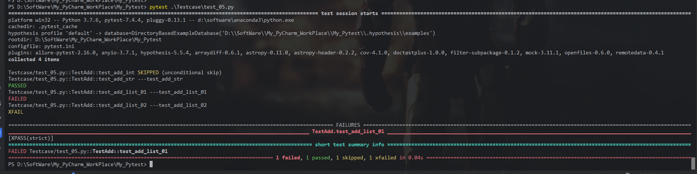

### markers：自定义注册标志

测试用例加了@pytest.mark.xxx修饰器，如果配置文件中没有配置markers就会报warnings **见04节**


### log-cli：控制台实时输出日志

默认是false，log-cli=false，等价于：log_cli=0

#### (1) 输出到控制台

```python
[pytest]
# 日志开关 true/false、1/0
log_cli = 1
# 输出到terminal
# 日志级别
log_cli_level = info
# 打印详细日志，相当于命令行加 -vs
# 日志格式
log_cli_format = %(asctime)s [%(levelname)s] %(message)s (%(filename)s:%(lineno)s)
# 日志时间格式
log_cli_date_format = %Y-%m-%d %H:%M:%S
```


```python
[pytest]
# 日志开关 true/false、1/0
log_cli = 1
# 输出到terminal
addopts = --capture=no # 打印详细日志，相当于命令行加 -vs
# 日志级别
log_cli_level = info
# 打印详细日志，相当于命令行加 -vs
# 日志格式
log_cli_format = %(asctime)s [%(levelname)s] %(message)s (%(filename)s:%(lineno)s)
# 日志时间格式
log_cli_date_format = %Y-%m-%d %H:%M:%S
```


#### (2) 输出到日志文件

```python
# 输出到文件
#日志文件位置
log_file = ./log/test.log
#日志文件等级
log_file_level = info
#日志文件格式
log_file_format = %(asctime)s [%(levelname)s] %(message)s (%(filename)s:%(lineno)s)
#日志文件日期格式
log_file_date_format = %Y-%m-%d %H:%M:%S
```

说明：

1、日志文件以写入模式打开，每次运行测试都会覆盖上一次日志文件内容
2、日志输出的时候不要用print，要采用logger进行输出

详情见 026-日志配置


## 06: fixture简介及调用

上一篇我们介绍了固件，通过示例可以看到，一个模块中，固件会对其作用范围内的所有用例起作用；

其实这样很不灵活，比如我们只希望部分测试用例执行某个固件，通过setup和teardown是实现不了的；

但是，通过fixture就可以根据需要自定义测试用例的前置、后置操作；

fixture是通过yield来区分前后置的，前后置均可以单独存在，fixture如果有后置，前置不报错就都会执行，前置报错后置就不会执行。

### fixture的优势

1、与setup、teardown类似，fixture提供了测试执行前和测试执行后的处理，但是又比setup、teardown更灵活好用，比如：fixture命名更加灵活，不局限于setup和teardown

2、conftest.py配置里可以实现数据共享，可以方便管理、修改和查看fixture函数，并且不需要import就能自动找到fixture

3、fixture可用于封装数据，也可用于封逻辑动作，使用范围非常广

### fixture介绍

fixture装饰器来标记固定的工厂函数，在其他函数、类、模块或整个工程调用它时会被激活并优先执行，通常会被用于完成预置处理和重复操作。

==源码==：

```python
def fixture(  # noqa: F811
    fixture_function: Optional[FixtureFunction] = None,
    *,
    scope: "Union[_ScopeName, Callable[[str, Config], _ScopeName]]" = "function",
    params: Optional[Iterable[object]] = None,
    autouse: bool = False,
    ids: Optional[
        Union[Sequence[Optional[object]], Callable[[Any], Optional[object]]]
    ] = None,
    name: Optional[str] = None,
) -> Union[FixtureFunctionMarker, FixtureFunction]:
```

==调用方法==：

```python
fixture(scope="function", params=None, autouse=False, ids=None, name=None)
```

==常用参数==：

- **scope**：被@pytest.fixture标记的方法的作用域，默认是function，还可以是class、module、package、session。（注：下一篇详解）
- **params**：用于给fixture传参，可实现数据基于fixture的数据驱动，接收一个可以迭代的对象，比如列表[]、元组()、字典列表{[],[],[]}、字典元组{(),(),()}，提供参数数据供调用fixture的用例使用；传进去的参数，可以用request.param调用
- **autouse**：是否自动运行，是一个布尔值，默认为False不会自动执行，需要手动调用；当它为True时，作用域内的测试用例都会自动调用该fixture
- **ids**：用例标识id，每个ids和params一一对应，如果没有id，将从params自动产生
- **name**：给被@pytest.fixture标记的方法取一个别名，如果使用了name，那只能将name传入，函数名不再生效


### fixture的调用

#### 函数引用/参数引用

将fixture名称作为测试用例函数/方法的参数；另外，如果fixture有返回值，必须用这种方式，否则获取不到返回值（比如：@pytest.mark.usefixtures()这种方式就获取不到返回值，详见：https://www.cnblogs.com/uncleyong/p/17957896）

==函数引用==：测试类中测试方法形参是**测试类外被@pytest.fixture()标记的测试函数**，也就是说，fixture标记的函数可以应用于测试类内部

==参数引用==：测试类中测试方法形参是**当前测试类中被@pytest.fixture()标记的方法**


## 05: fixture实现自定义前置、后置

## 06: fixture作用域(scope)详解

## 07: fixture跨模块共享conftest.py

## 08: fixture标志传参

## 09: fixture返回值实现参数化

## 10: fixture对用例重命名、给函数取别名

## 

## 

## 13: parametrize参数化

## 14: parametrize参数化数据来自yaml文件

## 15: parametrize参数化数据来自json文件

## 16: parametrize参数化数据来自excle文件

## 17: parametrize参数化数据来自csv文件

## 18: parametrize中indirect详解间接参数

## 19: parametrize中给用例取别名

## 20: 跳过用例 - skip、skipif

## 21: 标记为预期失败 - xfail]

## 22: 定义标记变量

## 23: pytest中配置过滤警告

## 24: pytest中异常处理

## 25: pytest断言

## 26: pytest中日志配置

## 27: pytest常用插件 - 失败重试pytest-rerunfailures

## 28: pytest常用插件 - 重复测试pytest-repeat

## 29: pytest常用插件 - 控制函数执行顺序pytest-ordering

## 30: pytest常用插件 - 随机执行pytest-random-order

## 31: pytest常用插件 - 并发执行pytest-xdist

## 32: pytest常用插件 - 依赖执行pytest-dependency

## 33: pytest常用插件 - 多重校验pytest-assume

## 34: pytest常用插件 - 测试报告pytest-html

## 35: pytest常用插件 - allure报告allure-pytest

## 36: pytest + allure最佳实践